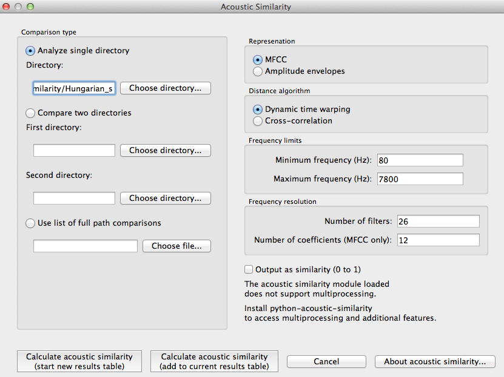

.. _acoustic_similarity:

*******************
Acoustic Similarity
*******************

.. _about_acoustic_similarity:

**NOTE:** Although acoustic similarity is still included as an algorithm within PCT, the focus of the PCT software is *phonological* analysis, not acoustic analysis. We do not actively maintain the acoustic similarity algorithm, and recommend that users look to PCT's companion software, Speech Corpus Tools (https://github.com/MontrealCorpusTools/speechcorpustools), developed at McGill University, for better and more updated functionality.

About the function
------------------

Acoustic similarity analyses quantify the degree to which waveforms of
linguistic objects (such as sounds or words) are similar to each other.
The acoustic similarity measures provided here have primarily been used
in the study of phonetic convergence between interacting speakers;
convergence is measured as a function of increasing similarity. These
measures are also commonly used in automatic speech and voice recognition
systems, where incoming speech is compared to stored representations.
Phonologically, acoustic similarity also has a number of applications.
For example, it has been claimed that sounds that are acoustically distant
from each other cannot be allophonically related, even if they are in
complementary distribution (e.g. [Pike1947]_; [Janda1999]_).

Acoustic similarity alogorithms work on an aggregate scale, quantifying,
on average, how similar one group of waveforms is to another.
Representations have traditionally been in terms of mel-frequency cepstrum
coefficents (MFCCs; [Delvaux2007]_; [Mielke2012]_), which is
used widely for automatic speech recognition, but one recent introduction
is multiple band amplitude envelopes [Lewandowski2012]_. Both MFCCs and
amplitude envelopes will be described in more detail in the following
sections, and both are available as part of PCT.

The second dimension to consider is the algorithm used to match
representations. The most common one is dynamic time warping (DTW),
which uses dynamic programming to calculate the optimal path through a
distance matrix [Sakoe1971]_, and gives the best alignment of
two time series. Because one frame in one series can align to multiple
frames in another series without a significant cost, DTW provides a
distance independent of time. The other algorithm that is used is
cross-correlation (see discussion in [Lewandowski2012]_, which aligns
two time series at variable lags. Taking the max value of the alignment
gives a similarity value for the two time series, with higher values
corresponding to higher similarity.

.. _method_acoustic_similarity:

Method of calculation
---------------------

Preprocessing
`````````````

Prior to conversion to MFCCs or amplitude envelopes, the waveform is
pre-emphasized to give a flatter spectrum and correct for the higher
drop off in amplitude of higher frequencies due to distance from the mouth.

MFCCs
`````

The calculation of MFCCs in PCT’s function follows the Rastamat
[Ellis2005]_'s implementation of HTK-style MFCCs [HTK]_ in [Matlab]_.
Generating MFCCs involves windowing the acoustic waveform and transforming
the windowed signal to the linear frequency domain through a Fourier
transform. Following that, a filterbank of triangular filters is
constructed in the mel domain, which gives greater resolution to
lower frequencies than higher frequencies. Once the filterbank is
applied to the spectrum from the Fourier transform, the spectrum is
represented as the log of the power in each of the mel filters. Using
this mel spectrum, the mel frequency cepstrum is computed by performing
a discrete cosine transform. This transform returns orthogonal
coefficients describing the shape of the spectrum, with the first
coefficent as the average value, the second as the slope of the spectrum,
the third as the curvature, and so on, with each coefficient representing
higher order deviations. The first coefficent is discarded, and the next
X coefficents are taken, where X is the number of coefficents specified
when calling the function. The number of coefficents must be one less
than the number of filters, as the number of coefficents returned by the
discrete cosine transform is equal to the number of filters in the mel
filterbank.

Please note that the MFCCs calculated in PCT follow the HTK standard,
and are not the same as those produced by Praat [PRAAT]_.

Amplitude envelopes
```````````````````

The calculation of amplitude envelopes follows the Matlab implementation
found in [Lewandowski2012]_. First, the signal is filtered into X number
of logarithmically spaced bands, where X is specified in the function call,
using 4th order Butterworth filters. For each band, the amplitude envelope
is calculated by converting the signal to its analytic signal through a
Hilbert transform. Each envelope is downsampled to 120 Hz.

Dynamic time warping (DTW)
``````````````````````````

PCT implements a standard DTW algorithm [SakoeChiba, 1971]_
and gives similar results as the dtw package [Giorgino2009)]_ in [R].
Given two representations, a 2D matrix is constructed where the dimensions
are equal to the number of frames in each representation. The initial
values for each cell of the matrix is the Euclidean distance between the
two feature vectors of those frames. The cells are updated so that they
equal the local distance plus the minimum distance of the possible previous
cells. At the end, the final cell contains the summed distance of the
best path through the matrix, and this is the minimum distance between
two representations.

Cross-correlation
`````````````````

Cross-correlation seeks to align two time series based on corresponding
peaks and valleys. From each representation a time series is extracted
for each frame's feature and this time series is cross-correlated with
the respective time series in the other representation. For instance,
the time series for an amplitude envelope’s representation corresponds
to each frequency band, and each frequency band of the first representation
is cross-correlated with each respective frequency band of the second
representation. The time series are normalized so that they sum to 1,
and so matching signals receive a cross-correlation value of 1 and
completely opposite signals receive a cross-correlation value of 0.
The overall distance between two representations is the inverse of the
average cross-correlation values for each band.

Similarity across directories
`````````````````````````````

The algorithm for assessing the similarity of two directories
(corresponding to segments) averages the similarity of each .wav
file in the first directory to each .wav file in the second directory.

.. _acoustic_similarity_gui:

Calculating acoustic similarity in the GUI
------------------------------------------

To start the analysis, click on the “Calculate acoustic similarity...” in
the Analysis menu and provide the following parameters. Note that unlike
the other functions, acoustic similarity is not tied directly to any corpus
that is loaded into PCT; sound files are accessed directly through
directories on your computer.

1. **Comparison type**: There are three kinds of comparisons that can be done
   in PCT: single-directory, two-directory, or pairwise.

   a. **Single directory**: If a single directory is selected (using the
      “Choose directory...” dialogue box), two types of results will be
      returned: (1) each of the pairwise comparisons and (2) an average
      of all these comparisons (i.e., a single value).
   b. **Two directories**: Choose two directories, each corresponding to a
      set of sounds to be compared. For example, if one were interested
      in the similarity of [s] and [ʃ] in Hungarian, one directory would
      contain .wav files of individual [s] tokens, and the other directory
      would contain .wav files of individual [ʃ] tokens. Every sound file
      in the first directory will be compared to every sound file in the
      second directory, and the acoustic similarity measures that are
      returned will again be (1) all the pairwise comparisons and (2)
      an average of all these comparisons (i.e., a single value).
   c. **Pairwise**: One can also use a tab-delimied.txt file that lists all
      of the pairwise comparisons of individual sound files by listing
      their full path names. As with a single directory, each pairwise
      comparison will be returned separately.

2. **Representation**: Select whether the sound files should be represented
   as MFCCs or amplitude envelopes (described in more detail above).
3. **Distance algorithm**: Select whether comparison of sound files should
   be done using dynamic time warping or cross-correlation (described in
   more detail above).
4. **Frequency limits**: Select a minimum frequency and a maximum frequency
   to use when generating representations. The human voice typically
   doesn't go below 80 Hz, so that is the default cut off to avoid
   low-frequency noise. The maximum frequency has a hard bound of the
   Nyquist frequency of the sound files, that is, half their sampling rate.
   The lowest sampling rate that is typically used for speech is 16,000 Hz,
   so a cutoff near the Nyquist (8,000 Hz) is used as the default. The
   range of human hearing is 20 Hz to 20 kHz, but most energy in speech
   tends to fall off after 10 kHz.
5. **Frequency resolution**: Select the number of filters to be used to divide
   up the frequency range specified above. The default for MFCCs is for 26
   filters to be constructed, and for amplitude envelopes, 8 filters.
6. **Number of coefficients (MFCC only)**: Select the number of coefficients
   to be used in MFCC representations. The default is 12 coefficients,
   as that is standard in the field. If the number of coefficients is
   more than the number of filters minus one, the number of coefficients
   will be set to the number of filters minus one.
7. **Output**: Select whether to return results as similarity (inverse
   distance) or to us ethe default, distance (inverse similarity).
   Dynamic time warping natively returns a distance measure which gets
   inverted to similarity and cross-correlation natively returns a
   similarity value which gets inverted to distance.
8. **Multiprocessing**: As the generation and comparison of representations
   can be time-intensive, using multiprocessing on parts that can be
   run in parallel can speed the process up overall. In order to make
   this option available, the python-acoustic-similarity module must be
   installed; multiprocessing itself can be enabled by going to
   “Options” / “Preferences” / “Processing” (see also §3.9.1).

Here’s an example of the parameter-selection box:



9. **Calculating and saving results**: The first time an analysis is run,
   the option to “Calculate acoustic similarity (start new results
   table)” should be selected. This will output the results to a
   pop-up window that lists the directories, the representation choice,
   the matching function, the minimum and maximum frequencies, the
   number of filters, the number of coefficients, the raw result, and
   whether the result is similarity (1) or distance (0). Subsequent
   analyses can either be added to the current table (as long as it
   hasn’t been closed between analyses) or put into a new table. Once
   a table has been created, click on “Save to file” at the bottom of
   the table window in order to open a system dialogue box and choose
   a directory; the table will be saved as a tab-delimited .txt file.

Here’s an example of the results file:

.. image:: static/asresults.png
   :width: 90%
   :align: center

To return to the function dialogue box with your most recently used
selections, click on “Reopen function dialog.” Otherwise, the results
table can be closed and you will be returned to your corpus view.

.. _acoustic_sim_classes_and_functions:

Classes and functions
---------------------
For further details about the relevant classes and functions in PCT's
source code, please refer to :ref:`api_reference`.
