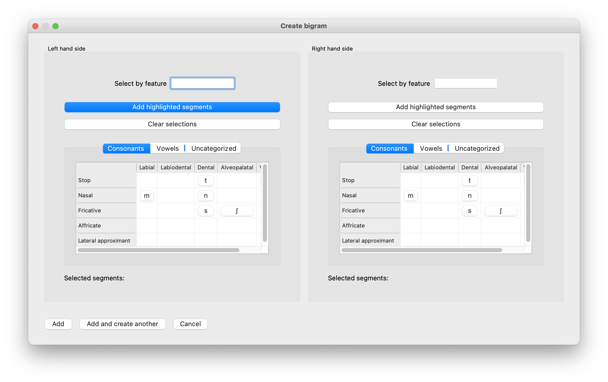
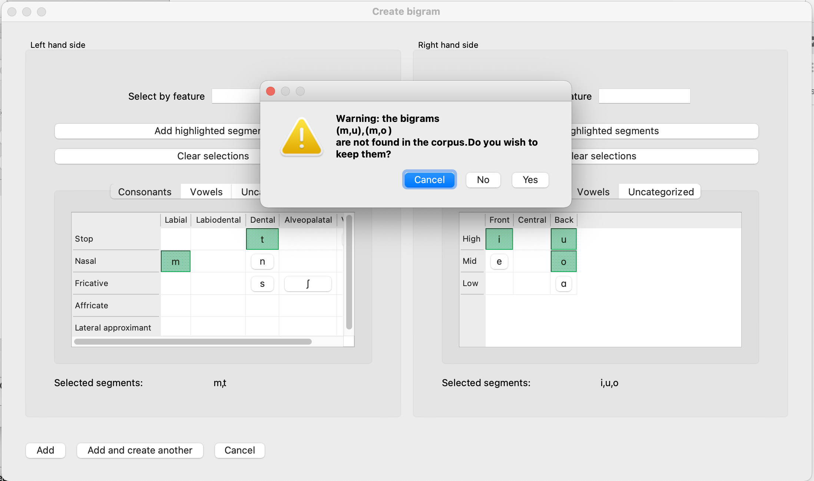
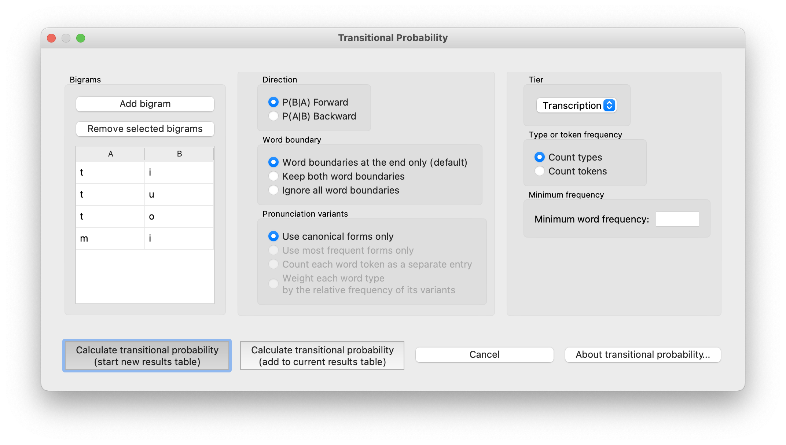

.. _bigram_selection:

*************************
Bigram selection
*************************

The analysis functions :ref:`mutual_information` and
:ref:`transitional_probability` are calculated from bigrams, or
ordered pairs of segments. Both functions use a bigram selector window
that lets a user specify a "left-hand side" and "right-hand side" from the
inventory of a loaded corpus, or use features in order to select multiple
left- or right-hand sides. The selector will return either one or multiple
bigrams to the analysis function's main window, where they will be displayed
in a table.

.. _bigram_select_steps:

Selecting bigrams using the GUI
-------------------------------
1. From the analysis function dialog, click
   on "Add Bigram." A new window will open, containing an inventory of all the
   segments in the loaded corpus, for selecting the left- and
   right-hand sides of a bigram:
   
   

2. **Using the inventory:** Selecting a single segment from both sides
   will add a single bigram, while selecting multiple segments from either
   side will add a cartesian product of the possible left- and right-hand
   sides.
3. **Using features:** Use the box above the inventory to select segments
   by feature, for either the left- or right-hand side. Once the feature
   is written into the text box, the corresponding segments will be
   highlighted in the inventory. Click "Add highlighted segments" in order
   to accept the selected segments. If there are multiple segments on either
   side, the resulting bigrams will be a cartesian product of the left- and
   right-hand segments. See :ref:`feature_selection` for more information
   on features.
4. Click "Add" to return to the analysis function dialog with your selected
   bigrams. To add more than one bigram, click “Add and create another” to be automatically returned to the selection window. Once the last bigram has been selected, simply click “Add” to return to the Mutual Information dialogue box with all selected bigrams listed.
5. If an added bigram does not appear in the corpus, a message box will
   appear specifying which bigrams are missing. From it, click "Cancel" to return to the bigram selector window
   without adding the bigram; click "No" to add all of the bigrams that do
   appear in the corpus without adding the ones that do not; and click
   "Yes" to add all of the bigrams regardless of whether they appear in
   the corpus. Note that PCT cannot calculate Mutual Information or
   Transitional Probability on bigrams that do not appear in the corpus.
   
   For example, in the following window, we have selected {m, t} as the first element and {i, u, o} as the second element. Ideally, this would result in six total bigrams being added to our search list: [mi], [mu], [mo], and [ti], [tu], [to]. However, PCT warns us that [mu] and [mo] are not in the corpus. By clicking "No" (i.e., we do not wish to keep them), we are returned to the main analysis window (in this case, the transitional probability dialogur box), with only the four extant bigrams selected:
   

   

