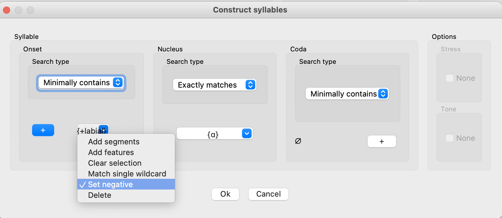
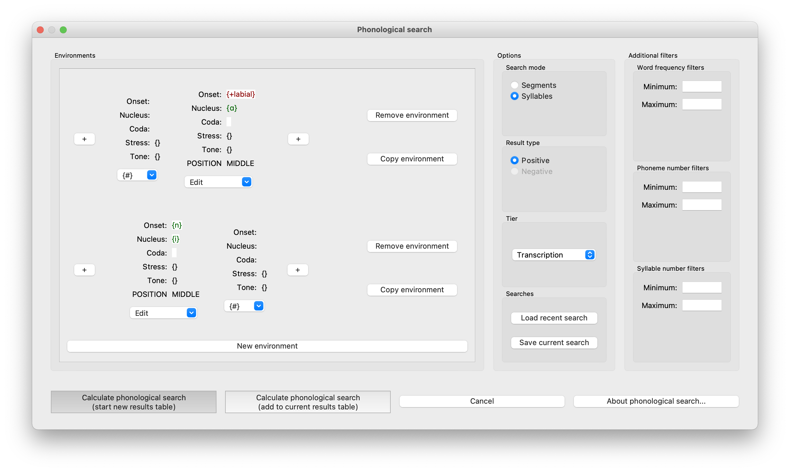
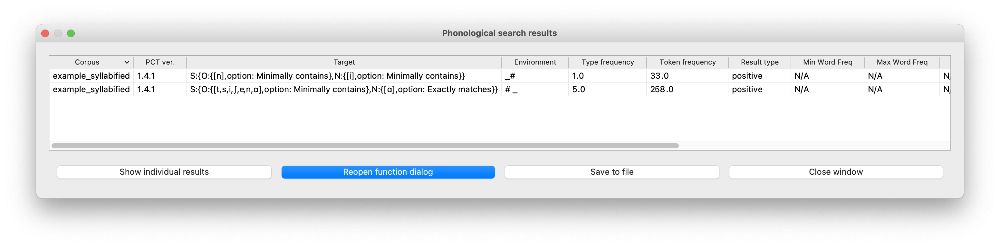
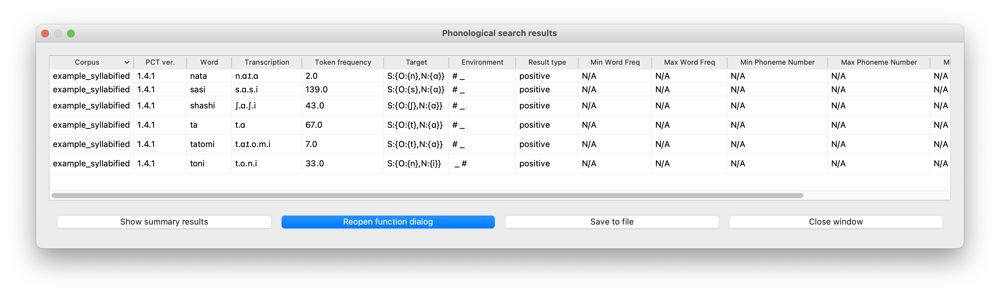

.. _environment_selection:

**********************
Environment Selection
**********************

There are many instances in PCT where you are given the opportunity to
define environments that will be used in an analysis. This section
describes the general interfaces used in all such instances. One of these
involves specifying environments based on **segments** (this is most common); 
the other involves specifying environments based on **syllables** (if syllables
are included in your corpus).

.. _segment_selection:

Segment-based selection
=======================

When you have the opportunity to define an environment, you will see a
blank "Environments" box with a button in it for "New environment."
Start by clicking this button to create a new environment -- you can
click it as many times as you need to define multiple environments.

When a new environment has been added, it starts out blank. Environments
are basically divided into three sections: the target, the left-hand side,
and the right-hand side.

The central rectangle marks the "target" of the environment and has an
underscore at the top and a set of empty curly brackets, {}, beneath.
Depending on where you are building the environment, you may be able to
edit the contents of this target. E.g., if you are doing a
:ref:`phonological_search`, you can put the target(s) of the search
here, and fill in the environment around them. On the other hand, if
you are building an environment to be used with pairs of sounds, as in
the :ref:`predictability_of_distribution`, :ref:`mutual_information`,
or :ref:`functional_load` analysis, you will have specified the target
pairs of sounds independently, and cannot edit the targets in the
environment selection box. In order to select a target in cases where
it is editable, simply click on the central target box; a sound
selection box will open. See :ref:`sound_selection` for details on how
to use this function, but basically, sounds can be selected either by
clicking on segments or by specifying feature values. Multiple sounds
can be selected as the targets; each will be placed in the same
surrounding environments.

On either side of the central target rectangle, there is a "+" button.
These allow you to add segments to either the left-hand or the right-hand
side of the environment in an iterative fashion, starting with segments
closest to the target and working out. Clicking on one of the "+" buttons
adds an empty set {} to the left or right of the current environment.

To fill the left- or right-hand side, click on the rectangle containing
the empty set {}. This again brings up the sound selection box; see
:ref:`sound_selection` for details. The environment can be filled by
either clicking on segments or specifying features.

Note that regardless of whether targets and environments are selected
by segments or by features, the result will be a disjunctive set of
all segments that have been selected.

For example, to set up an environment that might be used to search for
[n] vs. [m] vs. [ŋ] in words that start with [ɪ] and in which the nasal
is followed by voiceless stop, one could do the following:

1. Click on "New environment." This gives you a blank environment:

.. image:: static/environment1.png
   :width: 90%
   :align: center

2. Click on the left-hand "+" sign once, and the right-hand "+" sign once. This will give you the following, still blank environment:

.. image:: static/environment2.png
   :width: 90%
   :align: center

3. Click the empty environment slot {} to the right of the target. A new menu pops up, with the following options:

.. image:: static/environment3.png
   :width: 90%
   :align: center

These options are as follows:
   a. "Add segments" allows you to enter individual segments into the selected position (e.g., to search for [m] and [n]).
   b. "Add features" allows you to enter a set of features into the selected position (e.g. to search for nasals).
   c. "Add non-segment symbol" allows you to enter a symbol not classified as a segment (e.g., a word boundary).
   d. "Match single wildcard" allows you to enter a wildcard into the selected position. This is useful for ignoring intervening content. E.g., one could search for anything that occurs word-finally, by setting the target to a wildcard, or one could search for [m] and [n], followed by a wildcard, followed by a word boundary, to search for [m] and [n] as the penultimate segment in a word. Note that the wildcard position is just a single slot; PCT will simply treat it as a single segment that can be filled with any content (rather than, say, allowing any number of intervening elements). To get a more unbounded search, we recommend making use of additional tiers (e.g., setting up a tier that contains only [m], [n], and [#], and then searching for all words that have [m] or [n] directly followed by # on that tier; to learn more about tier creation, see :ref:`create_tiers`). See also :ref:`preferences` to switch between displaying the wildcard as an asterisk vs. as a list of all the segments in the inventory.
   e. "Clear selection" will clear the contents of this position if any contents have already been chosen.
   f. "Delete" allows you to delete the selected position entirely (not available for the central target position).
   g. "Add new environment position {To the left, To the right}" will insert an additional environment position in the selected location. This functions the same as the buttons with "+" signs, but allows additional environments to be inserted internally to the environment instead of solely at the periphery.

4. For the target, select [m], [n], and [ŋ] using their features
   (e.g., [+nasal, -vocalic] or whatever combination of features is
   relevant for the corpus). (See :ref:`sound_selection` for details.) 

5. Click the leftmost empty set.

6. Select the word boundary symbol, #.

7. Right-click on the # symbol and add an environment position to the right. 

8. Click the new empty set immediately to the left of the targets.

8. Select the vowel [ɪ].

9. Select the rightmost empty set.

10. Select all voiceless stops (e.g., by using the features [-voice,
    -continuant, -delayed release]).

This now gives you an environment that looks something like the following
(depending on the total inventory and the transcription system of your
corpus; this example is from the IPHOD corpus):

.. image:: static/environment4.png
   :width: 90%
   :align: center

To add additional environments, simply click "New environment." To copy an existing environment (and then edit it, e.g., to search for a different set of sounds in the same environment), click "Copy environment." To edit
an environment, either right-click on on the rectangle containing the part
of the environment you want to edit, clear the selection, and re-enter it, or click on the original selection to add to the original choices. To remove an environment entirely, click on the "Remove environment" button to the right.

.. _syllable_selection:

Syllable-based selection
========================

The basic principles of environment selection are the same in syllable mode, but the units being built have hierarchical syllable structure. 

To use syllable-based environments, first you will need to be in "Syllables mode" (there should be a checkbox within the search or analysis window that allows you to select either segment or syllable mode); then you add a new environment by clicking the “New environment” button.
The interface shows you a blank 'target' syllable. At the bottom of the blank syllable is a dropdown menu labelled "Edit." This gives you four choices:

1. **Add an unspecified syllable.**

   * Use this option to specify a 'wildcard' syllable. There must be a full syllable in the representation to match, but the syllable can contain any phonological material.

2. **Construct the syllable.** 

   * Use this option to specify some or all parts of the phonological material of the syllable. See details below.

3. **Clear selection.**
  
   * Use this option to re-set the position to be entirely empty.

4. **Add new environment position {to the left, to the right}.**

   * Use this option to add another syllable to the left or right of the current position. Note that the same function can be obtained by clicking on the "+" button to the left or right of a given position. Additional syllables will have the same "Edit" menu, but with two *additional* options:

   * **Add non-segment syllable.**
      * Use this option to include a word or morpheme boundary (#, - =) in the environment (instead of a syllable).
   
   * **Delete.**   
      * Use this option to delete only the position encompassed by the dropdown menu. Note that the 'middle' (target) position of an environment cannot be deleted.

**Constructing the Syllable:**

1. Once you have selected "Construct the syllable" from the dropdown menu as described above, the "Construct syllables" window will pop up:

2. The window has panels for each of the Onset, Nucleus, and Coda. Each of these can be specified using the same segment-based environment selector described in :ref:`segment_selection` above.

3. Additionally, for each of the Onset, Nucleus, and Coda, you can choose among "Exactly matches", "Minimally contains", "Starts with", and "Ends with."
   * Please note that using "Exactly matches" while not specifying an onset/coda slot means "no onset/coda", while using "Minimally contains" without specifying an
   onset or coda means that the onset or coda may either be empty or filled. 
   * Using a single wildcard for onset/coda slot does mean that a segment *must* fill the slot.

4. Additionally, you can exclude specific segments as a syllable component by selecting "Set negative" from the dropdown menu associated with the specific component. For example, if you want to search for a syllable that has any phoneme in the onset position except those that are [+labial], and does have exactly [ɑ] as the nucleus, you can do so in
   the "Construct syllables" window by specifying "Nucleus" as [ɑ] (setting this to be "Exactly matches") and setting "Onset" as +labial with "Set negative" option checked from
   the dropdown menu. This will search for [sɑ], [rɑ], etc. but exclude [mɑ] or [pɑ]. This would look like the following:

   
5. On the right-hand side, you can also specify Stress and Tone for the target syllable, if these are included in your syllable representations.

6. Once the syllable has been constructed, click "OK" to return to the original dialogue box where the environment selector was accessed (e.g., the phonological search dialogue box). The green colour for the nucleus indicates that this is a positive search (i.e., looking for matching material), while the red colour for the onset indicates this is a negative search (i.e., looking for non-matching material). Note that here, you can continue to specify additional material within the same environment (e.g., adding a requirement that the constructed syllable be word-initial, as in the example below, or followed by the syllable [ke], or any other combination) and also specify entirely separate environments (e.g., also search for the syllable [ni] in word-final position, as in the example below). Components within a single environment are additive (i.e., if you specify # plus a syllable with [ɑ] and a non-labial onset in a single environment, then you will get only results that have *all* of those components). Components across environments are disjunctive (i.e., if you specify # plus a syllable with [ɑ] and a non-labial onset in one environment, and [ni]+# in a separate environment, you will get results for each search independently).

.. _syllable_notation:

**Notation for Syllables in Results Boxes:**
   
Once a syllable-based analysis has been set up as in the above example, click on "Calculate [result]." General instructions for interpreting the results can be found in the sections for each individual analysis function / search function. However, we will explain here the *notation* for syllable specification within results windows. 

In order to maintain a 'flat' structure for exporting and interpreting results from PCT, while maintaining as much information about the set parameters as possible, we have developed the following conventions for syllables:

1. S: is used to indicate that a syllable is about to be defined; O: an onset, N: a nucleus, and C: a coda.

2. The definition of a unit is then enclosed in { }. So e.g. the structure for defining a syllable would look like: 

   S:{ } 

   ...and the structure for defining a syllable that contains a nucleus would have a nested structure, as in: 

   S:{ N:{ } }

3. Multiple components within a syllable are separated by commas, so that the structure for defining a syllable that contains both an onset and a nucleus would be: 

   S:{ O:{ }, N:{ } }

4. Individual segments that are specified in units of a syllable are then enclosed in [ ]. So e.g. the structure for defining the syllable [mi] would be: 

   S:{ O:{[m]}, N:{[i]} }

5. If it is relevant to specify all of the possible options that a user selected (instead of simply representing the actual syllable), options are listed immediately after segments contained in the unit. So e.g. a search that required any non-labial onset to be followed exactly by the nucleus [ɑ] would be as follows (note that the 'set negative' component and the '[+labial]' component have both been automatically converted into a positive list of matching segments):

   S:{O:[e,ɑ,t,i,s,ʃ,n],option: Minimally contains},N:{[ɑ],option: Exactly matches}}

Examples of a full specification and a syllable-specific specification can be seen in the following images, respectively:

   

