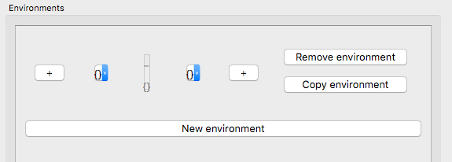

.. _environment_selection:

**********************
Environment Selection
**********************

There are many instances in PCT where you are given the opportunity to
define environments that will be used in an analysis. This section
describes the general interface used in all such instances.

When you have the opportunity to define an environment, you will see a
blank "Environments" box with a button in it for "New environment."
Start by clicking this button to create a new environment -- you can
click it as many times as you need to define multiple environments.

When a new environment has been added, it starts out blank. Environments
are basically divided into three sections: the target, the left-hand side,
and the right-hand side.

The central rectangle marks the "target" of the environment and has an
underscore at the top and a set of empty curly brackets, {}, beneath.
Depending on where you are building the environment, you may be able to
edit the contents of this target. E.g., if you are doing a
:ref:`phonological_search`, you can put the target(s) of the search
here, and fill in the environment around them. On the other hand, if
you are builiding an environment to be used with pairs of sounds, as in
the :ref:`predictability_of_distribution` analysis, you will have specified
the target pairs of sounds independently, and cannot edit the targets in the
environment selection box. In order to select a target in cases where it
is editable, simply click on the central target box; a sound selection box
will open. See :ref:`sound_selection` for details on how to use this
function, but basically, sounds can be selected either by clicking on
segments or by specifying feature values. Multiple sounds can be selected
as the targets; each will be placed in the same surrounding environments.

On either side of the central target rectangle, there is a "+" button.
These allow you to add segments to either the left-hand or the right-hand
side of the environment in an iterative fashion, starting with segments
closest to the target and working out. Clicking on one of the "+" buttons
adds an empty set {} to the left or right of the current environment.

To fill the left- or right-hand side, click on the rectangle containing
the empty set {}. This again brings up the sound selection box; see
:ref:`sound_selection` for details. The environment can be filled by
either clicking on segments or specifying features.

Note that regardless of whether targets and environments are selected
by segments or by features, the result will be a disjunctive set of
all segments that have been selected.

For example, to set up an environment that might be used to search for
[n] vs. [m] vs. [ŋ] in words that start with [ɪ] and in which the nasal
is followed by voiceless stop, one could do the following:

1. Click on "New environment." This gives you a blank environment:

.. image:: static/environment1.png
   :width: 90%
   :align: center

2. Click on the left-hand "+" sign twice, and the right-hand "+" sign once. This will give you the following, still blank environment:

3. Click the central "target" rectangle.

4. Select [m], [n], and [ŋ] either by hand or through their features
   (e.g., [+nasal, -vocalic] or whatever combination of features is
   relevant for the corpus). (Be sure to fully select the segments if
   you're using features; don't just have them highlighted, or they
   won't get added to the environment. See :ref:`sound_selection` for details.)

5. Click the leftmost empty set.

6. Select the word boundary symbol, #.

7. Click the empty set immediately to the left of the targets.

8. Select the vowel [ɪ].

9. Select the rightmost empty set.

10. Select all voiceless stops (e.g., by using the features [-voice,
    -continuant, -delayed release]).

This now gives you an environment that looks something like the following
(depending on the total inventory and the transcription system of your
corpus; this example is from the IPHOD corpus):

.. image:: static/environment3.png
   :width: 90%
   :align: center

To add additional environments, simply click "New environment." To edit
a current environment, simply click on the rectangle containing the part
of the environment you want to edit and re-select the sounds. To remove
an environment entirely, click on the "Remove environment" button to the right.
