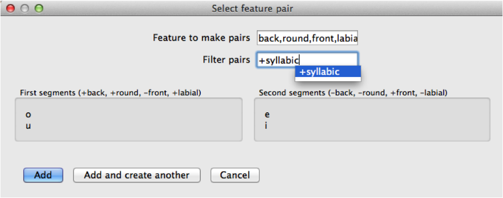

.. _feature_selection:

*****************
Feature Selection
*****************

There are several instances in PCT where you are given the opportunity to
select sounds for an analysis based on shared features. This section describes
the general interface used in all such instances. See also :ref:`sound_selection`
for general information on how to select individual segments for analysis,
including using features to identify classes of segments.

In many cases, you will just want to select individual sounds for an analysis
(e.g., [e] vs. [o]). Occasionally, however, it is useful to be able to compare
classes of sounds that differ along some dimension (e.g., comparing front vs.
back non-low vowels, i.e., [i, e] on the one hand vs. [u, o] on the other).

To do this in an analysis window, click on "Add sets of segments based on features" to open the
"Select feature pair" dialogue box.

At the top of the box, there is a place to enter the feature(s) along
which the pairs will have OPPOSITE values. No "+" or "-" value should be
entered here; rather, it should just be the name of the feature (e.g.,
"back"). Note that currently, PCT has some ability to automatically detect
redundant features within a given domain.
For instance, if the example corpus is open and
associated with SPE features, and one wanted to calculate the predictability
of distribution of [i,e] on the one hand vs. [u, o] on the other, one would
could enter either "back" or "round", but would also have enter "-low" and "+voc" in the "Filter pairs" box.

As soon as a feature or set of features has been entered that
describes two sets of sounds that differ on exactly the feature values for
the listed features, the sounds themselves will be shown in the box under
"First segments" and "Second segments."

One can then filter the entire set by entering in specific values of other
features. E.g., if one wanted to limit the comparison to [i] vs. [e],
one could enter "high" in the "feature to make pairs" box and then [-round]
in the "filter pairs" box. (Of course, in this case, it might be easier to
simply select those two sounds, [i] and [e], directly as segments, but the
same principle works for more complicated sets of segments.)

Once the correct segments are listed, click "Add" to add the pairs to the
segment list in the original analysis dialogue box. If additional pairs are
needed, one can click "Add and create another" instead.

Here's an example of using both features and filters in the Lemurian
corpus to select [o,u] vs. [e,i], to the exclusion of [w,j]:

