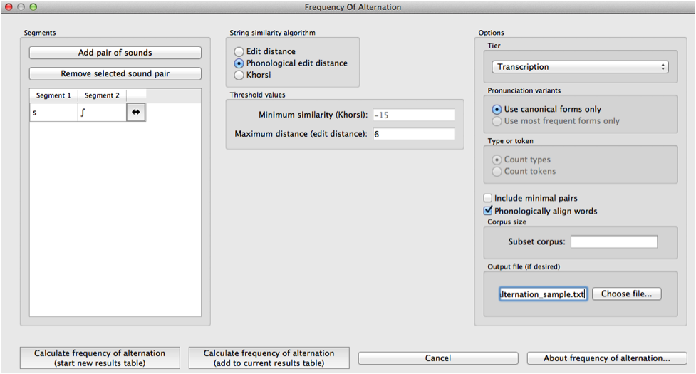
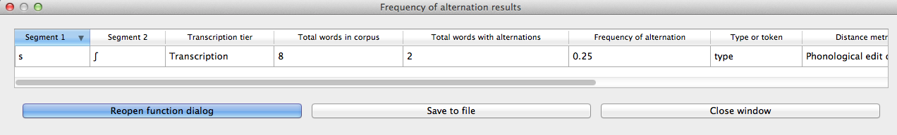

.. _frequency_of_alternation:

************************
Frequency of alternation
************************

.. _about_frequency_of_alternation:

About the function
------------------

**Frequency of alternation is currently not supported in PCT. What follows below
is the description of the function up to PCT ver. 1.2**

The occurrence of alternations can be used in assessing whether two
phonemes in a language are contrastive or allophonic, with alternations
promoting the analysis of allophony (e.g., [Silverman2006]_, [Johnson2010]_,
[Lu2012]_), though it’s clear that not all alternating sounds are
allophonic (e.g., the [k]~[s] alternation in electric~electricity).

In general, two phonemes are considered to alternate if they occur in
corresponding positions in two related words. For example, [s]/[ʃ]
would be considered an alternation in the words [dəpɹɛs] and [dəpɹɛʃən]
as they occur in corresponding positions and the words are morphologically
related. [Johnson2010]_ make the point that alternations may be
more or less frequent in a language, and imply that this frequency may
affect the influence of the alternations on phonological relations. As far
as we know, however, there is no literature that directly tests this claim
or establishes how frequency of alternation could actually be quantified
(though see discussion in [Hall2016]_).

.. _method_frequency_alternation:

Method of calculation
---------------------

In PCT, frequency of alternation [1] is the ratio of the number of words
that have an alternation of two phonemes to the total number of words
that contain either phoneme, as in:

:math:`Frequency\ of\ alternation = \frac{Words\ with\ an\ alternation\ of\ s_1\ and\ s_2}
{Words\ with\ s_1\ +\ words\ with\ s_2}`

To determine whether two words have an alternation of the targeted phonemes,
one word must contain phoneme 1, the other must contain phoneme 2, and some
threshold of “relatedness” must be met. In an ideal world, this would be
determined by a combination of orthographic, phonological, and semantic
similarity; see discussion in [Hall2016]_. Within PCT,
however, a much more basic relatedness criterion is used: string similarity.
This is indeed what [Khorsi2012]_ proposes as a measure of morphological
relatedness, and though we caution that this is not in particularly close
alignment with the standard linguistic interpretation of morphological
relatedness, it is a useful stand-in for establishing an objective
criterion. If both conditions are met, the two words are considered to
have an alternation and are added to the pool of “*words with an
alternation of s1 and s2*.”

It is also possible to require a third condition, namely, that the
location of phoneme 1 and phoneme 2 be roughly phonologically aligned
across the two words (e.g., preceded by the same material). Requiring
phonological alignment will make PCT more conservative in terms of what
it considers to “count” as alternations. However, the phonological
alignment algorithm is based on [Allen2014]_ and currently
only works with English-type morphology, i.e., a heavy reliance on
prefixes and suffixes rather than any other kinds of morphological
alternations. Thus, it should not be used with non-affixing languages.

Again, we emphasize that we do *not* believe this to currently be a
particularly accurate reflection of morphological relatedness, so the
resulting calculation of frequency of alternation should be treated with
**extreme** caution. We include it primarily because it is a straightforward
function of string similarity that has been claimed to be relevant, not
because the current instantiation is thought to be particularly valid.

.. _frequency_of_alternation_gui:

Calculating frequency of alternation in the GUI
-----------------------------------------------

To start the analysis, click on “Analysis” / “Calculate frequency of
alternation...” in the main menu, and then follow these steps:

1. **Segments**: First, select which pairs of sounds you want the functional
   load to be calculated for. Do this by clicking on “Add pair of sounds”;
   the “Select segment pair” dialogue box will open. The order that the sounds are selected in is irrelevant; picking [i] first and [u] second will yield the same
   results as picking [u] first and [i] second. Once sounds
   have been selected, click “Add.” Pairs will appear in the “Functional
   load” dialogue box. See more about interacting with the sound selection box (including, e.g., the use of features in selecting sounds and the options for selecting multiple pairs) in :ref:`sound_selection`.

2. **String similarity algorithm**: Next, choose which distance / similarity
   metric to use. Refer to :ref:`method_string_similarity` for more details.

3. **Threshold values**: If the Khorsi algorithm is selected, enter the minimum
   similarity value required for two words to count as being related.
   Currently the default is -15; this is an arbitrary (and relatively
   low / non-conservative) value. We recommend reading [Khorsi2012]_ and
   examining the range of values obtained using the string similarity
   algorithm before selecting an actual value here. Alternatively, if
   one of the edit distance algorithms is selected, you should instead
   enter a maximum distance value that is allowed for two words to count
   as being related. Again, there is a default (6) that is relatively
   high and non-conservative; an understanding of edit distances is crucial
   for applying this threshold in a meaningful way.

4. **Tier**: The tier from which string similarity is to be calculated can
   be selected. Generally, one is likely to care most about full
   transcriptions, but other tiers (e.g., a vowel tier) can also be
   selected; in this case, all information removed from the tier is
   ignored.

5. **Pronunciation variants**: If the corpus contains multiple pronunciation variants for lexical items, select what strategy should be used. For details, see :ref:`pronunciation_variants`. Note that here, the only choices currently available are canonical or most-frequent forms.

6. **Frequency Type**: Next, select which frequency type to use for your
   similarity metric, either type or token frequency. This parameter is
   only available if using the Khorsi similarity metric, which relies on
   counting the frequency of occurrence of the sounds in the currently
   selected corpus; neither edit distance metric involves frequency.

7. **Minimal pairs**: Then, select whether you wish to include alternations
   that occur in minimal pairs. If, for example, the goal is to populate
   a list containing all instances where two segments potentially
   alternate, select “include minimal pairs.” Alternatively, if one
   wishes to discard known alternations that are contrastive, select
   “ignore minimal pairs.” (E.g., “bat” and “pat” look like a potential
   “alternation” of [b] and [p] to PCT, because they are extremely similar
   except for the sounds in question, which are also phonologically aligned.)

8. **Phonological alignment**: Choose whether you want to require the phones
   to be phonologically aligned or not, as per the above explanation.

9. **Corpus size**: Calculating the full set of possible alternations for a
   pair of sounds may be extremely time-consuming, as all words in the
   corpus must be compared pairwise. To avoid this problem, a subset of
   the corpus can be selected (in which case, we recommend running the
   calculation several times so as to achieve different random subsets
   for comparison). To do so, enter either (1) the number of words you’d
   like PCT to extract from the corpus as a subset (e.g., 5000) or (2) a
   decimal, which will result in that percentage of the corpus being used
   as a subset (e.g., 0.05 for 5% of the corpus).

10. **Output alternations**: You can choose whether you want PCT to output
    a list of all the words it considers to be “alternations.” This is useful
    for determining how accurate the calculation is. If you do want the
    list to be created, enter a file path or select it using the system
    dialogue box that opens when you click on “Select file location.” If
    you do not want such a list, leave this option blank.

An example of selecting the parameters for frequency of alternation,
using the sample corpus:

11. **Results**: Once all options have been selected, click “Calculate
    frequency of alternation.” If this is not the first calculation,
    and you want to add the results to a pre-existing results table,
    select the choice that says “add to current results table.” Otherwise,
    select “start new results table.” A dialogue box will open, showing
    a table of the results, including sound 1, sound 2, the total number
    of words with either sound, and total number of words with an
    alternation, the frequency of alternation and information about
    the specified similarity / distance metric and selected threshold
    values, and the selected option with respect to pronunciation variants. To save these results to a .txt file, click on “Save to file”
    at the bottom of the table.

An example of the results table:

To return to the function dialogue box with your most recently used
selections, click on “Reopen function dialog.” Otherwise, the results
table can be closed and you will be returned to your corpus view.

.. [1] As emphasized throughout this section, the algorithm implemented
   in PCT is an extremely inaccurate way of calculating frequency of
   alternation, and should be used only with a full understanding of
   its severe limitations.

.. _freq_alt_classes_and_functions:

Classes and functions
---------------------
For further details about the relevant classes and functions in PCT's
source code, please refer to :ref:`freq_alt_api`.
