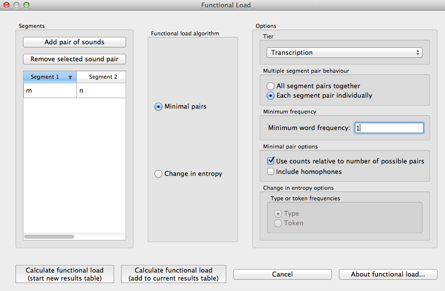

.. _functional_load:

***************
Functional Load
***************

.. _about_functional_load:

About the function
------------------

Functional load is a measure of the “work” that any particular contrast
does in a language, as compared to other contrasts (e.g., [Hockett1955]_,
[Hockett1966]_; [Kucera1963]_; [King1967]_; [Surendran2003]_). Two contrasts
in a language, such as [d] / [t] vs. [ð] / [θ] in English, may have very
different functional loads. The difference between [d] and [t] is used to
distinguish between many different lexical items, so it has a high
functional load; there are, on the other hand, very few lexical items
that hinge on the distinction between [ð] and [θ], so its functional
load is much lower. One of the primary claims about functional load is
that it is related to sounds’ propensity to merge over time, with pairs
of sounds that have higher functional loads being less likely to merge
than pairs of sounds with lower functional loads (e.g., [Wedel2013]_, [Todd2012]_).
The average functional load of a particular sound has also been claimed to
affect its likelihood of being used as an epenthetic vowel [Hume2013]_.
Functional load has also been illustrated to affect the perceived
similarity of sounds [Hall2014a]_.

.. _method_functional_load:

Method of calculation
---------------------

There are two primary ways of calculating functional load that are
provided as part of the PCT package. One is based on the change of
entropy in a system upon merger of a segment pair or set of segment
pairs (cf. [Surendran2003]_); the other is based on simply
counting up the number of minimal pairs (differing in only the target
segment pair or pairs) that occur in the corpus.

.. _method_change_entropy:

Change in entropy
`````````````````

The calculation based on change in entropy is described in detail in
[Surendran2003]_. Entropy is an Information-Theoretic measure of the
amount of uncertainty in a system [Shannon1949]_, and is
calculated using the formula in (1); it will also be used for the
calculation of predictability of distribution (see :ref:`method_pred_dist`). For every
symbol *i* in some inventory (e.g., every phoneme in the phoneme inventory,
or every word in the lexicon), one multiplies the probability of *i* by
the :math:`log_{2}` of the probability of *i*; the entropy is the sum of the products
for all symbols in the inventory.

Entropy:

:math:`H = -\sum_{i \in N} p_{i} * log_{2}(p_{i})`

The functional load of any pair of sounds in the system, then, can be
calculated by first calculating the entropy of the system at some level
of structure (e.g., words, syllables) with all sounds included, then
merging the pair of sounds in question and re-calculating the entropy
of the new system. That is, the functional load is the amount of
uncertainty (entropy) that is lost by the merger. If the pair has a
functional load of 0, then nothing has changed when the two are merged,
and :math:`H_{1}` will equal :math:`H_{2}`. If the pair has a non-zero functional load, then
the total inventory has become smaller through the conflating of pairs
of symbols that were distinguished only through the given pair of sounds.

Functional load as change in entropy:

:math:`\Delta H = H_{1} - H_{2}`

Consider a toy example, in which the following corpus is assumed (note
that, generally speaking, there is no “type frequency” column in a PCT
corpus, as it is assumed that each row in the corpus represents 1 type;
it is included here for clarity):

Consider a toy example, in which the following corpus is assumed
(note that, generally speaking, there is no “type frequency” column
in a PCT corpus, as it is assumed that each row in the corpus represents
1 type; it is included here for clarity):

+--------+-----------------------+
|        |        Original       |
|        +--------+------+-------+
|  Word  | Trans. | Type | Token |
|        |        | Freq.| Freq. |
+========+========+======+=======+
|  hot   |  [hɑt] |    1 |     2 |
+--------+--------+------+-------+
|  song  |  [sɑŋ] |    1 |     4 |
+--------+--------+------+-------+
|  hat   |  [hæt] |    1 |     1 |
+--------+--------+------+-------+
|  sing  |  [sɪŋ] |    1 |     6 |
+--------+--------+------+-------+
|  tot   |  [tɑt] |    1 |     3 |
+--------+--------+------+-------+
|  dot   |  [dɑt] |    1 |     5 |
+--------+--------+------+-------+
|  hip   |  [hɪp] |    1 |     2 |
+--------+--------+------+-------+
|  hid   |  [hɪd] |    1 |     7 |
+--------+--------+------+-------+
|  team  |  [tim] |    1 |     5 |
+--------+--------+------+-------+
|  deem  |  [dim] |    1 |     5 |
+--------+--------+------+-------+
|  toot  |  [tut] |    1 |     9 |
+--------+--------+------+-------+
|  dude  |  [dud] |    1 |     2 |
+--------+--------+------+-------+
|  hiss  |  [hɪs] |    1 |     3 |
+--------+--------+------+-------+
|  his   |  [hɪz] |    1 |     5 |
+--------+--------+------+-------+
| sizzle | [sɪzəl]|    1 |     4 |
+--------+--------+------+-------+
| dizzy  |  [dɪzi]|    1 |     3 |
+--------+--------+------+-------+
| tizzy  |  [tɪzi]|    1 |     4 |
+--------+--------+------+-------+
|      Total      |   17 |    70 |
+-----------------+------+-------+

The starting entropy, assuming word types as the relative unit of
structure and counting, is:

:math:`H_{1 - types} = -[(\frac{1}{17} log_{2}(\frac{1}{17}))
+ (\frac{1}{17} log_{2}(\frac{1}{17})) + (\frac{1}{17} log_{2}(\frac{1}{17}))
+ (\frac{1}{17} log_{2}(\frac{1}{17})) + (\frac{1}{17} log_{2}(\frac{1}{17}))\\
+ (\frac{1}{17} log_{2}(\frac{1}{17})) + (\frac{1}{17} log_{2}(\frac{1}{17}))
+ (\frac{1}{17} log_{2}(\frac{1}{17})) + (\frac{1}{17} log_{2}(\frac{1}{17}))
+ (\frac{1}{17} log_{2}(\frac{1}{17})) + (\frac{1}{17} log_{2}(\frac{1}{17}))\\
+ (\frac{1}{17} log_{2}(\frac{1}{17})) + (\frac{1}{17} log_{2}(\frac{1}{17}))
+ (\frac{1}{17} log_{2}(\frac{1}{17})) + (\frac{1}{17} log_{2}(\frac{1}{17}))
+ (\frac{1}{17} log_{2}(\frac{1}{17})) + (\frac{1}{17} log_{2}(\frac{1}{17}))]
=4.087`

The starting entropy, assuming word tokens, is:

:math:`H_{1 - tokens} = -[(\frac{2}{70} log_{2}(\frac{2}{70}))
+ (\frac{4}{70} log_{2}(\frac{4}{70})) + (\frac{1}{70} log_{2}(\frac{1}{70}))
+ (\frac{6}{70} log_{2}(\frac{6}{70})) + (\frac{3}{70} log_{2}(\frac{3}{70}))\\
+ (\frac{5}{70} log_{2}(\frac{5}{70})) + (\frac{2}{70} log_{2}(\frac{2}{70}))
+ (\frac{7}{70} log_{2}(\frac{7}{70})) + (\frac{5}{70} log_{2}(\frac{5}{70}))
+ (\frac{5}{70} log_{2}(\frac{5}{70})) + (\frac{9}{70} log_{2}(\frac{9}{70}))\\
+ (\frac{2}{70} log_{2}(\frac{2}{70})) + (\frac{3}{70} log_{2}(\frac{3}{70}))
+ (\frac{5}{70} log_{2}(\frac{5}{70})) + (\frac{4}{70} log_{2}(\frac{4}{70}))
+ (\frac{3}{70} log_{2}(\frac{3}{70})) + (\frac{4}{70} log_{2}(\frac{4}{70}))]
= 3.924`


+--------+-----------------------+
|        | Under [h] / [ŋ] merger|
|        +--------+------+-------+
|  Word  | Trans. | Type | Token |
|        |        | Freq.| Freq. |
+========+========+======+=======+
|  hot   |  [Xɑt] |    1 |     2 |
+--------+--------+------+-------+
|  song  |  [sɑX] |    1 |     4 |
+--------+--------+------+-------+
|  hat   |  [Xæt] |    1 |     1 |
+--------+--------+------+-------+
|  sing  |  [sɪX] |    1 |     6 |
+--------+--------+------+-------+
|  tot   |  [tɑt] |    1 |     3 |
+--------+--------+------+-------+
|  dot   |  [dɑt] |    1 |     5 |
+--------+--------+------+-------+
|  hip   |  [Xɪp] |    1 |     2 |
+--------+--------+------+-------+
|  hid   |  [Xɪd] |    1 |     7 |
+--------+--------+------+-------+
|  team  |  [tim] |    1 |     5 |
+--------+--------+------+-------+
|  deem  |  [dim] |    1 |     5 |
+--------+--------+------+-------+
|  toot  |  [tut] |    1 |     9 |
+--------+--------+------+-------+
|  dude  |  [dud] |    1 |     2 |
+--------+--------+------+-------+
|  hiss  |  [Xɪs] |    1 |     3 |
+--------+--------+------+-------+
|  his   |  [Xɪz] |    1 |     5 |
+--------+--------+------+-------+
| sizzle | [sɪzəl]|    1 |     4 |
+--------+--------+------+-------+
| dizzy  |  [dɪzi]|    1 |     3 |
+--------+--------+------+-------+
| tizzy  |  [tɪzi]|    1 |     4 |
+--------+--------+------+-------+
|      Total      |   17 |    70 |
+-----------------+------+-------+

Upon merger of [h] and [ŋ], there is no change in the number of unique words;
there are still 17 unique words with all their same token frequencies.
Thus, the entropy after an [h] / [ŋ] merger will be the same as it was
before the merger. The functional load, then would be 0, as the pre-merger
and post-merger entropies are identical.

+-----------+-----------------------+
|           | Under [t] / [d] merger|
|           +--------+------+-------+
|  Word     | Trans. | Type | Token |
|           |        | Freq.| Freq. |
+===========+========+======+=======+
|  hot      |  [hɑX] |    1 |     2 |
+-----------+--------+------+-------+
|  song     |  [sɑŋ] |    1 |     4 |
+-----------+--------+------+-------+
|  hat      |  [hæX] |    1 |     1 |
+-----------+--------+------+-------+
|  sing     |  [sɪŋ] |    1 |     6 |
+-----------+--------+------+-------+
|tot/dot    |  [XɑX] |    1 |     8 |
+-----------+--------+------+-------+
|  hip      |  [hɪp] |    1 |     2 |
+-----------+--------+------+-------+
|  hid      |  [hɪX] |    1 |     7 |
+-----------+--------+------+-------+
|team/deem  |  [Xim] |    1 |    10 |
+-----------+--------+------+-------+
|toot/dude  |  [XuX] |    1 |    11 |
+-----------+--------+------+-------+
|  hiss     |  [hɪs] |    1 |     3 |
+-----------+--------+------+-------+
|  his      |  [hɪz] |    1 |     5 |
+-----------+--------+------+-------+
| sizzle    | [sɪzəl]|    1 |     4 |
+-----------+--------+------+-------+
|dizzy/tizzy|  [Xɪzi]|    1 |     7 |
+-----------+--------+------+-------+
|      Total         |   13 |    70 |
+--------------------+------+-------+

Upon merger of [t] and [d], on the other hand, four pairs of words have
been collapsed. E.g., the difference between *team* and *deem* no longer
exists; there is now just one word, [Xim], where [X] represents the
result of the merger. Thus, there are only 13 unique words, and while
the total token frequency count remains the same, at 70, those 70 occurrences
are divided among only 13 unique words instead of 17.

Thus, the entropy after a [t] / [d] merger, assuming word types, is:

:math:`H_{1 - types} = -[(\frac{1}{13} log_{2}(\frac{1}{13}))
+ (\frac{1}{13} log_{2}(\frac{1}{13})) + (\frac{1}{13} log_{2}(\frac{1}{13}))
+ (\frac{1}{13} log_{2}(\frac{1}{13})) + (\frac{1}{13} log_{2}(\frac{1}{13}))\\
+ (\frac{1}{13} log_{2}(\frac{1}{13})) + (\frac{1}{13} log_{2}(\frac{1}{13}))
+ (\frac{1}{13} log_{2}(\frac{1}{13})) + (\frac{1}{13} log_{2}(\frac{1}{13}))
+ (\frac{1}{13} log_{2}(\frac{1}{13})) + (\frac{1}{13} log_{2}(\frac{1}{13}))\\
+ (\frac{1}{13} log_{2}(\frac{1}{13})) + (\frac{1}{13} log_{2}(\frac{1}{13}))]
= 3.700`

And the entropy after a [t] / [d] merger, assuming word tokens, is:

:math:`H_{1 - tokens} = -[(\frac{2}{70} log_{2}(\frac{2}{70}))
+ (\frac{4}{70} log_{2}(\frac{4}{70})) + (\frac{1}{70} log_{2}(\frac{1}{70}))
+ (\frac{6}{70} log_{2}(\frac{6}{70})) + (\frac{8}{70} log_{2}(\frac{8}{70}))\\
+ (\frac{2}{70} log_{2}(\frac{2}{70})) + (\frac{7}{70} log_{2}(\frac{7}{70}))
+ (\frac{10}{70} log_{2}(\frac{10}{70})) + (\frac{11}{70} log_{2}(\frac{11}{70}))
+ (\frac{3}{70} log_{2}(\frac{3}{70})) + (\frac{5}{70} log_{2}(\frac{5}{70}))\\
+ (\frac{4}{70} log_{2}(\frac{4}{70})) + (\frac{7}{70} log_{2}(\frac{7}{70}))]
= 3.466`


:math:`\Delta H = H_{1-types} - H_{2-types} = 4.087– 3.700 = 0.387`

And the functional load of [t] / [d] based on word tokens is:

:math:`\Delta H = H_{1-tokens} - H_{2-tokens} = 3.924– 3.466 = 0.458`

.. _method_change_minimal_pairs:

(Relative) Minimal Pair Counts
``````````````````````````````

The second means of calculating functional load that is included in PCT
is a straight count of minimal pairs, which can be relativized to the
number of words in the corpus that are potential minimal pairs—i.e. the
number of words in the corpus with at least one of the target segments.

In the above example, the number of minimal pairs that hinge on [h] vs.
[ŋ] is of course 0, so the functional load of [h] / [ŋ] is 0. The number
of minimal pairs that hinge on [t] / [d] is 3, and the number of words
with either [t] or [d] is 11; the functional load as a relativized minimal
pair count would therefore be 3/11 = 0.273. Note that here, a relatively
loose definition of minimal pair is used; specifically, two words are
considered to be a minimal pair hinging on sounds A and B if, upon merger
of A and B into a single symbol X, the words are identical. Thus, *toot* and
*dude* are considered a minimal pair on this definition, because they both
become [XuX] upon merger of [t] and [d].

The resulting calculations of functional load are thus quite similar
between the two measures, but the units are entirely different.
Functional load based on change in entropy is measured in *bits*,
while functional load based on relativized minimal pair counts is
simply a percentage. Also note that functional load based on minimal
pairs is only based on type frequency; the frequency of the usage of
the words is not used as a weighting factor, the way it can be under
the calculation of functional load as change in entropy.

.. _functional_load_gui:

Implementing the functional load function in the GUI
----------------------------------------------------

As with most analysis functions, a corpus must first be loaded (see :ref:`loading_corpora`).
Once a corpus is loaded, use the following steps.

1. **Getting started**: Choose “Analysis” / “Calculate functional load...”
   from the top menu bar.
2. **Sound selection**: First, select which two sounds you want the functional
   load to be calculated for. Do this by clicking on “Add pair of sounds”;
   the “Select segment pair” dialogue box will open. The segment choices that
   are available will automatically correspond to all of the unique
   transcribed characters in your corpus. The order of the sounds is
   irrelevant; picking [i] first and [u] second will yield the same
   results as picking [u] first and [i] second. Once a pair of sounds
   has been selected, click “Add.” They will appear in the “Functional
   load” dialogue box. Multiple pairs of sounds can be selected and
   added to the list for calculation simultaneously. To do this without
   going back to the “Functional Load” dialogue box first, click “Add
   and create another.” When multiple pairs are selected, they can be
   treated in two different ways, listed under “Options” on the right-hand
   side of the “Functional Load” dialogue box under “Multiple segment
   pair behaviour”:

   a. **All segment pairs together**: This option allows for the calculation
      of the functional load of featural contrasts. E.g., if the pairs [e]/[i]
      and [o]/[u] are chosen, PCT will  calculate the functional load from
      both pairs at the same time. This option is useful for investigating
      the functional load of featural contrasts: e.g., if the above pairs
      are the ONLY pairs of sounds in the corpus that differ by exactly the
      single feature [high], then this option will allow you to calculate
      the functional load of the [high] contrast. Note that the results
      table will list “[e], [o]” as “sound 1” and “[i], [u]” as “sound 2”
      in this scenario, to remind you that you are getting a single functional
      load value. Note too that this does not collapse all four sounds to a
      single sound (which would erroneously also neutralize [e]/[o], [e]/[u],
      [i]/[o], [i]/[u]), but rather collapses each pair of segments and only
      then checks for any minimal pairs or drop in entropy.
   b. **Each segment pair individually**: This option cycles through the list
      of pairs and gives the functional load of each pair individually
      from the corpus. E.g., if the pairs [e]/[i] and [o]/[u] are chosen,
      you will get results showing first the functional load of [e]/[i]
      in the corpus and then the functional load of [o]/[u] in the corpus,
      independently.

3. **Functional load algorithm**: Select which of the two methods of calculation
   you want to use—i.e., minimal pairs or change in entropy.
   (See discussion above for details of each.)
4. **Tier**: Select which tier the functional load should be calculated from.
   The default is the “transcription” tier, i.e., looking at the entire
   word transcriptions. If another tier has been created (see :ref:`create_tiers`),
   functional load can be calculated on the basis of that tier. For example,
   if a vowel tier has been created, then “minimal pairs” will be entries
   that are identical except for one entry in the vowels only, entirely
   independently of consonants. Thus, the words [mapotik] and [ʃɹaɡefli]
   would be treated as a minimal pair, given that their vowel-tier
   representations are [aoi] and [aei].
5. **Minimum frequency**: It is possible to set a minimum token frequency
   for words in the corpus in order to be included in the calculation.
   This allows easy exclusion of rare words; for example, if one were
   calculating the functional load of [s] vs. [ʃ] in English and didn’t
   set a minimum frequency, words such as *santy* (vs. *shanty*) might be
   included, which might not be a particularly accurate reflection of
   the phonological knowledge of speakers. To include all words in the
   corpus, regardless of their token frequency, set the the minimum frequency to 0.
6. **Additional parameters for minimal pairs**: If minimal pairs serve as the
   means of calculation, there are two additional parameters can be set.

   a. **Raw vs. relative count**: First, PCT can report only the raw count of
      minimal pairs that hinge on the contrast in the corpus, if you just
      want to know the scope of the contrast. On the other hand, the
      default is to relativize the raw count to the corpus size, by
      dividing the raw number by the number of lexical entries that
      include at least one instance of any of the target segments.
   b. **Include vs. ignore homophones**: Second, PCT can either include
      homophones or ignore them. For example, if the corpus includes
      separate entries for the words *sock* (n.), *sock* (v.), *shock* (n.),
      and *shock* (v.), this would count as four minimal pairs if homophones
      are included, but only one if homophones are ignored. The default is
      to ignore homophones.

7. **Additional parameters for change in entropy**: If you are calculating
   functional load using change in entropy, one additional parameter can be set.

   a. **Type or token frequency**: As described in :ref:`method_change_entropy`, entropy can be
      calculated using either type or token frequencies. This option
      determines which to use.

Here is an example of selecting [m] and [n], with functional load to be
calculated on the basis of minimal pairs, only including words with a
token frequency of at least 1, from the built-in example corpus:



8. Results table: Once all parameters have been set, click one of the two
   “Calculate functional load” buttons. If this is the first calculation,
   the option to “start new results table” should be selected. For subsequent
   calculations, the calculation can be added to the already started table,
   for direct comparison, or a new table can be started. [Note that if a
   table is closed, new calculations will not be added to the previously
   open table; a new table must be started.] Either way, the results table
   will have the following columns, with one row per calculation: segment 1,
   segment 2, which tier was used, which measurement method was selected,
   the resulting functional load, what the minimum frequency was, and for
   calculations using minimal pairs, whether the count is absolute or
   relative and whether homophones were ignored or not. (For calculations
   using change in entropy, “N/A” values are entered into the latter two columns.)
9. Saving results: Once a results table has been generated for at least
   one pair, the table can be saved by clicking on “Save to file” at the
   bottom of the table to open a system dialogue box and save the results
   at a user-designated location.

.. image:: static/funtionalloadresults.png
   :width: 90%
   :align: center

(Note that in the above screen shot, not all columns are visible;
they are visible only by scrolling over to the right, due to constraints
on the window size. All columns would be saved to the results file.)

To return to the function dialogue box with your most recently used
selections, click on “Reopen function dialog.” Otherwise, the results
table can be closed and you will be returned to your corpus view.

.. _functional_load_cli:

Implementing the functional load function on the command line
-------------------------------------------------------------

In order to perform this analysis on the command line, you must enter
a command in the following format into your Terminal::

   pct_funcload CORPUSFILE ARG2

...where CORPUSFILE is the name of your \*.corpus file and ARG2 is either
the transcription character(s) of a single segment (if calculating relative
functional load) or the name of your segment pair(s) file (if calculating a
single functional load value). The segment pairs file must list the pairs
of segments whose functional load you wish to calculate, with each pair
separated by a tab (\t) and one pair on each line. You may also use
command line options to change various parameters of your functional
load calculations. Descriptions of these arguments can be viewed by
running ``pct_funcload –h`` or ``pct_funcload --help``. The help text from
this command is copied below, augmented with specifications of default values:

Positional arguments:

.. cmdoption:: corpus_file_name

   Name of corpus file

Mandatory argument group (call must have one of these two):

.. cmdoption:: -p PAIRS_FILE_NAME_OR_SEGMENT
               --pairs_file_name_or_segment PAIRS_FILE_NAME_OR_SEGMENT

   Name of file with segment pairs (or target segment if relative fl is True)

.. cmdoption:: -l
               --all_pairwise_fls

   Flag: calculate FL for all pairs of segments

Optional arguments:

.. cmdoption:: -h
               --help

   Show help message and exit

.. cmdoption:: -a ALGORITHM
               --algorithm ALGORITHM

   Algorithm to use for calculating functional load:
   "minpair" for minimal pair count or "deltah" for change in entropy.
   Defaults to minpair.

.. cmdoption:: -f FREQUENCY_CUTOFF
               --frequency_cutoff FREQUENCY_CUTOFF

   Minimum frequency of words to consider as possible minimal pairs or
   contributing to lexicon entropy.

.. cmdoption:: -d DISTINGUISH_HOMOPHONES
               --distinguish_homophones DISTINGUISH_HOMOPHONES

   For minimal pair FL: if False, then you'll count sock~shock
   (sock=clothing) and sock~shock (sock=punch) as just one minimal
   pair; but if True, you'll overcount alternative spellings of the
   same word, e.g. axel~actual and axle~actual. False is the value
   used by Wedel et al.

.. cmdoption:: -t TYPE_OR_TOKEN
               --type_or_token TYPE_OR_TOKEN

   For change in entropy FL: specifies whether entropy is based on type
   or token frequency.

.. cmdoption:: -e RELATIVE_FL
               --relative_fl RELATIVE_FL

   If True, calculate the relative FL of a single segment by averaging
   across the functional loads of it and all other segments.

.. cmdoption:: -s SEQUENCE_TYPE
               --sequence_type SEQUENCE_TYPE

   The attribute of Words to calculate FL over. Normally this will be
   the transcription, but it can also be the spelling or a user-specified tier.

.. cmdoption:: -o OUTFILE
               --outfile OUTFILE

   Name of output file

EXAMPLE 1: If your corpus file is example.corpus and you want to
calculate the minimal pair functional load of the segments [m] and [n]
using defaults for all optional arguments, you first need to create a
text file that contains the text “m\tn” (where \t is a tab; no quotes
in the file). Let us call this file pairs.txt. You would then run the
following command in your terminal window::

   pct_funcload example.corpus -p pairs.txt

EXAMPLE 2: Suppose you want to calculate the relative (average) functional
load of the segment [m]. Your corpus file is again example.corpus. You
want to use the change in entropy measure of functional load rather than
the minimal pairs measure, and you also want to use type frequency
instead of (the default value of) token frequency. In addition, you want
the script to produce an output file called output.txt.  You would need
to run the following command::

   pct_funcload example.corpus -p m -a deltah -t type -o output.txt

EXAMPLE 3: Suppose you want to calculate the functional
loads of all segment pairs. Your corpus file is again example.corpus.
All other parameters are set to defaults. In addition, you want
the script to produce an output file called output.txt.  You would need
to run the following command::

   pct_funcload example.corpus -l -o output.txt x

.. _functional_load_api:

API reference
-------------
test
.. automodule:: corpustools.funcload.functional_load
   :members:
