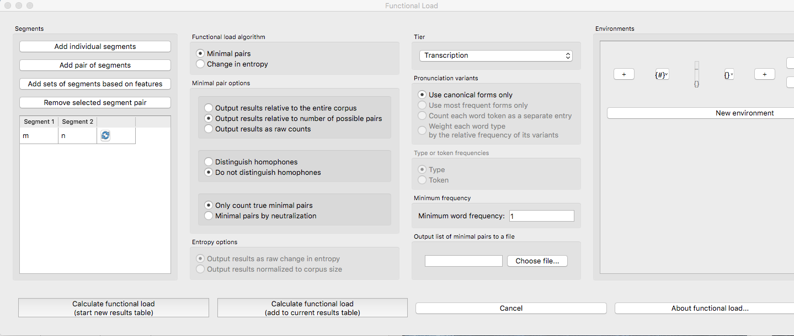

.. _functional_load:

***************
Functional Load
***************

.. _about_functional_load:

About the function
------------------

Functional load is a measure of the “work” that any particular contrast
does in a language, as compared to other contrasts (e.g., [Hockett1955]_,
[Hockett1966]_; [Kucera1963]_; [King1967]_; [Surendran2003]_). Two contrasts
in a language, such as [d] / [t] vs. [ð] / [θ] in English, may have very
different functional loads. The difference between [d] and [t] is used to
distinguish between many different lexical items, so it has a high
functional load; there are, on the other hand, very few lexical items
that hinge on the distinction between [ð] and [θ], so its functional
load is much lower. One of the primary claims about functional load is
that it is related to sounds’ propensity to merge over time, with pairs
of sounds that have higher functional loads being less likely to merge
than pairs of sounds with lower functional loads (e.g., [Wedel2013]_, [Todd2012]_).
The average functional load of a particular sound has also been claimed to
affect its likelihood of being used as an epenthetic vowel [Hume2013]_.
Functional load has also been illustrated to affect the perceived
similarity of sounds [Hall2014a]_.

.. _method_functional_load:

Method of calculation
---------------------

There are two primary ways of calculating functional load that are
provided as part of the PCT package. One is based on the change of
entropy in a system upon merger of a segment pair or set of segment
pairs (cf. [Surendran2003]_); the other is based on simply
counting up the number of minimal pairs (differing in only the target
segment pair or pairs) that occur in the corpus.

.. _method_change_entropy:

Change in entropy
`````````````````

The calculation based on change in entropy is described in detail in
[Surendran2003]_. Entropy is an Information-Theoretic measure of the
amount of uncertainty in a system [Shannon1949]_, and is
calculated using the formula in (1); it will also be used for the
calculation of predictability of distribution (see :ref:`method_pred_dist`). For every
symbol *i* in some inventory (e.g., every phoneme in the phoneme inventory,
or every word in the lexicon), one multiplies the probability of *i* by
the :math:`log_{2}` of the probability of *i*; the entropy is the sum of the products
for all symbols in the inventory.

Entropy:

:math:`H = -\sum_{i \in N} p_{i} * log_{2}(p_{i})`

The functional load of any pair of sounds in the system, then, can be
calculated by first calculating the entropy of the system at some level
of structure (e.g., words, syllables) with all sounds included, then
merging the pair of sounds in question and re-calculating the entropy
of the new system. That is, the functional load is the amount of
uncertainty (entropy) that is lost by the merger. If the pair has a
functional load of 0, then nothing has changed when the two are merged,
and :math:`H_{1}` will equal :math:`H_{2}`. If the pair has a non-zero functional load, then
the total inventory has become smaller through the conflating of pairs
of symbols that were distinguished only through the given pair of sounds.

Functional load as change in entropy:

:math:`\Delta H = H_{1} - H_{2}`

Consider a toy example, in which the following corpus is assumed (note
that, generally speaking, there is no “type frequency” column in a PCT
corpus, as it is assumed that each row in the corpus represents 1 type;
it is included here for clarity):

Consider a toy example, in which the following corpus is assumed
(note that, generally speaking, there is no “type frequency” column
in a PCT corpus, as it is assumed that each row in the corpus represents
1 type; it is included here for clarity):

+--------+-----------------------+-----------------------+-----------------------+
|        |        Original       | Under [h] / [ŋ] merger| Under [t] / [d] merger|
|        +--------+------+-------+--------+------+-------+--------+------+-------+
|  Word  | Trans. | Type | Token | Trans. | Type | Token | Trans. | Type | Token |
|        |        | Freq.| Freq. |        | Freq.| Freq. |        | Freq.| Freq. |
+========+========+======+=======+========+======+=======+========+======+=======+
|  hot   |  [hɑt] |    1 |     2 |  [Xɑt] |    1 |     2 |  [hɑX] |    1 |     2 |
+--------+--------+------+-------+--------+------+-------+--------+------+-------+
|  song  |  [sɑŋ] |    1 |     4 |  [sɑX] |    1 |     4 |  [sɑŋ] |    1 |     4 |
+--------+--------+------+-------+--------+------+-------+--------+------+-------+
|  hat   |  [hæt] |    1 |     1 |  [Xæt] |    1 |     1 |  [hæX] |    1 |     1 |
+--------+--------+------+-------+--------+------+-------+--------+------+-------+
|  sing  |  [sɪŋ] |    1 |     6 |  [sɪX] |    1 |     6 |  [sɪŋ] |    1 |     6 |
+--------+--------+------+-------+--------+------+-------+--------+------+-------+
|  tot   |  [tɑt] |    1 |     3 |  [tɑt] |    1 |     3 |  [XɑX] |      |       |
+--------+--------+------+-------+--------+------+-------+--------+    1 |     8 |
|  dot   |  [dɑt] |    1 |     5 |  [dɑt] |    1 |     5 |  [XɑX] |      |       |
+--------+--------+------+-------+--------+------+-------+--------+------+-------+
|  hip   |  [hɪp] |    1 |     2 |  [Xɪp] |    1 |     2 |  [hɪp] |    1 |     2 |
+--------+--------+------+-------+--------+------+-------+--------+------+-------+
|  hid   |  [hɪd] |    1 |     7 |  [Xɪd] |    1 |     7 |  [hɪX] |    1 |     7 |
+--------+--------+------+-------+--------+------+-------+--------+------+-------+
|  team  |  [tim] |    1 |     5 |  [tim] |    1 |     5 |  [Xim] |      |       |
+--------+--------+------+-------+--------+------+-------+--------+    1 |    10 |
|  deem  |  [dim] |    1 |     5 |  [dim] |    1 |     5 |  [Xim] |      |       |
+--------+--------+------+-------+--------+------+-------+--------+------+-------+
|  toot  |  [tut] |    1 |     9 |  [tut] |    1 |     9 |  [XuX] |      |       |
+--------+--------+------+-------+--------+------+-------+--------+    1 |    11 |
|  dude  |  [dud] |    1 |     2 |  [dud] |    1 |     2 |  [XuX] |      |       |
+--------+--------+------+-------+--------+------+-------+--------+------+-------+
|  hiss  |  [hɪs] |    1 |     3 |  [Xɪs] |    1 |     3 |  [hɪs] |    1 |     3 |
+--------+--------+------+-------+--------+------+-------+--------+------+-------+
|  his   |  [hɪz] |    1 |     5 |  [Xɪz] |    1 |     5 |  [hɪz] |    1 |     5 |
+--------+--------+------+-------+--------+------+-------+--------+------+-------+
| sizzle | [sɪzəl]|    1 |     4 | [sɪzəl]|    1 |     4 | [sɪzəl]|    1 |     4 |
+--------+--------+------+-------+--------+------+-------+--------+------+-------+
| dizzy  |  [dɪzi]|    1 |     3 |  [dɪzi]|    1 |     3 |  [Xɪzi]|      |       |
+--------+--------+------+-------+--------+------+-------+--------+    1 |     7 |
| tizzy  |  [tɪzi]|    1 |     4 |  [tɪzi]|    1 |     4 |  [Xɪzi]|      |       |
+--------+--------+------+-------+--------+------+-------+--------+------+-------+
|      Total      |   17 |    70 |        |   17 |    70 |        |   13 |    70 |
+--------+--------+------+-------+--------+------+-------+--------+------+-------+

The starting entropy, assuming word types as the relative unit of
structure and counting, is:

:math:`H_{1 - types} = -[(\frac{1}{17} log_{2}(\frac{1}{17}))
+ (\frac{1}{17} log_{2}(\frac{1}{17})) + (\frac{1}{17} log_{2}(\frac{1}{17}))
+ (\frac{1}{17} log_{2}(\frac{1}{17})) + (\frac{1}{17} log_{2}(\frac{1}{17}))\\
+ (\frac{1}{17} log_{2}(\frac{1}{17})) + (\frac{1}{17} log_{2}(\frac{1}{17}))
+ (\frac{1}{17} log_{2}(\frac{1}{17})) + (\frac{1}{17} log_{2}(\frac{1}{17}))
+ (\frac{1}{17} log_{2}(\frac{1}{17})) + (\frac{1}{17} log_{2}(\frac{1}{17}))\\
+ (\frac{1}{17} log_{2}(\frac{1}{17})) + (\frac{1}{17} log_{2}(\frac{1}{17}))
+ (\frac{1}{17} log_{2}(\frac{1}{17})) + (\frac{1}{17} log_{2}(\frac{1}{17}))
+ (\frac{1}{17} log_{2}(\frac{1}{17})) + (\frac{1}{17} log_{2}(\frac{1}{17}))]
=4.087`

The starting entropy, assuming word tokens, is:

:math:`H_{1 - tokens} = -[(\frac{2}{70} log_{2}(\frac{2}{70}))
+ (\frac{4}{70} log_{2}(\frac{4}{70})) + (\frac{1}{70} log_{2}(\frac{1}{70}))
+ (\frac{6}{70} log_{2}(\frac{6}{70})) + (\frac{3}{70} log_{2}(\frac{3}{70}))\\
+ (\frac{5}{70} log_{2}(\frac{5}{70})) + (\frac{2}{70} log_{2}(\frac{2}{70}))
+ (\frac{7}{70} log_{2}(\frac{7}{70})) + (\frac{5}{70} log_{2}(\frac{5}{70}))
+ (\frac{5}{70} log_{2}(\frac{5}{70})) + (\frac{9}{70} log_{2}(\frac{9}{70}))\\
+ (\frac{2}{70} log_{2}(\frac{2}{70})) + (\frac{3}{70} log_{2}(\frac{3}{70}))
+ (\frac{5}{70} log_{2}(\frac{5}{70})) + (\frac{4}{70} log_{2}(\frac{4}{70}))
+ (\frac{3}{70} log_{2}(\frac{3}{70})) + (\frac{4}{70} log_{2}(\frac{4}{70}))]
= 3.924`

Upon merger of [h] and [ŋ], there is no change in the number of unique words;
there are still 17 unique words with all their same token frequencies.
Thus, the entropy after an [h] / [ŋ] merger will be the same as it was
before the merger. The functional load, then would be 0, as the pre-merger
and post-merger entropies are identical.

Upon merger of [t] and [d], on the other hand, four pairs of words have
been collapsed. E.g., the difference between *team* and *deem* no longer
exists; there is now just one word, [Xim], where [X] represents the
result of the merger. Thus, there are only 13 unique words, and while
the total token frequency count remains the same, at 70, those 70 occurrences
are divided among only 13 unique words instead of 17.

Thus, the entropy after a [t] / [d] merger, assuming word types, is:

:math:`H_{2 - types} = -[(\frac{1}{13} log_{2}(\frac{1}{13}))
+ (\frac{1}{13} log_{2}(\frac{1}{13})) + (\frac{1}{13} log_{2}(\frac{1}{13}))
+ (\frac{1}{13} log_{2}(\frac{1}{13})) + (\frac{1}{13} log_{2}(\frac{1}{13}))\\
+ (\frac{1}{13} log_{2}(\frac{1}{13})) + (\frac{1}{13} log_{2}(\frac{1}{13}))
+ (\frac{1}{13} log_{2}(\frac{1}{13})) + (\frac{1}{13} log_{2}(\frac{1}{13}))
+ (\frac{1}{13} log_{2}(\frac{1}{13})) + (\frac{1}{13} log_{2}(\frac{1}{13}))\\
+ (\frac{1}{13} log_{2}(\frac{1}{13})) + (\frac{1}{13} log_{2}(\frac{1}{13}))]
= 3.700`

And the entropy after a [t] / [d] merger, assuming word tokens, is:

:math:`H_{2 - tokens} = -[(\frac{2}{70} log_{2}(\frac{2}{70}))
+ (\frac{4}{70} log_{2}(\frac{4}{70})) + (\frac{1}{70} log_{2}(\frac{1}{70}))
+ (\frac{6}{70} log_{2}(\frac{6}{70})) + (\frac{8}{70} log_{2}(\frac{8}{70}))\\
+ (\frac{2}{70} log_{2}(\frac{2}{70})) + (\frac{7}{70} log_{2}(\frac{7}{70}))
+ (\frac{10}{70} log_{2}(\frac{10}{70})) + (\frac{11}{70} log_{2}(\frac{11}{70}))
+ (\frac{3}{70} log_{2}(\frac{3}{70})) + (\frac{5}{70} log_{2}(\frac{5}{70}))\\
+ (\frac{4}{70} log_{2}(\frac{4}{70})) + (\frac{7}{70} log_{2}(\frac{7}{70}))]
= 3.466`

Then, the functional load of [t] / [d] based on word types is:

:math:`\Delta H = H_{1-types} - H_{2-types} = 4.087– 3.700 = 0.387`

And the functional load of [t] / [d] based on word tokens is:

:math:`\Delta H = H_{1-tokens} - H_{2-tokens} = 3.924– 3.466 = 0.458`

Rather than taking the difference directly, however, [Surendran2003]_ normalizes the difference by dividing it by the entropy of the corpus before the merger. PCT defaults to normalizing the difference, but you can choose not to normalize, and just return the difference in entropies as given above.

Returning to the above examples, we would normalize the functional load of [t] / [d] based on word types by dividing the difference given above, 0.387, by the entropy pre-merger, 4.087, and see that the normalized version is:

:math:`\Delta H = 0.387 / 4.087 = 0.0947`

And analogously, for the normalized functional load of [t] / [d] based on word tokens, we get:

:math:`\Delta H = 0.458 / 3.924 = 0.1167`

Note that the typical way of calculating Delta-H functional load is to use word tokens, not word types.

.. _method_change_minimal_pairs:

(Relative) Minimal Pair Counts
``````````````````````````````

The second means of calculating functional load that is included in PCT
is a straight count of minimal pairs, which can be relativized either to the total number of words in the corpus, or to the
number of words in the corpus that are potential minimal pairs—i.e. the
number of words in the corpus with at least one of the target segments.

In the above example, the number of minimal pairs that hinge on [h] vs.
[ŋ] is of course 0, so the functional load of [h] / [ŋ] is 0. The number
of minimal pairs that hinge on [t] / [d] is 3, the total number of words in the corpus is 17, 
and the number of words with either [t] or [d] is 11. Thus, the raw minimal pair count 
would be 3; the minimal pair count relativized to the corpus length would be 3 / 17 = 0.176; 
and the minimal pair count relativized to the number of words containing [t] or [d] is 3 / 11 = 0.273. 
Note that here, a relatively loose definition of minimal pair is used; specifically, two words are
considered to be a minimal pair hinging on sounds A and B if, upon merger
of A and B into a single symbol X, the words are identical. Thus, *toot* and
*dude* are considered a minimal pair on this definition, because they both
become [XuX] upon merger of [t] and [d]. Also note that either version of the relativization
relies on dividing the number of PAIRS by the total number of relevant WORDS;
it is intended just to provide some relative measure, rather than to be straightforwardly
interpretable as, say, a percentage. 

The difference between the two relativizations is that relativizing to the corpus allows
for direct comparison between functional loads of different pairs in the same corpus as
well as the comparison of functional loads across corpora. Within a single
corpus, raw minimal pair counts can be directly compared, but a raw minimal pair count of 
5 would be indicative of a highly contrastive pair if there are only 15 words in the corpus,
while being indicative of a low-contrast pair in a corpus of 15000 words. Thus, relativizing
to the corpus size is useful for cross-corpus comparisons.

On the other hand, relativizing to the number of words containing the segments in question
is more informative about their own "relative" contrastiveness in comparison to their "potential"
for contrast, an issue discussed in [Martin2017]_. In particular, imagine that we have a toy corpus with 100 words. There are 
5 minimal pairs based on [m]/[n], and 5 minimal pairs based on [b]/[d]. These would be 
identical functional loads as far as either of the first two measures are concerned 
(i.e., raw counts, where the FLs would be 5 and 5, or counts relativized to corpus size,
where the FLs would be 5 / 100 = 0.05 and 0.05).

But, if there are 18 words in the corpus that contain either [m] or [n] (or both), and 80 words 
in the corpus that contain either [b] or [d] (or both), then the minimal pair 
counts relativized to the number of words with the relevant segments will differ widely. 
Now, the functional load of [m]/[n] would be 5 / 18 (=0.278), while that of [b]/[d] would be 5 / 80 (=0.0625), 
much lower. In other words, the [b]/[d] contrast is making much less use of its potential
for contrast than the [m]/[n] contrat.

A benefit of this approach is that it does take into account the relative frequency of the sounds in any given pair (see also [Martin2017]_). That is, for sounds that are less frequent overall, we would _expect_ there to be fewer minimal pairs, and by relativizing to only the number of words containing at least one of the two sounds in the pair, we capture that expectation: Intuitively, it makes sense that if [m] and [n] in the above example are so much less frequent than [b] and [d], then having five minimal pairs hinging on [m] and [n] is more surprising than having five minimal pairs hinging on [b] and [d], so we want to say that the [m] / [n] contrast does more work in distinguishing lexical items than does [b]/[d].

The problem with this approach is that it conflates "work done by distinguishing lexical items" with "predictability of distribution,"  which can be calculated separately in PCT (see :ref:`predictability_of_distribution`). That is, minimal pairs provide examples of environments that are unpredictable. So for the [m]/[n] case, what is happening is that the sounds are often in unpredictable contexts (i.e., minimal pairs) relative to their total distribution, while [b] and [d] are generally not in completely unpredictable contexts, though that happens occasionally (relative to their distribution). 

Thus, this way of measuring "functional load" (i.e., minimal pair counts relative to the number of words in the corpus containing the relevant segments) in fact conflates a measure of lexical distinction (the classic definition of functional load) and a measure of predictability of distribution. This can be seen in the following graph showing the correlation of predictability of distribution to minimal pair counts relativized to the number of words containing the relevant segments, for (some) pairs of obstruents in the [IPHOD]_ corpus (with a correlation coefficient of r = 0.75):

.. image:: static/prod_vs_rel_min_pairs.png
   :width: 90%
   :align: center

While functional load and predictability of distribution are correlated with each other regardless, the measure of functional load relative to the number of words containing the relevant segments is more highly correlated than the other measures of functional load. The two are generally correlated because pairs of sounds with a high functional load *must* provide many examples of the unpredictable environments, and so high functional load tends to be associated with a high entropy score (low degree of predictability of distribution). The converse, however, is not true. That is, pairs of sounds with a low functional load may have either a high or low predictability of distribution. They could have a low functional load because they are infrequent in the language, but do occur in minimal pairs (and therefore have a low degree of predictability of distribution / high entropy), or they could have a low functional load because they are frequent in the language but never occur in the same context, in which case, they would have a high degree of predictability of distribution (low entropy). Using either the absolute measure of functional load (raw number of minimal pairs) or one relativized only to the corpus size will minimize the correlation between functional load and predictability of distribution. This can be seen in the following graph, which again shows the correlation of predictability of distribution to functional load for pairs of obstruents in the [IPHOD]_ corpus, but using the count of minimal pairs relativized to the corpus size. Here, the correlation is only r = 0.61.


.. image:: static/prod_vs_raw_min_pairs.png
   :width: 90%
   :align: center

The resulting calculations of functional load are thus quite similar
between the two algorithms (change in entropy vs. minimal pair count),
though the units are entirely different.
Functional load based on change in entropy is measured in *bits*,
while functional load based on relativized minimal pair counts is
simply a percentage. Also note that functional load based on minimal
pairs is only based on type frequency; the frequency of the usage of
the words is not used as a weighting factor, the way it can be under
the calculation of functional load as change in entropy.

Furthermore, if raw minimal pair count is used, or minimal pairs relativized to the size of the corpus,
these will be perfectly analogous to the (non-standard) calculation of functional load based on 
change in entropy using word types (rather than tokens). This is shown below, where the same pairs of obstruents in the [IPHOD]_ corpus are shown with their type-based Delta-H entropy on the y-axis and their raw minimal pair counts on the x-axis (r = 0.999):


.. image:: static/delta-H_vs_raw_min_pairs.png
   :width: 90%
   :align: center

Thus, using either type-based change-in-entropy or raw minimal pair counts, or minimal pair counts relative to the length of the whole corpus, will all provide equivalent measurements of functional load. In particular, note that this means that type-based change-in-entropy will be analogous to the minimal pair counts advocated by [Wedel2013]_. Token-based change-in-entropy should be used to either emulate [Surendran2003]_, or to specifically take into account the actual frequency with which words are used. Minimal pair count relative to the number of words containing the relevant segments should be used to get a sense of the degree to which a contrast meets its "potential" for contrast, but should be used with caution, understanding that it does conflate functional load and predictability of distribution.

Average Functional Load
````````````````````````

[Hume2013]_ suggests that the average functional load (there called "relative contrastiveness") is a useful way of indicating how much work an individual segment does, on average, in comparison to other segments. This is calculated by taking an individual segment, calculating the pairwise functional load of that segment and each other segment in the inventory (using any of the methods described above), and then taking the average across all those pairs. This calculation can also be performed in PCT.

Environment Filters
```````````````````

In addition to simply calculating functional load based on any occurrence of the segments in question, one can limit the occurences that "count" as occurrences of those segments by specific environments. For example, one might be interested in the functional load not of [t] / [d] in all positions, but only in word-final positions. If the corpus contained the words *hit*, *hid*, *tizzy*, *dizzy*, *mop*, and *shop*, then one could calculate the functional load of [t] / [d] in the corpus (e.g., there are two minimal pairs that hinge on this contrast), or one could specify that one is only interested in word-final [t] / [d] occurrences, and then find that the functional load of word-final [t] / [d] consists of one minimal pair. The algorithms for calculating functional load are the same as above, i.e., using either minimal pairs or change in entropy; the only difference is which instances of the segments are considered to be eligible for inclusion in the calculation.

.. _functional_load_gui:

Calculating functional load in the GUI
--------------------------------------

As with most analysis functions, a corpus must first be loaded (see
:ref:`loading_corpora`).
Once a corpus is loaded, use the following steps.

1. **Getting started**: Choose “Analysis” / “Calculate functional load...”
   from the top menu bar.
2. **Sound selection**: First, decide whether you want to calculate the
   average functional load of a single segment (i.e., its functional load
   averaged across all possible pairwise comparisons), or the more standard
   functional load of a pair of sounds, defined over segments or features. (Note that calculating the average functional load across all the pairwise comparisons will take several minutes.)
   To calculate the average functional load of a single sound, choose
   "Add one segment"; to calculate the pairwise functional load of two
   segments, choose "Add pair of segments"; to calculate the pairwise
   functional load based on features, choose "Add sets of segments based on features."

   For details on how to actually select segments or features, see
   :ref:`sound_selection` or :ref:`feature_selection` as relevant.

   When multiple individual segments or individual pairs are selected, each
   entry will be treated separately.

3. **Functional load algorithm**: Select which of the two methods of calculation
   you want to use—i.e., minimal pairs or change in entropy.
   (See discussion above for details of each.)

4. **Minimal pair options**: If minimal pairs serve as the
   means of calculation, there are three additional parameters can be set.

   a. **Raw vs. relative count**: First, PCT can report only the raw count of
      minimal pairs that hinge on the contrast in the corpus, if you just
      want to know the scope of the contrast. On the other hand, the
      default is to relativize the raw count to the corpus size, by
      dividing the raw number by the total number of words in the corpus. Still another possibility is to relativize by the number of lexical entries that
      include at least one instance of any of the target segments. For discussion of these three options, see above.
   b. **Distinguish homophones**: Second, PCT can either distinguish
      homophones or collapse them. For example, if the corpus includes
      separate entries for the words *sock* (n.), *sock* (v.), *shock* (n.),
      and *shock* (v.), this would count as four minimal pairs if homophones
      are distinguished, but only one if homophones are collapsed. The default is
      to collapse homophones. 
   c. **Output list of minimal pairs to a file**: It is possible to save
      a list of all the actual minimal pairs that PCT finds that hinge on a
      particular chosen contrast to a .txt file. To do so, enter a file
      path name, or select "Choose file..." to use a regular system
      dialogue box. If nothing is entered here, no list will be saved,
      but the overall output will still be provided (and can be saved independently).
      Note that this list will always include ALL minimal pairs in the corpus, without collapsing homophones, regardless of whether the option to distinguish or collapse them above is chosen. E.g., it might include *sock* (n.) / *shock* (n.), *sock* (n.) / *shock* (v.), *sock* (v.) / *shock* (n.), and *sock* (v.) / *shock* (v.), even if this is counted as only one minimal pair in the calculation of the functional load.

5. **Change in entropy options**: If you are calculating
   functional load using change in entropy, one parameter can be set.

   a. **Normalize results**: As described in :ref:`method_change_entropy`, entropy can be
      calculated using just a difference in entropies, or by normalizing that difference by the entropy of the corpus before the merger. The default is to normalize; clicking "Do not normalize results" removes this normalization and returns just the difference in entropies.


6. **Tier**: Select which tier the functional load should be calculated from.
   The default is the “transcription” tier, i.e., looking at the entire
   word transcriptions. If another tier has been created (see :ref:`create_tiers`),
   functional load can be calculated on the basis of that tier. For example,
   if a vowel tier has been created, then “minimal pairs” will be entries
   that are identical except for one entry in the vowels only, entirely
   independently of consonants. Thus, the words [mapotik] and [ʃɹaɡefli]
   would be treated as a minimal pair, given that their vowel-tier
   representations are [aoi] and [aei].

7. **Pronunciation variants**: If the corpus contains multiple pronunciation
   variants for lexical items, select what strategy should be used. For details,
   see :ref:`pronunciation_variants`.

8.    **Type or token frequency**: As described in :ref:`method_change_entropy`, \Delta H entropy can be
      calculated using either type or token frequencies. This option
      determines which to use. The default is to use token frequencies, as this is what [Surendran2003]_ do. Note that for minimal pairs, only type frequency is used.

9. **Minimum frequency**: It is possible to set a minimum token frequency
   for words in the corpus in order to be included in the calculation.
   This allows easy exclusion of rare words; for example, if one were
   calculating the functional load of [s] vs. [ʃ] in English and didn’t
   set a minimum frequency, words such as *santy* (vs. *shanty*) might be
   included, which might not be a particularly accurate reflection of
   the phonological knowledge of speakers. To include all words in the
   corpus, regardless of their token frequency, set the the minimum frequency to 0. Note that if a minimum frequency set, all words below that frequency are simply ignored entirely for the purposes of the entire calculation (e.g., they are not included in the total entropy of the corpus).

10. **Environment**: As described above, any of the possible functional load calculations can be done while limiting the segments to their occurrence in particular environments. Click on “New environment” to add an environment in which to calculate predictability of distribution. See :ref:`environment_selection` for details on how to use this interface. Note that you will not be able to edit the "target" segments in this function, because the targets are automatically populated from the list of pairs selected on the left-hand side.

   Here is an example of selecting [m] and [n], with functional load to be
   calculated on the basis of minimal pairs that hinge on this contrast only in word-initial position, only including words with a
   token frequency of at least 1, from the built-in example corpus (which
   only has canonical forms). [Note that the environment selection is somewhat cut off in this screenshot, but that in PCT, one can scroll over to see it more clearly.]



11. **Results**: Once all parameters have been set, click one of the two
    “Calculate functional load” buttons. If this is the first calculation,
    the option to “start new results table” should be selected. For subsequent
    calculations, the calculation can be added to the already started table,
    for direct comparison, or a new table can be started.

    Note that if a table is closed, new calculations will not be added to the previously open table; a new table must be started.

    Either way, the results table will have the following columns, with one row per calculation: the corpus used, segment 1, segment2, which tier was used, what environment(s) were selected (if applicable), which measurement method was selected, the resulting functional load, what the minimum frequency was, what strategy was used for dealing with pronunciation variants, whether the result is relativized (normalized) or not, and for calculations using minimal pairs, whether homophones were ignored or not.

12. **Saving results**: Once a results table has been generated for at least
    one pair, the table can be saved by clicking on “Save to file” at the
    bottom of the table to open a system dialogue box and save the results
    at a user-designated location.

   .. image:: static/functionalloadresults.png
      :width: 90%
      :align: center

   Note that in the above screen shot, not all columns are visible; they are visible only by scrolling over to the right, due to constraints on the window size. All columns would be saved to the results file.)

   To return to the function dialogue box with your most recently used
   selections, click on “Reopen function dialog.” Otherwise, the results
   table can be closed and you will be returned to your corpus view.

.. _functional_load_cli:

Implementing the functional load function on the command line
-------------------------------------------------------------

In order to perform this analysis on the command line, you must enter
a command in the following format into your Terminal::

   pct_funcload CORPUSFILE [additional arguments]

...where CORPUSFILE is the name of your \*.corpus file. If calculating
FL from a file of segment pairs, it must list the pairs
of segments whose functional load you wish to calculate with each pair
separated by a tab (``\t``) and one pair on each line. Note that you must either
specify a file or segment (using ``-p``) or request the functional loads of all
segment pairs in the inventory (using ``-l``). You may also use
command line options to change various parameters of your functional
load calculations. Descriptions of these arguments can be viewed by
running ``pct_funcload –h`` or ``pct_funcload --help``. The help text from
this command is copied below, augmented with specifications of default values:

Positional arguments:

.. cmdoption:: corpus_file_name

   Name of corpus file

Mandatory argument group (call must have one of these two):

.. cmdoption:: -p PAIRS_FILE_NAME_OR_SEGMENT
               --pairs_file_name_or_segment PAIRS_FILE_NAME_OR_SEGMENT

   Name of file with segment pairs (or target segment if relative fl is True)

.. cmdoption:: -l
               --all_pairwise_fls

   Flag: calculate FL for all pairs of segments

Optional arguments:

.. cmdoption:: -h
               --help

   Show help message and exit
   
.. cmdoption:: -s SEQUENCE_TYPE
               --sequence_type SEQUENCE_TYPE

   The attribute of Words to calculate FL over. Normally this will be
   the transcription, but it can also be the spelling or a user-specified tier.

.. cmdoption:: -c CONTEXT_TYPE
               --context_type CONTEXT_TYPE

   How to deal with variable pronunciations. Options are
   'Canonical', 'MostFrequent', 'SeparatedTokens', or
   'Weighted'. See documentation for details.

.. cmdoption:: -a ALGORITHM
               --algorithm ALGORITHM

   Algorithm to use for calculating functional load:
   "minpair" for minimal pair count or "deltah" for change in entropy.
   Defaults to minpair.

.. cmdoption:: -f FREQUENCY_CUTOFF
               --frequency_cutoff FREQUENCY_CUTOFF

   Minimum frequency of words to consider as possible minimal pairs or
   contributing to lexicon entropy.
   
.. cmdoption:: -r True/False
               --frequency_cutoff True/False

   For minimal pair FL: whether or not to divide the number of minimal 
   pairs by the number of possible minimal pairs (words with either 
   segment in the proper environment). Defaults to True; pass 
   '-r False' to set as False.

.. cmdoption:: -d DISTINGUISH_HOMOPHONES
               --distinguish_homophones DISTINGUISH_HOMOPHONES

   For minimal pair FL: if False, then you'll count sock~shock
   (sock=clothing) and sock~shock (sock=punch) as just one minimal
   pair; but if True, you'll overcount alternative spellings of the
   same word, e.g. axel~actual and axle~actual. False is the value
   used by Wedel et al.

.. cmdoption:: -t TYPE_OR_TOKEN
               --type_or_token TYPE_OR_TOKEN

   For change in entropy FL: specifies whether entropy is based on type
   or token frequency.

.. cmdoption:: -e RELATIVE_FL
               --relative_fl RELATIVE_FL

   If True, calculate the relative FL of a single segment by averaging
   across the functional loads of it and all other segments.
   
.. cmdoption:: -q ENVIRONMENT_LHS
               --environment_lhs ENVIRONMENT_LHS
               
   Left hand side of environment filter. Format:
   positions separated by commas, groups by slashes, e.g.
   m/n,i matches mi or ni.
   
.. cmdoption:: -w ENVIRONMENT_RHS
               --environment_rhs ENVIRONMENT_RHS
               
   Right hand side of environment filter. Format:
   positions separated by commas, groups by slashes, e.g.
   m/n,i matches mi or ni. Use \# for word edges.
   
.. cmdoption:: -x
               --separate_pairs
               
   If present, calculate FL for each pair in the pairs
   file separately.

.. cmdoption:: -o OUTFILE
               --outfile OUTFILE

   Name of output file

EXAMPLE 1: If your corpus file is example.corpus (no prounciation variants)
and you want to calculate the minimal pair functional load of the segments
[m] and [n] using defaults for all optional arguments, you first need to
create a text file that contains the text ``m\tn`` (where ``\t`` is a tab).
Let us call this file pairs.txt. You would then run the
following command in your terminal window::

   pct_funcload example.corpus -p pairs.txt

EXAMPLE 2: Suppose you want to calculate the relative (average) functional
load of the segment [m]. Your corpus file is again example.corpus. You
want to use the change in entropy measure of functional load rather than
the minimal pairs measure, and you also want to use type frequency
instead of (the default value of) token frequency. In addition, you want
the script to produce an output file called output.txt.  You would need
to run the following command::

   pct_funcload example.corpus -p m -e -a deltah -t type -o output.txt

EXAMPLE 3: Suppose you want to calculate the functional
loads of all segment pairs. Your corpus file is again example.corpus.
All other parameters are set to defaults. In addition, you want
the script to produce an output file called output.txt.  You would need
to run the following command::

   pct_funcload example.corpus -l -o output.txt
   
EXAMPLE 4: Suppose you want to calculate the minimal pair functional
loads of these segment pairs _separately_: i/u, e/o, i/e, and u/o. 
Your corpus file this time is lemurian.corpus. 
Specifically, you want to calculate the functional load of these pairs 
when they occur at the right edge of a word immediately following a 
nasal (n, m, or N). You want only the raw minimal pair counts, not 
relative counts. All other parameters are set to defaults. You would 
need first to create a file (e.g. 'pairs.txt') containing the following 
text (no quotes):
i\tu\ne\to\ni\te\nu\to
...where \t is a tab and \n is a newline (enter/return). You would
then need to run the following command::

   pct_funcload lemurian.corpus -p pairs.txt -q n/m/N -w \# -x -r False

.. _func_load_classes_and_functions:

Classes and functions
---------------------
For further details about the relevant classes and functions in PCT's
source code, please refer to :ref:`func_load_api`.
