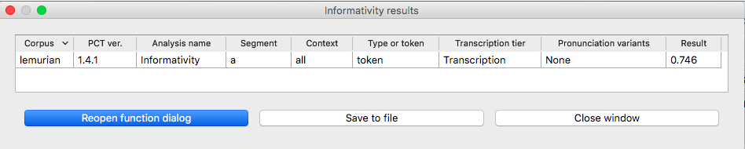
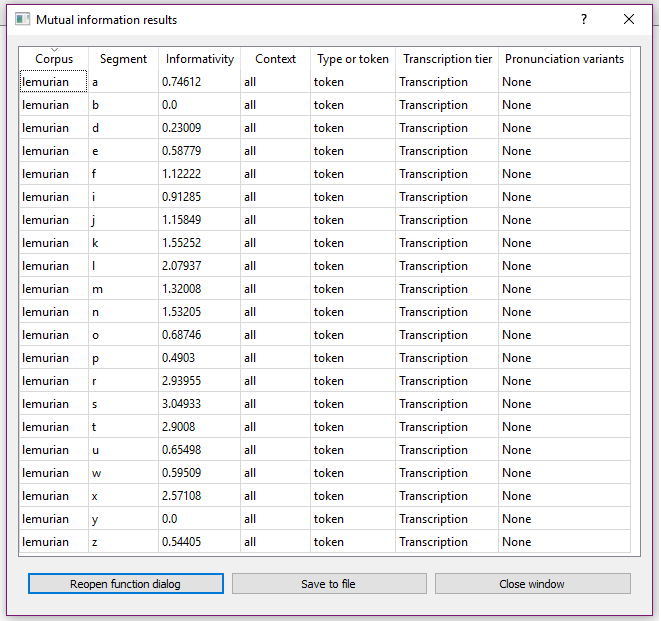

.. _informativity:

*************
Informativity
*************

.. _about_informativity:

About the function
------------------

Informativity is one of three primary information theoretic measures that has been demonstrated to affect how speech is
realized. Informativity is “the weighted average of the negative log predictability of all the occurrences of a segment”
[CohenPriva2015]_. Informally, it can be thought of as the "usual" (average) amount of information (surprisal) that a particular segment carries within a corpus. In other words, rather than being a measure of how probable a segment is in a particular context, it is a measure of how predictable that segment is when it occurs in any context. Thus, it can be used to explain the fact that some segments may be locally probable in some context, and yet exhibit properties generally expected of unpredictable segments: such segments are those whose general predictability (informativity) is low, even if their local predictability is high ([CohenPriva2015]_: 248).

It is formally defined with the following formula:

:math:`-sum[P(context|segment) * log_{2}P(segment|context)]`

Within this formula, :math:`-log_{2}P(segment|context)` is the negative logged probability of the segment in the given context, i.e., its information content. This transformation from probability to information simply captures the idea that more probable elements contain less information and are less surprising. By multiplying each of these information content values by :math:`P(context|segment)`, i.e., the probability of the context given the segment, we weight the local information content by the frequency of that context; by then summing these products over all possible contexts for a segment, we get the total informativity score for that segment.

While other information theoretic measures such as frequency and predictability can be used to describe a wide variety
of deletion and duration effects, Cohen Priva argues that informativity provides more nuanced and accurate predictions,
and offers empirical evidence from English, as well as other languages [CohenPrivaInPress]_.

One of the primary decisions in calculating informativity, is selecting the type of context to be used.
[CohenPriva2015]_ discusses four options used in the literature - uniphone, biphone, triphone, and all preceding
segments in the word. Within PCT, "all preceding" is currently the only supported option.

Consider a toy example, taken from [CohenPriva2015]_, §2.3, in which the following corpus is assumed
(note that, generally speaking, there is no “type frequency” column
in a PCT corpus, as it is assumed that each row in the corpus represents
1 type; it is included here for clarity):

+---------+---------+------+-------+
|  Word   | Trans.  | Type | Token | 
|         |         | Freq.| Freq. | 
+=========+=========+======+=======+
|   talk  |  [tɑk]  |    1 |  200  | 
+---------+---------+------+-------+
|  talks  | [tɑks]  |    1 |  100  |
+---------+---------+------+-------+
| talking | [tɑkɪŋ] |    1 |  100  |
+---------+---------+------+-------+
|   walk  |  [wɑk]  |    1 |  150  | 
+---------+---------+------+-------+
|  walks  | [wɑks]  |    1 |  300  |
+---------+---------+------+-------+
| walking | [wɑkɪŋ] |    1 |  150  |
+---------+---------+------+-------+

In this corpus, the segment [s] appears twice, once in 'talks' and once in 'walks.' To calculate the informativity of [s] in this corpus using "all preceding segments" as the context, we do the following:

1. For each context, calculate :math:`log_{2}P(segment|context)` 

   a. For the context in 'talks,' i.e., [tɑk..], there are three words with this context ('talk,' 'talks,' and 'talking'), and their token frequencies are 200, 100, and 100 (respectively). The probability of [s] in this context is the token frequency of 'talks' divided by the total token frequency of the context, i.e., 100 / (200 + 100 + 100) = 100 / 400 = 0.25. Then, :math:`log_{2}P(0.25)` gives -2. That is, we have (negative) two bits of information in this context (the negation will be inversed at the end of the calculation). [Note: one can also do this calculation using type frequencies, though Cohen Priva presents only token frequencies; the default for PCT is also to use token frequencies. Using type frequency, the probability of [s] in this context would be 1 / (1+1+1) = 1/3, and the information content would be -1.58 bits.]
   
   b. For the context in 'walks', we can similarly calculate that the probability of [s] in this context is the token frequency of 'walks' divided by the total token frequency of the context, i.e., 300 / (150 + 300 + 150) = 300 / 600 = 0.5. Then, :math:`log_{2}P(0.5)` gives -1. In other words, we have (negative) one bit of information in this context. It is less surprising to have an [s] after [wɑk] (only 1 bit of information is gained) than it is to have an [s] after [tɑk] (where 2 bits of information were gained). (Note that using type frequency, we would also have -1.58 bits of information for [s] after [wɑk]; i.e., the amount of information gained is the same in either context.)

2. For each context, calculate :math:`P(context|segment)`.

   a. For the context in 'talks', the probability of having this context given an [s] is found by taking the token frequency of 'talks' and dividing by the sum of the token frequencies of the contexts with [s], i.e., 100 / (100 + 300) = 100 / 400 = 0.25. (Using type frequency, this would be 1 / (1+1) = 0.5.)
   
   b. For the context in 'walks,' we analogously get 300 / (100 + 300) = 300 / 400 = 0.75. (Using type frequency, this would again be 1 / (1+1) = 0.5.)
   
   In other words, using token frequencies, 25% of the contexts that contain [s] are the [tɑk] contexts (which are more informative) while 75% are the [wɑk] contexts (which are less informative). (Using type frequencies, we have an equal number of contexts that are [tɑk] as [wɑk], and they each contain the same amount of information.)
   
3. For each context, multiply :math:`log_{2}P(segment|context)` (the information content in the context) by :math:`P(context|segment)` (the relative frequency of this context).

   a. Using token freqeuncies: For the context in 'talks' we multiply -2 by 0.25 and get -0.5. (For type frequencies: -1.58 * .5 = -0.79.)
   
   b. Using token frequencies: For the context in 'walks' we multiply -1 by 0.75 and get -0.75. (For type frequencies: -1.58 * .5 = -0.79.)
   
   In other words, we are weighting the information content of each context by the frequency of the context.

4. We sum the products for each context. Here, for the token frequency case, -0.5 + -0.75 = -1.25. (For type frequencies: -0.79 + -0.79 = -1.58.)

5. For ease of comprehension, we take the inverse of the sign. For token frequencies: -(-1.25) = 1.25. (For type frequencies: -(-1.58) = 1.58.)

Thus, the informativity of [s] in this corpus (using token frequency) is 1.25 bits. In some (less frequent) contexts, it has an information content of 2 bits, while in other (more frequent) contexts, it has an information content of 1 bit. On average, then, we end up with an average information content (i.e., an informativity) of 1.25 bits. (The type frequency calculation in this case is less interesting, though it wouldn't have to be; here, [s] always has an information content of 1.58 bits in all equally frequent contexts, so its average information content, i.e., its informativity, is also 1.58 bits.)

.. _method_informativity:

Method of calculation
---------------------

.. _method_context:

Defining context
````````````````
The context for a given segment is currently defined as all of the preceding segments within the same word - the
preferred method in [CohenPriva2015]. The context method includes parameters for the index (integer) of the segment and word in question. Index is used instead of segment, as a word may contain more than one of the same segment, and it is important to consider the context for each occurrence. The function returns a tuple of segments comprising the context. Typical users will not interact with context. Future improvements to the informativity function will allow for customizable context.

Informativity
`````````````
The function that calculates informativity create two Python dictionaries. The dictionary :math:`SegFreq` maps contexts to in-context segment frequencies. The dictionary :math:`ContextProb` maps contexts to in-context conditional probability of segments.

Given this input, the informativity of a given segment is calculated as follows:

:math:`\frac{-\sum SegFreq[c]*log_{2}(ContextProb[c])\,for\,c \in ContextProb}{\sum s \in SegFreq}`

The following is an example run of the function for a single segment, using the built-in lemurian corpus (see :ref:`examplecorpora`):



In addition to getting the informativity for a single segment, informativity can be calculated for all segments in a corpus. The following is an example run for getting the informativities for all segments in the lemurian inventory:



.. _informativity_gui:

Calculating informativity in PCT
--------------------------------------

As with most analysis functions, a corpus must first be loaded (see
:ref:`loading_corpora`).
Once a corpus is loaded, follow these steps.

1. **Getting started**: Choose “Analysis” / “Calculate informativity...”
   from the top menu bar.
2. **Sound selection**: First, decide whether you want to calculate the
   informativity of a single segment (or multiple segments), or the informativity of all segments in the corpus.
   To calculate the informativity of individual sounds, choose
   "Select one or more segments from the invnetory." To calculate the informativity of ALL segments in the corpus, choose "Select all segments in the inventory."
   
   For details on how to actually select segments (by themselves or using features), see
   :ref:`sound_selection` or :ref:`feature_selection` as relevant.

   When multiple individual segments are selected, each
   entry will be treated separately.
   
3. **Tier**: Select which tier the informativity should be calculated from.
   The default is the “transcription” tier, i.e., looking at the entire
   word transcriptions. If another tier has been created (see :ref:`create_tiers`),
   informativity can be calculated on the basis of that tier. For example,
   if a vowel tier has been created, then the preceding context will be only the vowels that precede the segment in question. Thus, the words [mapotik] and [ʃɹaɡofli] would provide the same context for the vowel [i], given that their vowel-tier
   representations are each [aoi].
   
4. **Preceding context**: As described above, informativity could be calculated on the basis of contexts of varying sizes, as uniphone, biphone, etc. The current version of PCT only allows the calculation based on all segments preceding the given segment in a word.

5. **Pronunciation variants**: If the corpus contains multiple pronunciation
   variants for lexical items, select what strategy should be used. For details,
   see :ref:`pronunciation_variants`.

6. **Type vs. Token frequency**: As mentioned above, it is possible to calculate informativity on the basis of type or token frequency. Following Cohen Priva, however, PCT defaults are based on token frequency.

7. **Results**: Once all parameters have been set, click one of the two
    “Calculate informativity” buttons. If this is the first calculation,
    the option to “start new results table” should be selected. For subsequent
    calculations, the calculation can be added to the already started table,
    for direct comparison, or a new table can be started.

8. **Saving results**: Once a results table has been generated for at least
    one pair, the table can be saved by clicking on “Save to file” at the
    bottom of the table to open a system dialogue box and save the results
    at a user-designated location.

.. _references:

.. [CohenPriva2015] Cohen Priva, Uriel (2015). Informativity affects consonant duration and deletion rates. Laboratory Phonology, 6(2), 243–278.

.. [CohenPrivaInPress] Cohen Priva, Uriel (in press). Informativity and the actuation of lenition. Language. Retrieved from   https://urielcpublic.s3.amazonaws.com/Informativity-and-the-actuation-of-lenition-accepted.pdf
