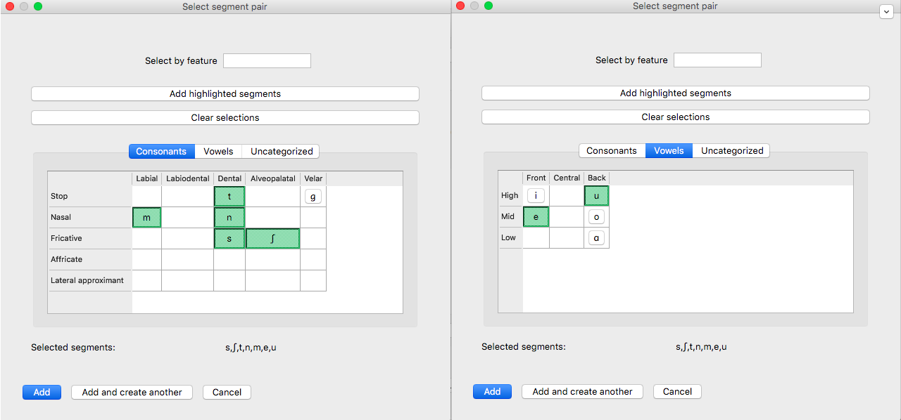
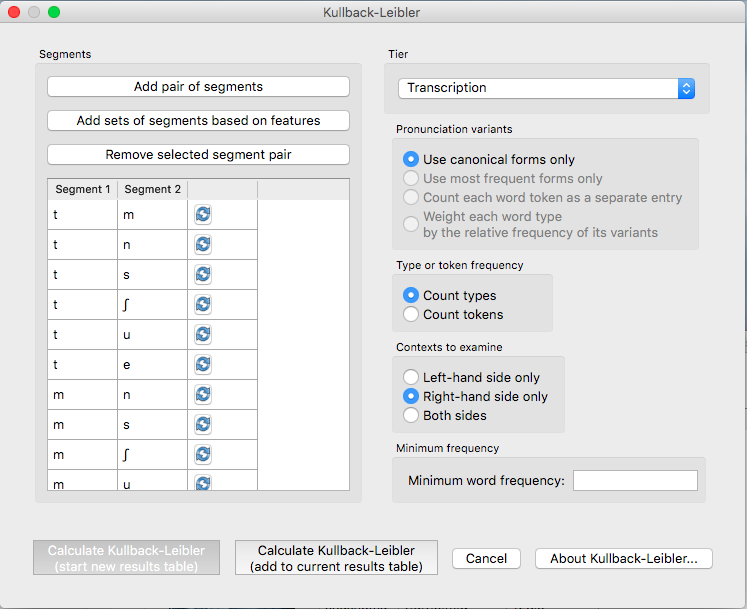
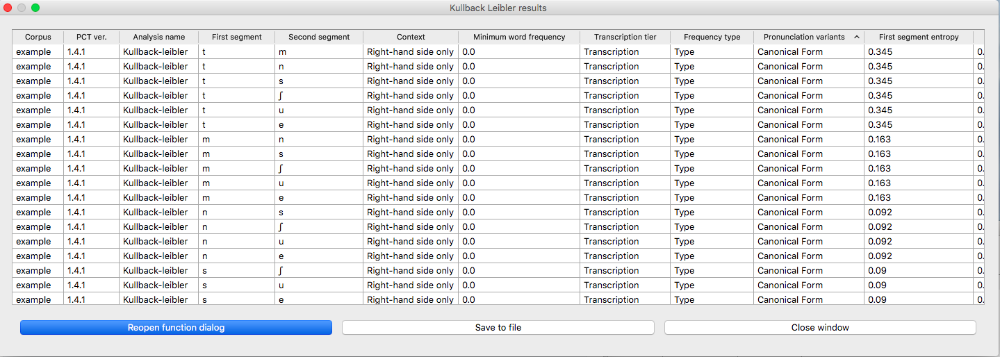

.. _kullback-leibler:

***************************
Kullback-Leibler Divergence
***************************

.. _about_kl:

About the function
------------------

Another way of measuring the distribution of environments as a proxy for
phonological relationships is the Kullback-Leibler (KL) measure of the
dissimilarity between probability distributions [Kullback1951]_.
Sounds that are distinct phonemes appear in the same environments, that is,
there are minimal or near-minimal, pairs. Allophones, on the other hand,
have complementary distribution, and never appear in the same environment.
Distributions that are identical have a KL score of 0, and the more
dissimilar two distributions, the higher the KL score. Applied to
phonology, the idea is to calculate the probability of two sounds across
all environments in a corpus, and use KL to measure their dissimilarity.
Scores close to 0 suggest that the two sounds are distinct phonemes,
since they occur in many of the same environments (or else there is
extensive free variation). Higher scores represent higher probabilities
that the two sounds are actually allophones. Since KL scores have no
upper bound, it is up to the user to decide what counts as “high enough”
for two sounds to be allophones (this is unlike the predictability of
distribution measure described in :ref:`predictability_of_distribution`).
See [Peperkamp2006]_ for a discussion of how to use Z-Scores to make this discrimination.

As with the predictability of distribution measure in :ref:`predictability_of_distribution`, spurious
allophony is also possible, since many sounds happen to have non-overlapping
distributions. As a simple example, vowels and consonants generally have
high KL scores, because they occur in such different environments.
Individual languages might have cases of accidental complementary
distribution too. For example, in English /h/ occurs only initially and
[ŋ] only occurs finally. However, it is not usual to analyze them as
being in allophones of a single underlying phonemes. Instead, there is
a sense that allophones need to be phonetically similar to some degree,
and /h/ and /ŋ/ are simply too dissimilar.

To deal with this problem, [Peperkamp2006]_ suggest two
“linguistic filters” that can be applied, which can help identify
cases of spurious allophones, such as /h/ and /ŋ/. Their filters do
not straightforwardly apply to CorpusTools, since they use 5-dimensional
vectors to represent sounds, while in CorpusTools most sounds have only
binary features. An alternative filter is used instead, and it is
described below.

It is important to note that this function's usefulness depends on the
level of analysis in your transcriptions. In many cases, corpora are
transcribed at a phonemic level of detail, and KL will not be very
informative. For instance, the IPHOD corpus does not distinguish between
aspirated and unaspirated voiceless stops, so you cannot measure their
KL score.

.. _method_kl:

Method of calculation
---------------------

All calculations were adopted from [Peperkamp2006]_. The variables
involved are as follows: s is a segment, *c* is a context, and *C* is the
set of all contexts. The Kullback-Leibler measure of dissimilarity between
the distributions of two segments is the sum for all contexts of the
entropy of the contexts given the segments:

KL Divergence:

:math:`m_{KL}(s_1,s_2) = \sum_{c \in C} P(c|s_1) log (\frac{P(c|s_1)}{P(c|s_2)})
+ P(c|s_2) log(\frac{P(c|s_2)}{P(c|s_1)})`

The notation *P(c|s)* means the probability of context c given segment s,
and it is calculated as follows:

:math:`P(c|s) = \frac{n(c,s) + 1}{n(s) + N}`

...where *n(c,s)* is the number of occurrences of segments *s* in context *c*.
[Peperkamp2006]_ note that this equal to the number of occurrences
of the sequence *sc*, which suggests that they are only looking at the right
hand environment. This is probably because in their test corpora, they were
looking at allophones conditioned by the following segment. PCT provides
the option to look only at the left-hand environment, only at the right-hand
environment, or at both.

[Peperkamp2006]_ then compare the average entropy values of each segment,
in the pair. The segment with the higher entropy is considered to be a
surface representation (SR), i.e. an allophone, while the other is the
underlying representation (UR). In a results window in PCT, this is given
as “Possible UR.” More formally:

:math:`SR = \max_{SR,UR}[\sum_{c} P(c|s) log \frac{P(c|s)}{P(c)}]`

[Peperkamp2006]_ give two linguistic filters for getting rid of spurious
allophones, which rely on sounds be coded as 5-dimensional vectors. In
PCT, this concept as been adopted to deal with binary features. The aim
of the filter is the same, however. In a results window the column labeled
“spurious allophones” gives the result of applying this filter.

The features of the supposed UR and SR are compared. If they differ by
only one feature, they are considered plausibly close enough to be
allophones, assuming the KL score is high enough for this to be
reasonable (which will depend on the corpus and the user's expectations).
In this case, the “spurious allophones?” results will say ‘No.’

If they differ by more than 1 feature, PCT checks to see if there any
other sounds in the corpus that are closer to the SR than the UR is.
For instance, if /p/ and /s/ are compared in the IPHOD corpus, /p/ is
considered the UR and /s/ is the SR. The two sounds differ by two
features, namely [continuant] and [coronal]. There also exists another
sound, /t/, which differs from /s/ by [continuant], but not by [coronal]
(or any other feature). In other words, /t/ is more similar to /s/ than
/p/ is to /s/. If such an “in-between” sound can be found, then in the
“spurious allophones?” column, the results will say ‘Yes.’

If the two sounds differ by more than 1 feature, but no in-between sound
can be found, then the “spurious allophones?” results will say ‘Maybe.’

Note too that a more direct comparison of the acoustic similarity of
sounds can also be conducted using the functions in :ref:`acoustic_similarity`.

.. kl_gui:

Calculating Kullback-Leibler Divergence in the GUI
--------------------------------------------------

To implement the KL function in the GUI, select “Analysis” / “Calculate
Kullback-Leibler...” and then follow these steps:

1. **Pair of sounds**: First, select which pairs of sounds you want the functional
   load to be calculated for. Do this by clicking on either “Add pair of sounds”
   or "Add pair of features" -- use the former for selecting segments (even if
   the segments are chosen using features); use the latter for selecting
   featural differences to calculate KL divergence for (e.g., the KL score
   for [+/-high]).
   See :ref:`sound_selection` or :ref:`feature_selection` for more on how to
   interact with these options.

2. **Tier**: Select which tier the KL-divergence should be calculated from.
   The default is the “transcription” tier, i.e., looking at the entire
   word transcriptions. If another tier has been created (see :ref:`create_tiers`),
   KL can be calculated on the basis of that tier. For example,
   if a vowel tier has been created, then the sounds will be considered only in
   terms of their adjacent vowels, ignoring intervening consonants.

3. **Pronunciation variants**: If the corpus contains multiple pronunciation
   variants for lexical items, select what strategy should be used. For details,
   see :ref:`pronunciation_variants`.

4. **Type or token frequency**: Select whether probabilities should be
   based on type or token frequencies.

5. **Contexts**: Using KL requires a notion of “context,” and there are three
   options: left, right, or both. Consider the example word [atema]. If
   using the “both” option, then this word consists of these environments:
   [#\_t], [a\_e], [t\_m], [e\_a], and [m\_#]. If the left-side option is chosen,
   then only the left-hand side is used, i.e., the word consists of the
   environments [#\_], [a\_], [t\_], [e\_], and [m\_]. If the right-side option
   is chosen, then the environments in the word are [\_t], [\_e], [\_m], [\_a],
   and [\_#]. Note that the word boundaries don’t count as elements of words,
   but can count as parts of environments.
   
   Selecting the "both" option forces the KL algorithm to look at the both sides of an environment simaultaneously. This gives different results than looking at the left and the right side independantly. It is possible for a pair of sounds to be considered the most divergent on the "left" or "right" option, but not on the "both" option. Consider the distribution of /i,e/ and /u,o/ in the following hypothetical corpus:
   
   tih, tey, diq, dex, bif, pef, biv, pev
   
   mun, mul, nul, lum, soz, soc, zoc, cos
   
   The set /i,e/ have some overlap in their left- and right-hand environments  (e.g. they both occur after /t/ and before /f/), while /o,u/ have no overlapping environments. The KL algorithm will calculate a lower divergence for the pair /i,e/ than for /u,o/ if the "left side" or "right side" options are selected. 
   However, when considering both sides simaultaneously, /i/ and /e/ have no overlapping environments at all. The sound /i/ can appear in t_h, d_q, b_f, and b_v while the sound /e/ appears in t_y, d_x, p_f, and p_v. If you run the KL algorithm and select "both sides", then the pair /i,e/ will have the same divergence as /o,e/.

6. **Minimum Word Frequency**: It is possible to set a minimum token frequency for including words in the calculation. This allows easy exclusion of rare words. To include all words in the corpus, regardless of their token frequency, set the minimum frequency to 0, or leave the field blank. Note that if a minimum frequency is set, all words below that frequency will be ignored entirely for the purposes of calculation.

7. **Results**: Once all selections have been made, click “Calculate
   Kullback-Leibler.” If you want to start a new results table, click
   that button; if you’ve already done at least one calculation and
   want to add new calculations to the same table, select the button
   with “add to current results table.” Results will appear in a pop-up
   window on screen. Each member of the pair is listed, along with which
   context was selected, what tier was used, what strategy was used for pronunciation variants, what kind of frequency was used, the entropy of each segment, the KL score, which
   of the two members of the pair is more likely to be the UR (as described
   above), and PCT’s judgment as to whether this is a possible case of
   spurious allophones based on the featural distance.

7. **Output file / Saving results**: If you want to save the table of results,
   click on “Save to file” at the bottom of the table. This opens up a
   system dialogue box where the directory and name can be selected.

   To return to the function dialogue box with your most recently used
   selections, click on “Reopen function dialog.” Otherwise, the results
   table can be closed and you will be returned to your corpus view.

An example of calculating the KL scores in the Example corpus (which has canonical forms only), with the
sounds [s], [ʃ], [t], [n], [m], [e], [u] selected (and therefore all
pairwise comparisons thereof calculated), examining only right-hand side
contexts:

The “Select segment pair” dialogue box, within the “Kullback-Leibler”
dialogue box:

The “Kullback-Leibler” dialogue box, with pairs of sounds and contexts
selected:

The resulting table of results:

.. kl_cli:

Implementing the KL-divergence function on the command line
-------------------------------------------------------------

In order to perform this analysis on the command line, you must enter
a command in the following format into your Terminal::

   pct_funcload CORPUSFILE [additional arguments]

...where CORPUSFILE is the name of your \*.corpus file. If calculating
FL from a file of segment pairs, it must list the pairs
of segments whose functional load you wish to calculate with each pair
separated by a tab (``\t``) and one pair on each line. Note that you must either
specify a file or segment (using ``-p``) or request the functional loads of all
segment pairs in the inventory (using ``-l``). You may also use
command line options to change various parameters of your functional
load calculations. Descriptions of these arguments can be viewed by
running ``pct_funcload –h`` or ``pct_funcload --help``. The help text from
this command is copied below, augmented with specifications of default values:

Positional arguments:

.. cmdoption:: corpus_file_name

   Name of corpus file

.. cmdoption:: seg1

   First segment

.. cmdoption:: seg2

   Second segment

.. cmdoption:: side

   Context to check. Options are 'right', 'left' and
   'both'. You can enter just the first letter.

Optional arguments:

.. cmdoption:: -h
               --help

   Show help message and exit

.. cmdoption:: -s SEQUENCE_TYPE
               --sequence_type SEQUENCE_TYPE

   The attribute of Words to calculate KL-divergence over. Normally this will be
   the transcription, but it can also be the spelling or a user-specified tier.

.. cmdoption:: -t TYPE_OR_TOKEN
               --type_or_token TYPE_OR_TOKEN

   Specifies whether quantifications are based on type
   or token frequency.

.. cmdoption:: -c CONTEXT_TYPE
               --context_type CONTEXT_TYPE

   How to deal with variable pronunciations. Options are
   'Canonical', 'MostFrequent', 'SeparatedTokens', or
   'Weighted'. See documentation for details.

.. cmdoption:: -o OUTFILE
               --outfile OUTFILE

   Name of output file

EXAMPLE 1: If your corpus file is example.corpus (no pronunciation variants)
and you want to calculate the KL-divergence of the segments
[m] and [n] considering contexts on both sides and using defaults for all
optional arguments, you would run the following command in your terminal window::

   pct_kl example.corpus m n both

.. _kl_classes_and_functions:

Classes and functions
---------------------
For further details about the relevant classes and functions in PCT's
source code, please refer to :ref:`kl_api`.
