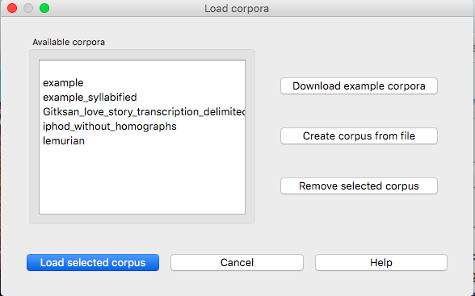
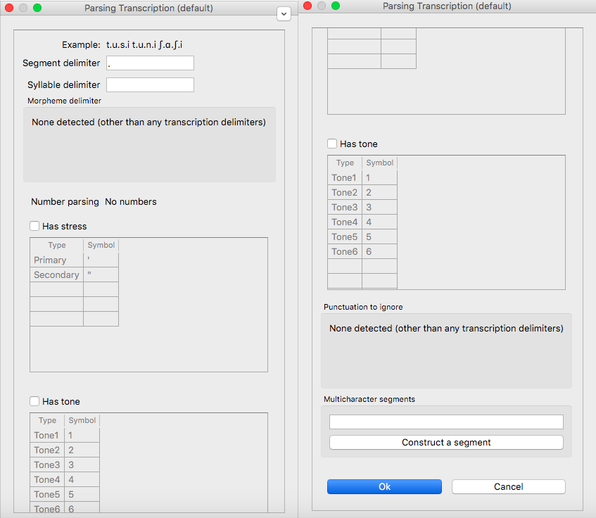
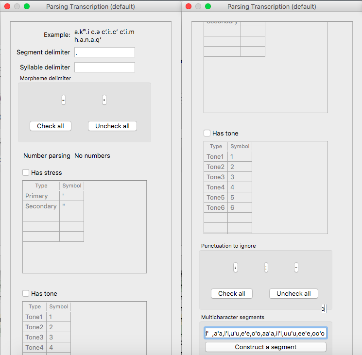
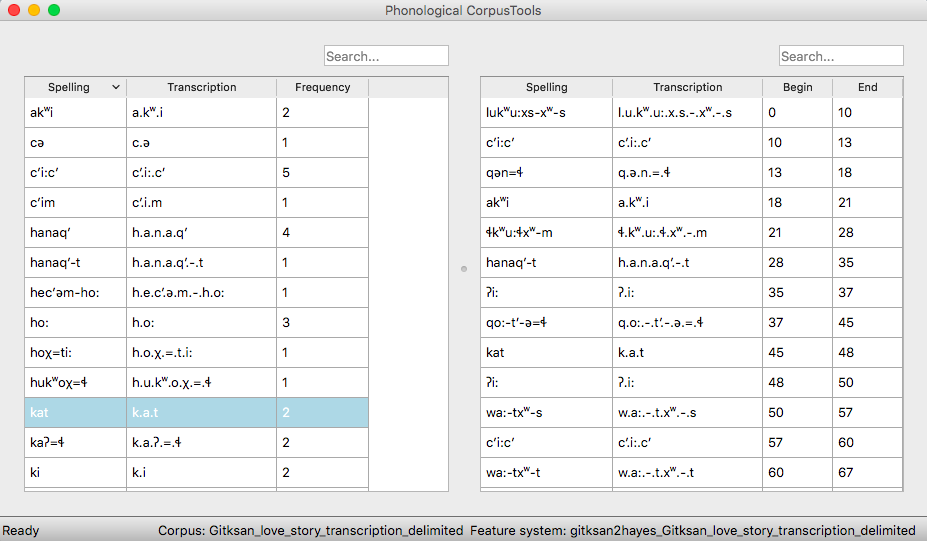
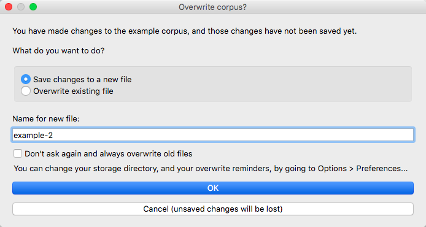

.. _loading_corpora:

******************
Loading in corpora
******************

.. _PCT website: http://phonologicalcorpustools.github.io/CorpusTools/

.. _GitHub repository: https://github.com/PhonologicalCorpusTools/CorpusTools/

.. _kathleen.hall@ubc.ca: kathleen.hall@ubc.ca

.. _online PCT documentation: http://corpustools.readthedocs.org/en/latest/index.html

In order to use the analysis functions in PCT, you’ll first need to open
up a corpus. When we say a "corpus" in PCT, we mean a file that has the
following basic structure: a list of words with other possible information
about each: e.g., its transcription, its frequency of occurrence, its
lexical category, its syllable structure, etc. These are in columnar format;
e.g., loaded from a CSV or tab-delimited text file. (See more at :ref:`corpus_format`.)

There are five possible ways of getting a corpus in PCT:

1. Use one of the built-in corpora to get started immediately. You can
   choose between two small, entirely invented corpora that have various
   parameters (see :ref:`example_corpora`) or use the Irvine Phonotactic
   Online Dictionary of English [IPHOD]_;

2. Use a corpus in the above format that is independently stored on your
   local computer;

3. Create a corpus from running text (e.g., straight transcriptions of
   speech or interlinear texts);

4. Create a corpus from Praat TextGrids [PRAAT]_;

5. Import a corpus from your own local copy of another standard corpus; currently, we support only the Buckeye corpus [BUCKEYE]_; the TIMIT corpus [TIMIT]_ is not supported anymore. (PCT is intended to focus on analyses of lexical and usage-based statistics and phonological analysis. The TIMIT corpus is not actually structured for this kind of work, because it is a pre-structured corpus rather than containing spontaneous-style speech. It is also not trivial to figure out how to develop a PCT-compatible feature system for the TIMIT-style transcriptions, where sub-segmental units are transcribed separately (e.g., stop closure vs. release burst). Thus, we no longer support the TIMIT format.)

Each of these options is discussed in more detail below.

Note that for any of these scenarios, if you load a corpus without associating it with
a feature system, you will have the option to associate a system to the corpus later
(see :ref:`applying_editing_feature`). If you load a corpus and try to associate it
with a pre-existing feature system that does not in fact have all the segments in the
corpus in it (e.g., you're basically using an IPA-based transcription system, but your
corpus includes the symbol [č]), then PCT will warn you and ask if you want to proceed.
If you do proceed, PCT will automatically create a copy of the existing feature file,
add the new segment(s), and give them default feature values of 'n' for all features.
The new feature system will be called the same thing as the old one, but will be
relativised to the appropriate corpus. E.g., if the original feature system was the
ipa2hayes system, and the corpus containing [č] is called 'November_fieldwork', then
the new feature system will automatically be called ipa2hayes_November_fieldwork. This
feature system is editable and available for use with any other corpora, as generally
described in :ref:`applying_editing_feature`.

Also note that all created or downloaded corpus files are stored as .corpus in the working
directory of PCT. See :ref:`local_storage` for details.

.. _download_corpora:

Using a built-in corpus
=======================

To use a built-in corpus, simply go to the “File” menu and select
“Load corpus...” from the list, which will open the “Load corpora” dialogue box.

As of v. 1.5.0, these corpora are directly packaged with the executable version of PCT and should simply be available on opening the software. You can also download them directly from GitHub: https://github.com/PhonologicalCorpusTools/PCT_Fileshare/tree/main/CORPUS See :ref:`local_storage` for details on how to store and access these.

Before v. 1.5.0, the first time you wanted to use a built-in corpus, you needed to download it
(from a Dropbox link accessed by PCT internally); you had to therefore be
connected to the internet to complete this step. To do so, click on
“Download example corpora” from the right-hand menu. This will allow
you to download either of the two example corpora (one is called "example" and the
other called "Lemurian" (both are entirely made up; see :ref:`example_corpora`)
and/or the two versions of IPhOD corpus [IPHOD]_.

Note that there are currently two versions of IPhOD corpus available on PCT: 'IPHOD with
homographs' and 'IPHOD without homographs.' The one without homographs was the default
up to 2019. 'IPHOD with homographs' contains all different pronunciations of a homograph
provided in the `original IPhOD corpus <http://www.iphod.com/>`_, while the other version
only has one pronunciation. As the '(token) frequency' (from the SUBTLEX corpus [SUBTLEX]_)
is for each orthographic word, the same frequency value is given for two or more homographs.
Therefore, it is important to note that using the one with homographs may double count the
frequency of a lexeme in analyses.

For example, the word 'African' is a homograph as it has two pronunciations, transcribed
as /AE.F.R.AH.K.AH.N/ and /AE.F.R.IH.K.AH.N/, respectively. 'IPHOD with homographs'
contains both pronunciations as separate entries. Both entries have the same value, 6.76
(per million words), for the 'Frequency' column. 'IPHOD without homographs,' on the other
hand, only has /AE.F.R.AH.K.AH.N/ with the frequency of 6.76.

Also note that the versions of the IPHOD corpus that are
contained here have been altered from the freely `downloadable version
<http://www.iphod.com/>`_, in that they (1) do not have the derived columns and
(2) have been re-formatted as a .corpus file for easy reading by PCT.
They also contain only the following information: word, transcription,
and token frequency (from the SUBTLEX corpus [SUBTLEX]_).
Please note that if you use the IPHOD corpus, you should use the following
citation (see more on citing corpora and functions of PCT in :ref:`citing_pct`):

Vaden, K. I., Halpin, H. R., Hickok, G. S. (2009). Irvine Phonotactic Online
Dictionary, Version 2.0. [Data file]. Available from `http://www.iphod.com/
<http://www.iphod.com/>`_.

After the corpus has been downloaded, it appears in the lefthand side of
the “Load corpora” dialogue box. Simply select the corpus and click on
“Load selected corpus” at the bottom of the dialogue box. Once these
corpora have been downloaded once, you don’t have to do so again; they
will be saved automatically to your local system unless and until you
delete them. On subsequent loadings of the PCT software, you will still
see these corpora listed in the lefthand side of the “Load corpora” dialogue
box, as in the following diagram:

The example corpora and the included version of the IPHOD corpus include
phonetic transcriptions (in IPA for the example corpora and in Arpabet for IPHOD), and are by default interpreted either
using the feature system of [Mielke2012]_, which in turn is based on
SPE features [SPE]_ [this is the default for the example corpus], or using
the feature system suggested by [Hayes2009]_ [this is the default
for the IPHOD corpus and the Lemurian corpus]. These systems are fully functional for doing subsequent
analyses. 

Again, prior to v. 1.5.0, this was a built-in functionality of these
particular corpora, and did not allow you to use SPE or Hayes features
with other corpora. To use SPE features with other corpora, or to change
the feature system associated with a built-in corpus prior to 1.5.0, you’ll need to
download the actual feature files, as described in
:ref:`transcriptions_and_feature_systems`. Features can be used
for defining classes of sounds (e.g., creating separate tiers for
different types of segments) and for defining environments (e.g., the
environments in which segments might occur, for use in calculating their
predictability of distribution). As of v. 1.5.0, feature systems are also packaged directly with the software and should be immediately accessible, though they can also be downloaded manually from https://github.com/PhonologicalCorpusTools/PCT_Fileshare/tree/main/FEATURE.

The corpus may take several seconds to load, but will eventually appear;
the following is the example corpus:

Note that the name of the corpus and the current feature system are shown
at the bottom right-hand corner of the screen for easy reference. :ref:`corpus_summary`
gives more detail on how to find out summary information about your
corpus. Typing a word or part-word in the “search” box takes you to each
successive occurrence of that word in the corpus (hit “return” once to see
the first instance; hit “return” again to see the second, etc.). Note that the
“search” box searches only the “Spelling” column of the corpus. To do a
phonological search, please use the “Phonological search” function under
the “Corpus” menu (see detailed discussion in :ref:`phonological_search`).

For more details on the structure of the Lemurian corpus, which has been built to show particular kinds of phenomena that may be of interest to PCT users, please see the section on :ref:`Lemurian`.

.. _custom_corpus:

Creating a corpus
==================

It is also possible to create a corpus within PCT. These can be pre-formatted columnar corpora or corpora that are compiled from running text, TextGrids, or special corpus formats. It may be helpful to first load the relevant feature system for your corpus into PCT, so that the transcriptions in your corpus can be interpreted; detailed instructions for doing this are given in :ref:`transcriptions_and_feature_systems` (note that the corpus can be loaded in without featural interpretation, and features added later).

In all cases, to use a custom corpus, click on “File” / “Load corpus...” and then
choose “Create corpus from file.” The "Import corpus" dialogue box opens up.

At the top of the box, enter the path for the file that will form the corpus or select it using “Choose file...” and navigating to it from a system dialogue box. If the corpus is being created from a series of .txt files or .TextGrid files or other special files instead of a single file (e.g., being compiled from multiple files of running text or specially formatted corpora such as the Buckeye corpus), you can instead choose the directory that contains the files. All files that PCT thinks are plausible will be selected, ignoring other files. For example, if you have both .txt and .pdf files in a directory, only the .txt files will be selected. If there are both .txt and .TextGrid files (both of which could be used by PCT), it will read in only the one that has a greater number of instances in the directory. That is, if there are more .TextGrid files than .txt files, it will assume it should read the .TextGrid files (or vice versa). If you have selected a directory, you can hover the mouse over the box labeled "Mouseover for included files" to see a pop-up list of exactly which files in a directory have been chosen. Obviously, you can manually force PCT to read in all of your intended files by simply putting all and only those files into a single directory. Note that for a pre-formatted columnar corpus, a single file must be chosen, rather than a directory of files.

Enter a name for the corpus in the box to the right of the corpus source selection. (Note that on some screens, the box may initially appear to be absent; simply re-size the "Import corpus" dialogue box to make it appear.)

PCT will automatically detect what kind of file type you have selected and select the tab for the corpus type that it thinks most likely. For .txt files, it will default to assuming it is a column-delimited file, but you can easily select the "running text" or "interlinear text" tabs instead. For .TextGrid files, it will take you to the TextGrid tab; if it detects a directory of Buckeye files, it will take you to the "Other standards" tab. The choices within each of these tabs is described below: :ref:`column-delimited`; :ref:`running_text`; :ref:`interlinear`; :ref:`textgrid`; :ref:`other_standards`

.. _column-delimited:

Column-delimited files
======================

If you have a corpus that is in
the appropriate format (see :ref:`corpus_format`) and stored independently on your
computer, you can read it in as a column-delimited file.

Once you have selected the file path and named the corpus (see :ref:`custom_corpus`)
, make sure that the "Column-delimited file" tab is selected. PCT will
automatically try to figure out what delimiter (e.g., comma, tab) is used to
separate columns, but you can also enter it manually (e.g., a comma (,) or a
tab (\t)). Any symbol can be used; PCT will simply break
elements at that symbol, so whatever symbol is used should be used only to
delimit columns within the corpus.

If there is a column in the corpus that shows phonetic transcription, choose
which feature system you would like to use. As noted above, in order for
there to be feature systems to choose from, you must first have loaded
them into PCT (:ref:`transcriptions_and_feature_systems`). If you haven't
yet added any, you may still import the corpus and then add them later.

To parse transcription with syllable boundaries, you have to put the syllable-delimiter
symbol in the "Syllable delimiter" box. Note also that in order for the syllable-parsing
algorithm to work (which just assigns the nucleus to the [+syllabic] segment in a syllable
and onset/coda to segments that come before/after the nucleus), you have to
specify all feature values to all the segment present in the corpus in the feature file.

On the right-hand side of the "Import corpus" dialogue box, you will see a
"Parsing preview" window. This shows each of the columns in the corpus and
allows you to specify particular parameters for each one. For details on
this, please see the section on :ref:`parsing_parameters`.

Once all selections have been made, click "Ok." PCT will process the corpus
(depending on how big it is, this may take a few minutes). It will then
appear listed in the "Available corpora" window in the "Load corpus"
dialogue box; you can select it and then click "Load selected corpus" to open it.

Note: the processed version of the corpus is stored in a .corpus file
and automatically lives in a "CORPUS" folder in Documents / PCT / CorpusTools
on your hard drive. See :ref:`preferences` for information on how to change this.

See also :ref:`logging` for information about how the parameters you picked
when loading the corpus are temporarily saved.

Below is a picture of the "Import corpus" dialogue box set up to load in
a .csv file with orthography, transcription, and frequency columns:

.. image:: static/importcsv1.png
   :width: 90%
   :align: center

And here is the "Parsing settings" window of the transcription column (note that because of the length of the window, we have split this image into two side-by-side images; in PCT itself, this is a single long vertical window):

.. _running_text:

Running Text
============

It is also possible to have PCT create a corpus for you from running text,
either in orthographic or transcribed form. If the text is orthographic,
of course, then segmental / phonological analysis won’t be possible, but
if the text is itself a transcription, then all subsequent analysis functions
are available. (Please see the section on :ref:`interlinear` for running texts that interleave orthographic and phonetic transcriptions.)

Once you have selected the file path or directory and named the corpus
(see :ref:`custom_corpus`), make sure that the "Running text" tab is
selected. Select whether the text is spelling ("Orthography") or
phonetic transcription ("Transcribed").

If the running text is transcribed, choose which feature system you would
like to use. As noted above, in order for there to be feature systems
to choose from, you must first have loaded them into PCT
(:ref:`transcriptions_and_feature_systems`). If you haven't yet added
any, you may still import the corpus and then add them later.

If the running text is orthographic, and you have a corpus that contains
transcriptions for the language of the running text, you can have PCT look
up the transcriptions of words in that "support corpus." This must be a
corpus that has already been created in PCT. For example, you could first
download the IPHOD corpus (see :ref:`download_corpora`) and then ask
PCT to create a corpus from a .txt file that contains English prose,
looking up each word's transcription in the IPHOD corpus. You can specify
that case should be ignored during lookup (e.g., to allow PCT to find the
transcriptions of words even if they happen to be capitalized at the
beginning of sentences in the running text).

At the right-hand side of the "Import corpus" dialogue box, you will see
a "Parsing preview" window for the column of the corpus that will result
from the running text. (The frequency of individual words in the text
will be created automatically.) Please see the section on
:ref:`parsing_parameters` for details on how to make choices in this window.

Once all selections have been made, click "Ok." PCT will process the
corpus (depending on how big it is, this may take a few minutes). It
will then appear listed in the "Available corpora" window in the
"Load corpus" dialogue box; you can select it and then click
"Load selected corpus" to open it.

Note: the processed version of the corpus is stored in a .corpus file
and automatically lives in a "CORPUS" folder in Documents / PCT / CorpusTools
on your hard drive. See :ref:`preferences` for information on how to change this.

See also :ref:`logging` for information about how the parameters you picked
when loading the corpus are temporarily saved.

.. _interlinear:

Interlinear Text
=================

In addition to plain running text (:ref:`running_text`), PCT also supports
building corpora from interlinear texts, e.g., those with spelling and
transcription on alternating lines. Interlinear texts may have any number
of repeating lines.

Once you have selected the file path or directory and named the corpus
(see :ref:`custom_corpus`), make sure that the "Interlinear text" tab is selected.

PCT will start by automatically inspecting the text for characteristics
that seem to repeat on particular sets of lines, to figure out how many
lines there are per "unit." E.g., a text that has spelling on the first
line, transcription on the second, and glosses on the third will be
automatically detected as having 3 lines per unit. The number can also
be specified manually. Note that the text must maintain this pattern
throughout; deviations will cause errors in how PCT reads in the data.

If the text is transcribed, choose which feature system you would like to use.
As noted above, in order for there to be feature systems to choose from,
you must first have loaded them into PCT (:ref:`transcriptions_and_feature_systems`).
If you haven't yet added any, you may still import the corpus and then add them later.

On the right hand side of the dialogue box, you'll see a "Parsing preview"
window which allows you to inspect each line of the gloss and specify how
that line is interpreted. Please see the section on :ref:`parsing_parameters`
for details on how to make choices in this window.

Once all selections have been made, click "Ok." PCT will process the corpus
(depending on how big it is, this may take a few minutes). It will then
appear listed in the "Available corpora" window in the "Load corpus" dialogue
box; you can select it and then click "Load selected corpus" to open it.

Note: the processed version of the corpus is stored in a .corpus file and
automatically lives in a "CORPUS" folder in Documents / PCT / CorpusTools
on your hard drive. See :ref:`preferences` for information on how to change this.

See also :ref:`logging` for information about how the parameters you
picked when loading the corpus are temporarily saved.

An example of the "Import corpus" dialogue box set up for loading in a
3-line interlinear Gitksan text:

.. image:: static/ilg_loading1.png
   :width: 90%
   :align: center

.. _textgrid:

TextGrids
=========

PCT can also be used to create corpora from a collection of Praat
TextGrids [PRAAT]_. This is particularly useful for creating spontaneous
speech corpora from recordings, especially if the transcription is
based on what was actually spoken rather than on canonical forms of
each word -- PCT can keep track of the individual pronunciation variants
associated with individual words (see :ref:`pronunciation_variants`). PCT 
uses the TextGrid package (https://pypi.org/project/TextGrid/) to read in
.TextGrid files. Currently, it uses TextGrid version 1.1, which has been
added to the /corpustools/corpus/io folder to maintain compatibility. 

Once you have selected the file path or directory and named the corpus
(see :ref:`custom_corpus`), make sure that the "TextGrid" tab is selected
(this should happen automatically if the file extension(s) is .TextGrid).

If any of the tiers in the TextGrid is a transcription tier, choose which
feature system you would like to use. As noted above, in order for there
to be feature systems to choose from, you must first have loaded them into
PCT (:ref:`transcriptions_and_feature_systems`). If you haven't yet added
any, you may still import the corpus and then add them later.

If any of the tiers in the TextGrid is orthographic, and you have a corpus
that contains transcriptions for the language of the text, you can have PCT
look up the transcriptions of words in that "support corpus." This must be a
corpus that has already been created in PCT. For example, you could first
download the IPHOD corpus (see :ref:`download_corpora`) and then ask PCT to
create a corpus from a .txt file that contains English prose, looking up
each word's transcription in the IPHOD corpus. You can specify that case
should be ignored during lookup (e.g., to allow PCT to find the transcriptions
of words even if they happen to be capitalized at the beginning of sentences
in the running text).

At the right-hand side of the "Import corpus" dialogue box, you'll see a
"Parsing preview" window. This will give you choices for how to parse each
tier of the TextGrid, labelled with the original names of the tiers. Please
see the section on :ref:`parsing_parameters` for details on how to make
choices in this window.

Once all selections have been made, click "Ok." PCT will process the corpus
(depending on how big it is, this may take a few minutes). It will then appear
listed in the "Available corpora" window in the "Load corpus" dialogue box;
you can select it and then click "Load selected corpus" to open it.

Note: the processed version of the corpus is stored in a .corpus file and
automatically lives in a "CORPUS" folder in Documents / PCT / CorpusTools
on your hard drive. See :ref:`preferences` for information on how to change this.

See also :ref:`logging` for information about how the parameters you picked
when loading the corpus are temporarily saved.

.. _other_standards:

Other Standards
===============

Finally, PCT comes pre-equipped to handle certain other standard corpus types.
At the moment, the only supported standards are the Buckeye corpus [BUCKEYE]_.
You must obtain your own copy of the Buckeye corpus through its usual means
and store it locally; PCT simply gives you a way to easily open these corpora
in the standard PCT format.

When selecting the corpus source, navigate to the directory where the
Buckeye files are stored. PCT will automatically detect the
format of files in the directory and select the "Other Standards" tab.
Within that tab, it will also automatically select the file format.

If the text is transcribed, choose which feature system you would like to
use. As noted above, in order for there to be feature systems to choose
from, you must first have loaded them into PCT
(:ref:`transcriptions_and_feature_systems`). If you haven't yet added any,
you may still import the corpus and then add them later. There is an
option to download a Hayes-style feature system ([Hayes2009]_) for the Buckeye
corpus transcriptions.

At the right-hand side of the "Import corpus" dialogue box, you'll see a
"Parsing preview" window. This will give you choices for how to parse each
part of the original corpus. Please see the section on :ref:`parsing_parameters`
for details on how to make choices in this window.

Once all selections have been made, click "Ok." PCT will process the corpus
(depending on how big it is, this may take a few minutes). It will then appear
listed in the "Available corpora" window in the "Load corpus" dialogue box;
you can select it and then click "Load selected corpus" to open it.

Note: the processed version of the corpus is stored in a .corpus file and
automatically lives in a "CORPUS" folder in Documents / PCT / CorpusTools
on your hard drive. See :ref:`preferences` for information on how to change this.

See also :ref:`logging` for information about how the parameters you
picked when loading the corpus are temporarily saved.

.. _corpus_format:

Required format of corpus
-------------------------

In order to use your own corpus, it must have certain properties.
First, it should be some plain text file (e.g., .txt, .csv); it cannot,
for example, be a .doc or .pdf file. The file should be set up in columns
(e.g., imported from a spreadsheet) and be delimited with some uniform character
(tab, comma, backslash, etc.). The names of most columns of information
can be anything you like, but the column representing common spelling of
the word should be called “spelling”; that with transcription should be
called “transcription”; and that with token frequency should be called
“frequency.” All algorithms for doing corpus analysis will assume these
column names. If, for example, you were using a corpus that had different
frequency columns for total frequency vs. the frequency of occurrence of
the word in its lowercase form (cf. the SUBTLEX corpus), then whichever
column is to be used for token frequency calculations should simply be
labelled “frequency.”

.. _parsing_parameters:

Parsing Parameters
__________________

This section outlines the choices that can be made in the "Parsing Preview"
section of the import corpus dialogue box. In order for this section to be
available, you need to have first started to import a corpus and selected a
file, as described in the section on :ref:`custom_corpus`.

1. **Name**: Specify the name of the column. If you are importing from a
   column-delimited file or a TextGrid with tiers, PCT will default to the
   name of the column / tier that is there. If you are reading from a running
   text or interlinear gloss file, and have specified that the file is either
   orthographic or transcribed, PCT will default to "Spelling" or
   "Transcription," respectively. You may also manually enter the name.

2. **Annotation type**: Specify what type of information the column will
   contain. The default is simply a numeric or character column, depending
   on what type of information PCT automatically detects. **IMPORTANT**:
   You should specify which column you want PCT to treat as the "Orthography"
   and "Transcription" columns -- without these named annotation types, some
   of the functions in PCT will not work, as they call on these particular
   types of columns.

3. **Word association**: Specify whether the information in the column
   should be associated with lexical items or should be allowed to vary
   within lexical items. Most types of information will be associated with
   lexical items (e.g., spelling, frequency). There are some kinds of
   information that do vary depending on the specific token, however,
   such as pronunciation variants. These are most likely to
   arise when creating a corpus from a TextGrid that has a tier for
   lexical items (e.g., based on spelling on canonical transcriptions)
   and then a separate tier that will show the characteristics of
   particular tokens (similar structures may be found with interlinear
   glosses). Currently, PCT allows the choice of varying within lexical items ONLY for columns labelled as 'Transcription (alternative).' See also :ref:`pronunciation_variants` and specifically
   :ref:`creating_pronunciation_variants`.

4. **Delimiters and Special Characters**: For transcription and orthography
   columns, transcription and morpheme delimiters as well as any special
   characters are previewed at the right-hand side of the column information
   box. By clicking on "Edit parsing settings," you can edit these, as follows:

    a. **Example**: At the top of the "parsing" dialogue box, you will see
       an example of the entries in the column, to remind yourself of what
       sort of entries you are dealing with.
    b. **Segment delimiter**: If your transcriptions are delimited by segment,
       (i.e., have special characters that indicate segment breaks, as
       in [t.ai.d] for the word 'tide') you can enter the delimiting
       character here. PCT will automatically search for this delimiter,
       but you may adjust it manually as well. For more on understanding
       complex transcriptions, see :ref:`complex_transcriptions`.
    c. **Syllable delimiter**: If your transcriptions use a delimiter for syllable,
       you can use :ref:`syllable_mode` in the phonological search. Similar to "Segment delimiter,"
       you can specify your syllable delimiter. For example, if the word 'subtle' is
       transcribed as [sə-tl], enter "-" here.
    d. **Morpheme delimiter**: If your transcriptions include a morpheme
       delimiter (i.e., have special characters that indicate morpheme breaks,
       as in [ri-du] for the word 'redo,' you can enter the delimiting character
       here. PCT will automatically search for this delimiter, but you may
       adjust it manually as well.
    e. **Number parsing**: If PCT detects that there are numbers in the
       transcriptions, you have several options. Sometimes, numbers are
       simply used as alternatives for segmental transcriptions (e.g., [2]
       is used in the Lexique corpus [LEXIQUE]_ for IPA [ø]); in this case,
       simply select that they should be treated the "Same as other characters."
       In other cases, numbers may be used to indicate tone (e.g.,
       [l.ei6.d.a1.k.s.eoi3] 'profits tax' might be used in a Cantonese corpus
       like the Hong Kong Cantonese Adult Language Corpus [HKCAC]_ to indicate
       the tone number associated with each vowel). In this case, select that
       number parsing should be "Tone." Finally, numbers might be used to
       indicate stress (e.g., [EH2.R.OW0.D.AY0.N.AE1.M.IH0.K] is the
       representation of the word "aerodynamic" in the IPHOD corpus [IPHOD]_
       using CMU [CMU]_ transcriptions that include stress).
    f. **Has stress / Has tone**: If your transcriptions use a special symbol to indicate the
       stress or tone, select the checkbox and specify the type and symbol in the table below.
    g. **Punctuation to ignore**: If there are punctuation marks in the file,
       and these have not already been specified as being used as either
       transcription of morpheme delimiters, then they will be listed as
       possible punctuation marks that PCT can ignore. Ignoring punctuation
       allows PCT to compile an accurate count of unique words, especially
       from running texts; for example, the words “example” and “example,”
       should be treated as two tokens of the same word, ignoring the comma
       at the end of the second one. Punctuation can be included, however;
       this might be desirable in a case where a punctuation symbol is being
       used within the transcription system (e.g., [!] used for a retroflex click).
       Each symbol can be ignored or included as needed. (Clicking on the
       symbol so that it is selected makes PCT IGNORE the symbol in the
       corpus creation.)
    h. **Multicharacter segments**: See the discussion in
       :ref:`construct_multicharacter_sequences` in the section on
       :ref:`complex_transcriptions` for details.

.. _complex_transcriptions:

Complex transcriptions (Digraphs and other multi-character sequences)
---------------------------------------------------------------------

There is no way for PCT to know automatically when a single sound is
represented by a sequence of multiple characters – e.g., that the digraphs
[aɪ], [tʰ], [xw], [p’], [tʃ], and [iː] are intended to represent single
sounds rather than sequences of two sounds. There are currently three
possible ways of ensuring that characters are interpreted correctly:

1. **One-to-one transcriptions**: The first way is to use a transcription
   system with a one-to-one correspondence between sounds and symbols,
   such as DISC. If you need to create a novel transcription system in
   order to accomplish this (e.g., using [A] to represent [aɪ] and [2]
   to represent [tʰ], etc.), you may certainly do so; it is then necessary
   to create a novel feature file so that PCT can interpret your symbols
   using known features. See detailed instructions on how to do this in
   :ref:`download_features`. The word tide in American English might then be transcribed as
   [2Ad]. This is a relatively easy solution to implement by using
   find-and-replace in a text editing software, though it does result
   in less easily human-readable transcriptions.
2. **Delimited transcriptions**: The second way is to use a standard
   transcription system, such as IPA, but to delimit every unitary
   sound with a consistent mark that is not otherwise used in the
   transcription system (e.g., a period). Thus the word *tide* in
   American English might be transcribed in IPA as [tʰ.aɪ.d], with
   periods around every sound that is to be treated as a single unit.
   When creating the corpus, PCT will give you the option of specifying
   what the character is. PCT will then read in all elements between
   delimiting characters as members of a single “segment” object, which
   can be looked up in a standard feature file (either an included one
   or a user-defined one; see :ref:`custom_feature`). This solution makes it easy to
   read transcribed words, but can be more labour-intensive to implement
   without knowledge of more sophisticated searching options (e.g.,
   using regular expressions or other text manipulation coding) to
   automatically insert delimiters in the appropriate places given a
   list of complex segments. A first pass can be done using, e.g.,
   commands to find “aɪ” and replace it with “.aɪ.” – but delimiters
   will also have to be added between the remaining single characters,
   without interrupting the digraphs.

.. _construct_multicharacter_sequences:

Constructed multicharacter sequences
------------------------------------

The third option is to tell PCT what the set ofmulticharacter sequences is in
your corpus manually, and then to have PCT automatically
identify these when it creates the corpus. This can be done by editing
the parsing settings for a column during the import of a corpus. In the
“Import corpus” dialogue box, there is an option to edit the parsing
settings for each column in the corpus. At the bottom there is an option
for listing multicharacter segments in the corpus. You may enter these
manually, separated by commas, or choose "Construct a segment" to have
help from PCT. If you are entering them manually, you may copy and paste
from other documents (e.g., if you have created a list of such sequences
independently). If you choose "Construct a segment," PCT will scan the
selected file for single
characters and present these to you as options for constructing
multi-character segments from.

For example, in the following box, all of the single characters
in a Gitksan text file are presented, and can be selected sequentially
to create the appropriate multi-character segments. This method is somewhat more
labour-intensive in terms of knowing ahead of time what all the
multi-character segments are and being able to list them, but ensures that all
such occurrences are found in the text file. Note, however, that
if there’s a *distinction* to be made between a sequence of characters
and a digraph (e.g., [tʃ] as a sequence in *great ship* vs. as an
affricate in *grey chip*), this method will be unable to make that
distinction; all instances will be treated as multi-character segments.
Each multi-character segment can be as long as you like. If there are
shorter sequences that are subsets of longer sequences, PCT will
automatically look for the longer sequences first, and separate them
out; it will then scan for the shorter sequences. E.g., it will search
for and delimit [tsʷ'] before it searches for [tsʷ], regardless of the
order in which the sequences are entered. Note that the list of
multicharacter segments is **temporarily** saved in a log file for
the current PCT session; you may want to open the log file and copy
and paste the set of multicharacter segments to a new file for your
own later use. For instance, this is useful for times when you may want
to re-create the corpus with different settings or formatting and don't
want to have to re-construct all the multi-character sequences by hand,
as the entire list of multicharacter segments can simply be copy-pasted
into the parsing dialogue box. See details on this feature in the
:ref:`logging` section.

.. _logging:

Logging / Saving Parsing Parameters
___________________________________

When you import a new corpus into PCT, there are many parameters that you choose, such as the name of the corpus, the type of corpus, the various delimiters, ignored punctuation, multicharacter sequences, etc. -- see :ref:`custom_corpus`. Sometimes, you may find it necessary to tweak the parameters originally chosen once you've imported a corpus and loaded it in (for instance, you might realize that you forgot a particular digraph when you were specifying multicharacter segments). PCT automatically keeps a **temporary** log of the import settings on any given session. You can, for example, copy and paste the set of digraphs from this log to save and re-use in future sessions, rather than having to re-create them from scratch just to add a new one in. To limit the size of the log file, though, PCT will overwrite it every time PCT is re-launched with a new corpus import, so any information that is important should be saved from the log file manually.

To access the log file, go to the directory where your PCT files are stored. By default, this is Documents / PCT / CorpusTools, but you can change this location; to do so, see the :ref:`preferences` section. Within this directory, click on the "log" folder; you will see a pct_gui.log file. This can be opened in any text editor. Information from this file can be copied and pasted into a separate document that can be saved for future reference.

Here's an example of the log file after importing a 3-line interlinear gloss file of Gitksan:

.. image:: static/pctguilog.png
   :width: 90%
   :align: center

The following shows an example of a transcribed Gitksan story transformed
into a (small!) corpus (with grateful acknowledgement to Barbara Sennott
and the UBC Gitksan language research group, headed by Lisa Matthewson &
Henry Davis, for granting permission to use this text):

1. The original transcribed story:

.. image:: static/gitksanoriginal.png
   :width: 90%
   :align: center

2. The transcription delimited with periods to show unitary characters:

.. image:: static/gitksandelimited.png
   :width: 90%
   :align: center

3. The dialogue boxes for creating the corpus from text. Note that hyphens
   and equal signs, which delimit morphological boundaries in the original,
   have been ignored during the read-in. A feature system called gitksan2hayes_delimited, which maps the delimited transcription system used in this example to the features given
   in [Hayes2009]_, has already been loaded into PCT (see :ref:`custom_feature`), and so is selected here. In this case, the multicharacter segments are indicated manually.

.. image:: static/gitksanorthcorpus1.png
   :width: 90%
   :align: center

4. The resulting corpus, ready for subsequent analysis:

The corpus appears on the left, in the familiar columnar format. The
original text of the corpus appears at the right, one word at a time but in their original order. Right-clicking on
a word in the corpus list gives you the option to “Find all tokens”
in the running text; these words will be highlighted. Similarly,
right-clicking a word in the running text gives you the option to
“Look up word,” which will highlight the word’s entry in the corpus list.

Here is an example of creating a corpus based on three .TextGrid files
from the Corpus of Spontaneous Japanese [CSJ]_. Note that the hovering over the box labelled "Mouseover for included files" shows a list of the names of the files in the chosen directory. In the "parsing preview" window, each set of boxes corresponds to one tier of the TextGrids, and the original name of the TextGrid is shown at the top (e.g., "word," "seg"). Note that here, the orthographic tier is associated with the lexical item, while the transcription tier is allowed wot vary within lexical item, such that pronunciation variants are kept track of.

.. image:: static/importspontaneous.png
   :width: 90%
   :align: center

Once the TextGrids have been processed, they appear in a window such as
the following. The regular corpus view is in the centre, with frequency
counts aggregated over the entire set of speakers / TextGrids. Note that
the transcription column may be blank for many words; this is because in
spontaneous speech, the citation / spelled words often have multiple
different transcribed forms in the corpus itself. To see these various
transcriptions, right-click on any word in the corpus and select “List
pronunciation variants.” A new dialogue box will pop up that shows the
individual pronunciation variants that occur in the corpus for that word,
along with their token frequencies. (See also :ref:`pronunciation_variants`.)

.. image:: static/pronunciationvariant.png
   :width: 90%
   :align: center

In this example, each TextGrid is interpreted as belonging to a different
speaker, and these individual speakers are listed on the left. Clicking
on one of the speakers shows the transcript of that speaker’s speech in
a box on the right. This is not a corpus, but rather a sequential
listing of each word that was extracted, along with the transcription
and the timestamp of the beginning of that word in the TextGrid.
Right-clicking on a word in this list will give you the option to
look up the word’s summary entry in the corpus itself, which apears in
the centre. Right-clicking a word
in the overall corpus will give you the option to “Find all tokens” of
that word in the transcriptions, where they will simply be highlighted.

.. _corpus_cli:

Creating a corpus file on the command line
==========================================

In order to create a corpus file on the command line, you must enter a
command in the following format into your Terminal::

   pct_corpus TEXTFILE FEATUREFILE

...where TEXTFILE is the name of your input text file and FEATUREFILE
is the name of your feature file. You may specify file names using
just the file name itself (plus extension) if your curre nt working
directory contains the files; alternatively, you can specify the full
path to these files. Please do not mix short and full paths. 
This script will also look in your Documents directory, 
in the same place where the GUI keeps its corpus files: 
...Documents/PCT/CorpusTools/CORPUS .
You may also use command line options to change the column delimiter 
character or segment delimiter character from their defaults (``\t`` and 
``''``, respectively). Descriptions of these arguments can be viewed by
running ``pct_corpus -h`` or ``pct_corpus --help``. The help text from
this command is copied below, augmented with specifications of default values:

Positional arguments:

.. cmdoption:: -h
               --help

   Show this help message and exit

.. cmdoption:: -d DELIMITER
               --delimiter DELIMITER

   Character delimiting columns in input file, defaults to ``\t``

.. cmdoption:: -t TRANS_DELIMITER
               --trans_delimiter TRANS_DELIMITER

   Character delimiting segments in input file, defaults to the empty string

EXAMPLE:

If your pre-formatted text file is called mytext.txt and your features
are hayes.feature, and if mytext.txt uses ``;`` as column delimiters and ``.``
as segment delimiters, to create a corpus file, you would need to run
the following command::

   pct_corpus mytext.txt hayes.feature -d ; -t .

.. _corpus_summary:

Summary information about a corpus
==================================

Phonological CorpusTools allows you to get summary information about
your corpus at any time. To do so, go to “Corpus” / “Summary.”

1. **General information**: At the top of the “Corpus summary” dialogue box,
   you’ll see the name of the corpus, the feature system currently being
   used, and the number of word types (entries) in the corpus.
2. **Inventory**: Under the “Inventory” tab, there will generally be three
   sections, “Consonants,” “Vowels,” and “Other.” (Note that this assumes
   there is an interpretable feature system being used; if not, then all
   elements in the inventory will be shown together.) If there is a feature
   system in place, consonants and vowels will be arranged in a manner similar
   to an IPA chart. (For more on how to edit this arrangement,
   see :ref:`inventory_categories`.) Any other symbols
   (e.g., the symbol for a word boundary, #) will be shown under “Other.”

   a. **Segments**: Clicking on any individual segment in the inventory will
      display its type and token frequency in the corpus, both in terms
      of the raw number of occurrences and the percentage of occurrences.
      Note that the percentages are calculated as follows: First, for any segment X, the number of occurrences of X in words in the corpus is counted (e.g., if the corpus consists of the words 'mother' [#mʌðɚ#], 'father' [#fɑðɚ#], and 'mommy' [#mɑmi#], and X is [m], then it is counted once in the word 'mother' and twice in the word 'mommy' for a total of 3 occurrences). This number is then relativized to the total number of segments (including word boundaries, which are also included in the summary window) that occur in words in the corpus (e.g. 18 in the three-word corpus of 'mother,' 'father,' and 'mommy' since each word has four phonemes and two word boundaries = 6 segments each), for a type-based percentage of 3/18 = 0.1667 = 16.67%. In the case of token frequency, each occurrence of a segment is multiplied by the frequency of occurrence in the corpus. E.g. if the token frequencies in our mini-corpus example are n = 3 for 'mother,' n = 4 for 'father,' and n = 7 for 'mommy,' then the token frequency of [m] is (1*3) + (2*7) = 17, and the token-based percentage of [m] is 17 / [(3*6) + (4*6) + (7*6)] = 0.2024 = 20.24%.

3. **Columns**: Under the “Columns” tab, you can get information about each
   of the columns in your corpus (including any that you have added as
   tiers or other columns; see :ref:`adding_editing_word_columns_tiers`).
   The column labels are listed in
   the drop-down menu. Selecting any column will show you its type
   (spelling, tier, numeric, factor) and other available information.
   Tier columns (based on transcriptions) will indicate which segments
   are included in the tier. Numeric columns will indicate the range of
   values contained.

Once you are finished examining the summary information, click “Done” to exit.

.. _corpus_subset:

Subsetting a corpus
===================

It is possible to subset a corpus, creating new corpora that have only
a portion of the original corpus. For example, one might want to create
a subset of a corpus that contains only words with a frequency greater
than 1, or contains only words of a particular part of speech or that
are spoken by a particular talker (if such information is available).
The new subsetted corpus will be saved and made available to open in
PCT as simply a new corpus.

To create a subset, click on “File” / “Generate a corpus subset” and follow these steps:

1. **Name for new corpus**: Enter the name for your new corpus. The default is to use the
   name of the current corpus, followed by “_subset,” but a more informative
   name (e.g., “Gitksan_nouns”) may be useful.
2. **Filter logic**: Choose either “AND” or “OR.” The “AND” option makes multiple filters
   to be applied cumulative; i.e., the subset corpus will only contain items that pass through 
   ALL filters (rather than, say, one of the filters, or having many subsets, one for each filter).
   If you want to generate a subset of items that pass any one of the filters, select “OR” here.
3. **Filters**: Click on “Add filter” to add a filter that will be used to
   subset the corpus. You can filter based on any numeric or factor tier
   / column that is part of your corpus. For a numeric column (e.g., frequency),
   you can specify that you want words that have values that are equal to,
   greater than, less than, greater than or equal to, less than or equal to,
   or not equal to any given value. For a factor column (e.g. an abstract CV
   skeleton tier), you can add as many or as few levels of the factor as you like.
   After a filter has been created, you can choose to “Add” it or “Add and create another” filter.
4. **Create subset**: Once all filters have been selected, click on “Create
   subset corpus.” A prompt window “Corpus subset created” will appear, letting you know that the subset
   corpus is available if you go to “File” / “Load corpus...” – it will automatically be added to your list of
   available corpora. Note that the subset corpus will automatically
   contain any additional tiers that were created in your original
   corpus before subsetting.

.. _corpus_save:

Saving and exporting a corpus or feature file
=============================================

If changes have been made to a corpus (e.g., adding a new tier), you can save them by going to "File" / "Save corpus." If you attempt to close a corpus that has had changes made to it, without first saving them, the "Overwrite corpus?" dialogue box appears:

   
Here you can specify whether the changes should be saved within the corpus, i.e., overwriting the old version of the corpus, or should be saved as a new, separate corpus. The default is to suggest a new corpus name, based on the old one, but you can select "Overwrite existing file" to simply save the changes within the open corpus. You can also select "Don't ask again and always overwrite old files" to have PCT auto-save changes within a corpus without checking; this setting can be changed at any time in :ref:`preferences`. If you want to discard the changes entirely and not save them either within the current corpus or in a new version of the corpus, simply click "Cancel."
   
It is also possible to export
the corpus as a text file (.txt), which can be opened in other software,
by selecting “File” / “Export corpus as text file” and entering the
file name and location, and the delimiters for column, transcription and syllable (if the corpus has syllables).
(Note: use \\t to indicate a tab as the delimiter.) You can also choose whether and how to
export pronunciation variants, if there are any in the corpus
(see :ref:`pronunciation_variants` and the subsection
:ref:`exporting_pronunciation_variants` for more details).

Similarly, the feature system can also be exported to a .txt file by
selecting “File” / “Export feature system as text file” and selecting
the file name and location and the column delimiter. See more about
the utility of doing so in :ref:`transcriptions_and_feature_systems`.

See also information about the temporary log file that is created when a
new corpus is imported by going to :ref:`logging`; this file has
information about the various :ref:`parsing_parameters` that were
chosen in the creation of any given corpus.

.. _preferences_and_options:

Setting preferences & options; Getting help and updates
=======================================================

.. _preferences:

Preferences
-----------

There are several preferences that can be set in PCT. These can be
selected by going to “Options” / “Preferences....” The following are available:

1. **Storage**: By default, PCT will save corpus, feature, and result files to your local “Documents” directory, which should exist under the default settings on most computers. When saving a particular output file, you can generally specify the particular storage location as you are saving. However, it is also possible to change the default storage location by changing the file path in this dialogue box. You may enter the path name directly, or select it from a system window by selecting “Choose directory...”.
2. **Display**: 
   a. **Decimal Places**: By default, PCT will display three decimal places in on-screen
   results tables (e.g., when calculating predictability of distribution or
   string similarity, etc.). The number of displayed decimal places can
   be globally changed here. Note that regardless of the number specified
   here, PCT will save results to files using all of the decimal places
   it has calculated.
   b. **Wildcard Display**: When creating an environment (see :ref:`environment_selection`), there is an option to include a "wildcard" in any position, which will match any segment in the inventory. The default is for this to display as a single asterisk, but you can change it here to always display the entire set of segments in the inventory if you want to verify what segments are actually being included.
3. **Processing**: Some calculations consume rather a lot of computational
   resources and can be made faster by using multiprocessing. To allow
   PCT to use multiprocessing on multiple cores when that is possible,
   select this option and indicate how many cores should be used (enter
   0 to have PCT automatically use ¾ of the number of cores available
   on your machine).
4. **Reminders**: By default, PCT will ask before overwriting feature and corpus files. You can change this; unselecting either option will cause PCT to auto-save changes as over-writes to the existing files. See also :ref:`corpus_save`.

.. _warnings:

Help and warnings
-----------------

When using PCT, hovering over a dialogue box within a function will
automatically reveal quick ToolTips that give brief information about
the various aspects of the function. These can be turned on or off by
going to “Options” / “Show tooltips.”

There is also extensive documentation for all aspects of PCT (of which
the current text is part). There are several options for accessing this information:

1. In the main PCT window (i.e., when viewing your corpus), click on
   "Help" from the "Help" menu. This will take you to the main help file,
   from which you can navigate to other specific topics.

2. Go to the `online PCT documentation`_ to get access to the help files online.

3. While working in PCT, most dialogue boxes have options at the lower
   right-hand corner that say either "Help" or "About..." (e.g., "About
   functional load..."). Clicking this button will pull up the relevant help file.

.. _copy_paste:

Copying and pasting
-------------------

It is possible to highlight the cells in any table view (a corpus, a
results window, etc.) and copy / paste a tab-delimited string version
of the data into another program (e.g., a spreadsheet or text editor)
using your standard copy & paste keyboard commands (i.e., Ctrl-C and
Ctrl-V on a PC; Command-C and Command-V on a Mac).

.. _updates:

Updates
--------

To manually see whether there is a more recent version of PCT available
for download, click on "Help" / "Check for updates...".

To be automatically notified of new versions of PCT or any other major news
that is relevant to all users, please sign up for the PCT mailing list,
available from the `PCT website`_.
