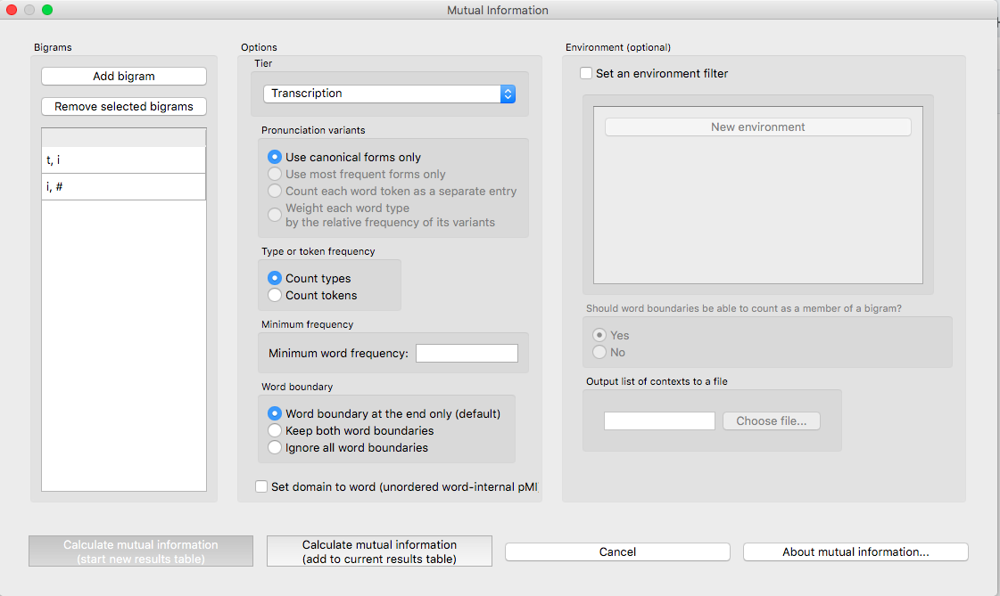
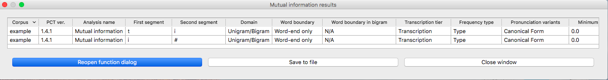

.. _mutual_information:

******************
Mutual Information
******************

.. _about_mi:

About the function
------------------

Mutual information [1]_ is a measure of how much dependency there is between
two random variables, X and Y. That is, there is a certain amount of
information gained by learning that X is present and *also* a certain amount
of information gained by learning that Y is present. But knowing that X
is present might also tell you something about the likelihood of Y being
present, and vice versa. If X and Y always co-occur, then knowing that
one is present already tells you that the other must also be present. On
the other hand, if X and Y are entirely independent, then knowing that
one is present tells you nothing about the likelihood that the other is
present.

In phonology, there are two primary ways in which one could interpret X
and Y as random variables. In one version, X and Y are equivalent random
variables, each varying over “possible speech sounds in some unit” (where
the unit could be any level of representation, e.g. a word or even a
non-meaningful unit such as a bigram). In this case, one is measuring
how much the presence of X anywhere in the defined unit affects the
presence of Y in that same unit, regardless of the order in which X and
Y occur, such that the mutual information of (X; Y) is the same as the
mutual information of (Y; X), and furthermore, the pointwise mutual
information of any individual value of each variable (X = *a*; Y = *b*) is
the same as the pointwise mutual information of (X = *b*; Y = *a*). Although
his is perhaps the most intuitive version of mutual information, given
that it does give a symmetric measure for “how much information does the
presence of a provide about the presence of *b*,” we are not currently
aware of any work that has attempted to use this interpretation of MI
for phonological purposes.

The other interpretation of MI assumes that X and Y are different random
variables, with X being “possible speech sounds occurring as the first
member of a bigram” and Y being “possible speech sounds occurring as the
second member of a bigram.” This gives a directional interpretation to
mutual information, such that, while the mutual information of (X; Y) is
the same as the mutual information of (Y; X), the pointwise mutual
information of (X = *a*; Y = *b*) is NOT the same as the pointwise mutual
information of (X = *b*; Y = *a*), because the possible values for X and Y
are different. (It is still, trivially, the case that the pointwise mutual
information of (X = *a*; Y = *b*) and (Y = *b*; X = *a*) are equal.)

This latter version of mutual information has primarily been used as a
measure of co-occurrence restrictions (harmony, phonotactics, etc.). For
example, [Goldsmith2012]_ use pointwise mutual information as a
way of examining Finnish vowel harmony; see also discussion in
[Goldsmith2002]_. Mutual information has also been used instead of
transitional probability as a way of finding boundaries between words
in running speech, with the idea that bigrams that cross word boundaries
will have, on average, lower values of mutual information than bigrams
that are within words (see [Brent1999]_, [Rytting2004]_). Note, however, that
in order for this latter use of mutual information to be useful, one must
be using a corpus based on running text rather than a corpus that is
simply a list of individual words and their token frequencies.

.. _mi_method:

Method of calculation
---------------------

Both of the interpretations of mutual information described above are
implemented in PCT. We refer to the first one, in which X and Y are
interpreted as equal random variables, varying over “possible speech
sounds in a unit,” as word-internal co-occurrence pointwise mutual
information (pMI), because we specifically use the word as the unit in
which to measure pMI. We refer to the second one, in which X and Y are
different random variables, over either the first or second members of
bigrams, as ordered pair pMI.

The general formula for pointwise mutual information is given below;
it is the binary logarithm of the joint probability of X = *a* and Y = *b*,
divided by the product of the individual probabilities that X = *a* and Y = *b*.

:math:`pMI = log_2 (\frac{p(X=a \& Y = b)}{p(X=a)*p(Y=b)})`

**Word-internal co-occurrence pMI**: In this version, the joint probability
that X = *a* and Y = *b* is equal to the probability that some unit
(here, a word) contains both a and b (in any order). Therefore, the
pointwise mutual information of the sounds *a* and *b* is equal to the binary
logarithm of the probability of some word containing both *a* and *b*, divided
by the product of the individual probabilities of a word containing *a* and
a word containing *b*.

Pointwise mutual information for individual segments:

:math:`pMI_{word-internal} = log_2 (\frac{p(a \in W \& b \in W)}
{p(a \in W)*p(b \in W)})`

Ordered pair pMI: In this version, the joint probability that X = *a* and
Y = *b* is equal to the probability of occurrence of the sequence ab.
Therefore, the pointwise mutual information of a bigram (e.g., *ab*) is
equal to the binary logarithm of the probability of the bigram divided
by the product of the individual segment probabilities, as shown in the
formula below.

Pointwise mutual information for bigrams:

:math:`pMI_{ordered-pair} = log_2 (\frac{p(ab)}
{p(a)*p(b)})`

For example, given the bigram [a, b], its pointwise mutual information
is the binary logarithm of the probability of the sequence [ab] in the
corpus divided by a quantity equal to the probability of [a] times the
probability of [b]. Bigram probabilities are calculated by dividing counts
by the total number of bigrams, and unigram probabilities are calculated
equivalently.

Note that pMI can also be expressed in terms of the information content
of each of the members of the bigram. Information is measured as the
negative log of the probability of a unit :math:`(I(a) = -log_2*p(a))`, so the
pMI of a bigram *ab* is also equal to :math:`I(a) + I(b) – I(ab)`.

Note that in PCT, calculations are not rounded until the final stage,
whereas in [Goldsmith2012]_, rounding was done at some
intermediate stages as well, which may result in slightly different
final pMI values being calculated.

.. _mi_gui:

Implementing the mutual information function in the GUI
-------------------------------------------------------

To start the analysis, click on “Analysis” / “Calculate mutual information...”
in the main menu, and then follow these steps:

1. **Bigram**: Click on the “Add bigram” button in the “Mutual Information”
   dialogue box. A new window will open with an inventory of all
   the segments that occur in your corpus. Select the bigram by clicking
   on one segment from the “left-hand side” and one segment from the
   “right-hand side.” Note that the order of the sounds matters in this function! To add more than one bigram, click “Add and create
   another” to be automatically returned to the selection window. Once
   the last bigram has been selected, simply click “Add” to return to
   the Mutual Information dialogue box. All the selected bigrams will
   appear in a list. To remove one, click on it and select “Remove
   selected bigram.”

2. **Tier**: Mutual information can be calculated on any available tier.
   The default is transcription. If a vowel tier has been created,
   for example, one could calculate the mutual information between
   vowels on that tier, ignoring intervening consonants, to examine
   harmony effects.

3. **Pronunciation variants**: If the corpus contains multiple pronunciation variants for lexical items, select what strategy should be used. For details, see :ref:`pronunciation_variants`.

4. **Type vs. Token Frequency**: Next, pick whether you want the calculation
   to be done on types or tokens, assuming that token frequencies are
   available in your corpus. If they are not, this option will not be
   available. (Note: if you think your corpus does include token frequencies,
   but this option seems to be unavailable, see :ref:`corpus_format` on the required
   format for a corpus.)

5. **Domain**: Choosing “set domain to word” will change the calculation so
   that the calculation is for word-internal co-occurrence pMI. In this
   case, the order and adjacency  of the bigram does not matter; it is
   simply treated as a pair of segments that could occur anywhere in a word.

6. **Word boundary count**: A standard word object in PCT contains word
   boundaries on both sides of it (e.g., [#kæt#] ‘cat’). If words were
   concatenated in real running speech, however, one would expect to see
   only one word boundary between each pair of words (e.g., [#mai#kæt#]
   ‘my cat’ instead of [#mai##kæt#]). To reproduce this effect and assume
   that word boundaries occur only once between words (as is assumed in
   [Goldsmith2012]_, choose “halve word boundary count.” Note that this
   technically divides the number of boundaries in half and then adds one,
   to compensate for the extra “final” boundary at the end of an utterance.
   (It will make a difference only for calculations that include a boundary
   as one member of the pair.)

7. **Results**: Once all options have been selected, click “Calculate mutual
   information.” If this is not the first calculation, and you want to add
   the results to a pre-existing results table, select the choice that
   says “add to current results table.” Otherwise, select “start new
   results table.” A dialogue box will open, showing a table of the
   results, including sound 1, sound 2, the tier used, and the mutual
   information value. To save these results to a .txt file, click on
   “Save to file” at the bottom of the table.

The following image shows the inventory window used for selecting bigrams
in the sample corpus:

.. image:: static/bigram.png
   :width: 90%
   :align: center

The selected bigrams appear in the list in the “Mutual Information” dialogue box:

The resulting mutual information results table:

To return to the function dialogue box with your most recently used selections,
click on “Reopen function dialog.” Otherwise, the results table can be
closed and you will be returned to your corpus view.

.. _mi_cli:

Implementing the mutual information function on the command line
----------------------------------------------------------------

In order to perform this analysis on the command line, you must enter a
command in the following format into your Terminal::

   pct_mutualinfo CORPUSFILE [additional arguments]

...where CORPUSFILE is the name of your \*.corpus file. If not calculating
the mutal informations of all bigrams (using -l), the query bigram must
be specified using -q, as '-q QUERY'. The bigram QUERY must
be in the format 's1,s2' where s1 and s2 are the first and second
segments in the bigram. You may also use command line options to
change the sequency type to use for your calculations, or to specify
an output file name. Descriptions of these arguments can be viewed by
running ``pct_mutualinfo -h`` or ``pct_mutualinfo --help``. The help text
from this command is copied below, augmented with specifications of
default values:

Positional arguments:

.. cmdoption:: corpus_file_name

   Name of corpus file

Mandatory argument group (call must have one of these two):

.. cmdoption:: -q QUERY
               --query QUERY

   Bigram or segment pair, as str separated by comma

.. cmdoption:: -l
               --all_pairwise_mis

   Flag: calculate MI for all orders of all pairs of segments

Optional arguments:

.. cmdoption:: -h
               --help

   Show help message and exit

.. cmdoption:: -c CONTEXT_TYPE
               --context_type CONTEXT_TYPE

   How to deal with variable pronunciations. Options are
   'Canonical', 'MostFrequent', 'SeparatedTokens', or
   'Weighted'. See documentation for details.

.. cmdoption:: -s SEQUENCE_TYPE
               --sequence_type SEQUENCE_TYPE

   The attribute of Words to calculate MI over. Normally, this will be
   the transcription, but it can also be the spelling or a user-specified tier.

.. cmdoption:: -o OUTFILE
               --outfile OUTFILE

   Name of output file

EXAMPLE 1: If your corpus file is example.corpus (no pronunciation variants)
and you want to calculate the mutual information of the bigram 'si' using
defaults for all optional arguments, you would run the following command
in your terminal window::

   pct_mutualinfo example.corpus -q s,i

EXAMPLE 2: Suppose you want to calculate the mutual information of the
bigram 'si' on the spelling tier. In addition, you want the script to
produce an output file called output.txt. You would need to run the
following command::

   pct_mutualinfo example.corpus -q s,i -s spelling -o output.txt

EXAMPLE 3: Suppose you want to calculate the mutual information of all
bigram types in the corpus. In addition, you want the script to
produce an output file called output.txt. You would need to run the
following command::

   pct_mutualinfo example.corpus -l -o output.txt

.. _mutual_info_classes_and_functions:

Classes and functions
---------------------
For further details about the relevant classes and functions in PCT's
source code, please refer to :ref:`api_reference`.

.. [1] The algorithm in PCT calculates what is sometimes referred to
   as the “pointwise” mutual information of a pair of units X and Y,
   in contrast to “mutual information,” which would be the expected
   average value of the pointwise mutual information of all possible
   values of X and Y. We simplify to use “mutual information” throughout.
