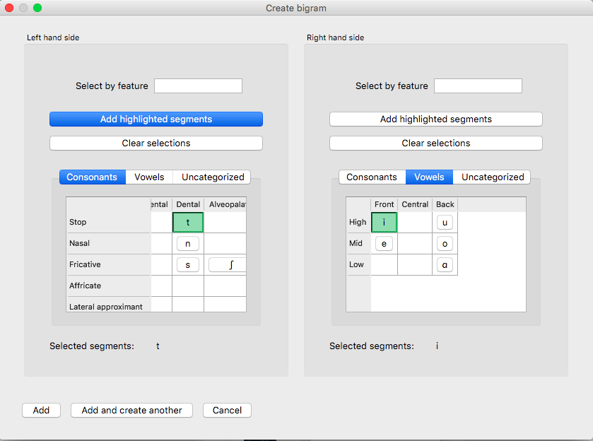

.. _mutual_information:

******************
Mutual Information
******************

.. _about_mi:

About the function
------------------

Mutual information [1]_ is a measure of how much dependency there is between
two random variables, X and Y. That is, there is a certain amount of
information gained by learning that X is present and *also* a certain amount
of information gained by learning that Y is present. But knowing that X
is present might also tell you something about the likelihood of Y being
present, and vice versa. If X and Y always co-occur, then knowing that
one is present already tells you that the other must also be present. On
the other hand, if X and Y are entirely independent, then knowing that
one is present tells you nothing about the likelihood that the other is
present.

In phonology, there are two primary ways in which one could interpret X
and Y as random variables. In one version, which we will call *word-internal co-occurrence pointwise mutual
information*, X and Y are equivalent random
variables, each varying over “possible speech sounds in some unit” (where
the unit could be any level of representation, e.g. a word or even a
non-meaningful unit such as a bigram). In this case, one is measuring
how much the presence of X anywhere in the defined unit affects the
presence of Y in that same unit, regardless of the order in which X and
Y occur, such that the mutual information of (X; Y) is the same as the
mutual information of (Y; X), and furthermore, the pointwise mutual
information of any individual value of each variable (X = *a*; Y = *b*) is
the same as the pointwise mutual information of (X = *b*; Y = *a*). Although
this is perhaps the most intuitive version of mutual information, given
that it does give a symmetric measure for “how much information does the
presence of *a* provide about the presence of *b*,” we are not currently
aware of any work that has attempted to use this interpretation of MI
for phonological purposes.

The other interpretation of MI, which we will call *ordered pair pMI*, assumes that X and Y are different random
variables, with X being “possible speech sounds occurring as the first
member of a bigram” and Y being “possible speech sounds occurring as the
second member of a bigram.” This gives a directional interpretation to
mutual information, such that, while the mutual information of (X; Y) is
the same as the mutual information of (Y; X), the pointwise mutual
information of (X = *a*; Y = *b*) is NOT the same as the pointwise mutual
information of (X = *b*; Y = *a*), because the possible values for X and Y
are different. (It is still, trivially, the case that the pointwise mutual
information of (X = *a*; Y = *b*) and (Y = *b*; X = *a*) are equal.)

This latter version of mutual information has primarily been used as a
measure of co-occurrence restrictions (harmony, phonotactics, etc.). For
example, [Goldsmith2012]_ use pointwise mutual information as a
way of examining Finnish vowel harmony; see also discussion in
[Goldsmith2002]_. Mutual information has also been used instead of
:ref:`transitional_probability` as a way of finding boundaries between words
in running speech, with the idea that bigrams that cross word boundaries
will have, on average, lower values of mutual information than bigrams
that are within words (see [Brent1999]_, [Rytting2004]_). Note, however, that
in order for this latter use of mutual information to be useful, one must
be using a corpus based on running text rather than a corpus that is
simply a list of individual words and their token frequencies.

Note that pointwise mutual information can also be expressed in terms of the
information content of each of the members of the bigram. Information is measured as the
negative log of the probability of a unit :math:`(I(a) = -log_2*p(a))`, so the
pMI of a bigram *ab* is also equal to :math:`I(a) + I(b) – I(ab)`.

.. _mi_method:

Method of calculation
---------------------

Both of the interpretations of mutual information described above are
implemented in PCT. We refer to the first one, in which X and Y are
interpreted as equal random variables, varying over “possible speech
sounds in a unit,” as *word-internal co-occurrence pointwise mutual
information* (pMI), because we specifically use the word as the unit in
which to measure pMI. We refer to the second one, in which X and Y are
different random variables, over either the first or second members of
bigrams, as *ordered pair pMI*.

The general formula for all versions of pointwise mutual information is given below;
it is the binary logarithm of the joint probability of X = *a* and Y = *b*,
divided by the product of the individual probabilities that X = *a* and Y = *b*.

:math:`pMI = log_2 (\frac{p(X=a \& Y = b)}{p(X=a)*p(Y=b)})`

Note that in PCT, calculations are not rounded until the final stage,
whereas in [Goldsmith2012]_, rounding was done at some
intermediate stages as well, which may result in slightly different
final pMI values being calculated.

.. _mi_method_word_internal_pmi:

Word-internal co-occurrence pMI
```````````````````````````````
In this implementation of pMI, the joint probability that X = *a* and Y = *b*
is equal to the probability that some unit (in our case, a word) contains
both a and b in any order. Therefore, the pMI of the sounds *a* and *b* is equal to the binary
logarithm of the probability of some word containing both *a* and *b*, divided
by the product of the individual probabilities of a word containing *a* and
a word containing *b*.

Pointwise mutual information for individual segments:

:math:`pMI_{word-internal} = log_2 (\frac{p(a \in W \& b \in W)}
{p(a \in W)*p(b \in W)})`

.. _mi_method_ordered_pair_pmi:

Ordered pair pMI
````````````````
In this version of pMI, the joint probability that X = *a* and Y = *b* is equal to the probability
of occurrence of the sequence *ab*. Therefore, the pointwise mutual information of a bigram
(e.g., *ab*) is equal to the binary logarithm of the probability of the bigram divided
by the product of the individual segment probabilities, as shown in the
formula below.

Pointwise mutual information for bigrams:

:math:`pMI_{ordered-pair} = log_2 (\frac{p(ab)}
{p(a)*p(b)})`

For example, given the bigram [a, b], its pointwise mutual information
is the binary logarithm of the probability of the sequence [ab] in the
corpus divided by a quantity equal to the probability of [a] times the
probability of [b]. Bigram probabilities are calculated by dividing counts
by the total number of bigrams, and unigram probabilities are calculated
equivalently.

.. _mi_env_filter:

Environment filters
```````````````````
In addition to simply calculating mutual information based on any occurrence of the two segments,
the user may limit the occurrences that "count" as occurrences of those segments by specific
environments using :ref:`environment_selection`. For example, one might be interested in calculating
the ordered pair pMI not in all positions but only in word-final positions (environment filtering is
irrelevant for word-internal co-occurrence pMI). Let's assume we calculate pMI of the bigram [ʃ,i] in the
mini corpus below. For the purpose of presentation, each word occurs once in the corpus and
transcriptions contain word boundaries (#) on both sides, contra the default setting for word boundaries. In
this table, we will include both word boundaries as potential elements of bigrams (e.g. in this table, the word [#ʃi#] 
contains three bigrams, [#ʃ], [ʃi], and [i#]), though we will subsequently discuss other options. See step 6
of "Calculating mutual information in the GUI" (**Word boundary count**) for general information.

+--------+------------+------+-----------+-------------+----------+----------+-----------+
|  Word  |  Trans.    | Freq.| Num. seg. | Num. bigram | Num. [ʃ] | Num. [i] | Num. [ʃi] |
+========+============+======+===========+=============+==========+==========+===========+
|  ʃaʃi  |  [#ʃaʃi#]  |  1   |     6     |      5      |    2     |    1     |     1     |
+--------+------------+------+-----------+-------------+----------+----------+-----------+
|   ʃi   |   [#ʃi#]   |  1   |     4     |      3      |    1     |    1     |     1     |
+--------+------------+------+-----------+-------------+----------+----------+-----------+
| ʃisota | [#ʃisota#] |  1   |     8     |      7      |    1     |    1     |     1     |
+--------+------------+------+-----------+-------------+----------+----------+-----------+
|   i    |   [#i#]    |  1   |     3     |      2      |    0     |    1     |     0     |
+--------+------------+------+-----------+-------------+----------+----------+-----------+
|        Total        |  4   |    21     |     17      |    4     |    4     |     3     |
+--------+------------+------+-----------+-------------+----------+----------+-----------+

One can calculate pMI of the bigram [ʃ,i] in this corpus with or without environment filtering.

Let's first calculate pMI(ʃ,i) without environment filtering as the baseline. Using the numbers presented
in the table,

:math:`pMI (ʃ,i) = log_2 (\frac{p(ʃi)}
{p(ʃ)*p(i)}) = 2.28`

since, :math:`p(ʃi) = \frac{3}{17}`, :math:`p(ʃ) = \frac{4}{21}`, and :math:`p(i) = \frac{4}{21}`

Meanwhile, when calculating pMI for the same bigram only in word-final position, i.e., in the context [__#],
we “clip” or "filter" the corpus,
leaving only the last two segment positions in each word for potential bigrams. (Note that the location
of the potential bigrams is dependent on the :ref:`environment_selection`. For example,
calculating the same bigram in a word-initial position would require leaving the first two positions.)
In the two tables below, the result of clipping is shown in the column labeled “Context”. In this case,
we have simply extracted all bigrams that occur in the context __#.

When applying environment filters, the question of word boundaries takes on an additional complication. 
Specifically, we must decide whether a word boundary is allowed to count as part of a bigram (separately from the 
presence of the word boundary that happens to be a part of our selected context in this case). 
Whether the word boundary can be a part of potential bigram is critical for the last word, [#i#].
If # can count as a member of a bigram, the word has the bigram [#i] in the context [__#]. If # is NOT
allowed to count a a member of a bigram, then the only segment in the context [__#] in this word is not
a bigram (it's the single segment [i]), and so the word [#i#] is ignored entirely.

The comparison between including or excluding # in bigrams is presented in the two tables below. 
Note how the “Context” columns are different in the row for [#i#].

**Word boundary counts as a member of a bigram**

+--------+------------+---------+------+-----------+-------------+----------+----------+-----------+
|  Word  |  Trans.    | Context | Freq.| Num. seg. | Num. bigram | Num. [ʃ] | Num. [i] | Num. [ʃi] |
+========+============+=========+======+===========+=============+==========+==========+===========+
|  ʃaʃi  |  [#ʃaʃi#]  |  [ʃi#]  |  1   |     3     |      2      |    1     |    1     |     1     |
+--------+------------+---------+------+-----------+-------------+----------+----------+-----------+
|   ʃi   |   [#ʃi#]   |  [ʃi#]  |  1   |     3     |      2      |    1     |    1     |     1     |
+--------+------------+---------+------+-----------+-------------+----------+----------+-----------+
| ʃisota | [#ʃisota#] |  [ta#]  |  1   |     3     |      2      |    0     |    0     |     0     |
+--------+------------+---------+------+-----------+-------------+----------+----------+-----------+
|   i    |   [#i#]    |  [#i#]  |  1   |     3     |      2      |    0     |    1     |     0     |
+--------+------------+---------+------+-----------+-------------+----------+----------+-----------+
|        Total                  |  4   |    12     |      8      |    2     |    3     |     2     |
+--------+------------+---------+------+-----------+-------------+----------+----------+-----------+

Now, we can calculate pMI(ʃ,i) in this “Clipped corpus,” that is, using the forms in the “Context” column.

:math:`pMI_{(\_\#, WB\ bigram)} (ʃ,i) = log_2 (\frac{p(ʃi)}
{p(ʃ)*p(i)}) = 2.58`

since, :math:`p(ʃi) = \frac{2}{8}`, :math:`p(ʃ) = \frac{2}{12}`, and :math:`p(i) = \frac{3}{12}`

**Word boundary does NOT count as a member of a bigram**

+--------+------------+---------+------+-----------+-------------+----------+----------+-----------+
|  Word  |  Trans.    | Context | Freq.| Num. seg. | Num. bigram | Num. [ʃ] | Num. [i] | Num. [ʃi] |
+========+============+=========+======+===========+=============+==========+==========+===========+
|  ʃaʃi  |  [#ʃaʃi#]  |  [ʃi#]  |  1   |     3     |      2      |    1     |    1     |     1     |
+--------+------------+---------+------+-----------+-------------+----------+----------+-----------+
|   ʃi   |   [#ʃi#]   |  [ʃi#]  |  1   |     3     |      2      |    1     |    1     |     1     |
+--------+------------+---------+------+-----------+-------------+----------+----------+-----------+
| ʃisota | [#ʃisota#] |  [ta#]  |  1   |     3     |      2      |    0     |    0     |     0     |
+--------+------------+---------+------+-----------+-------------+----------+----------+-----------+
|   i    |   [#i#]    |   N/A   |                                                                  |
+--------+------------+---------+------+-----------+-------------+----------+----------+-----------+
|        Total                  |  3   |     9     |      6      |    2     |    2     |     2     |
+--------+------------+---------+------+-----------+-------------+----------+----------+-----------+

Again, we can calculate pMI(ʃ,i) in this “Clipped corpus,” that is, using the forms in the “Context” column.
Note that the word [#i#] does not have the context since the word-initial word boundary symbol cannot be a
part of bigram.

:math:`pMI_{(\_\#)} (ʃ,i) = log_2 (\frac{p(ʃi)}
{p(ʃ)*p(i)}) = 2.75`

since, :math:`p(ʃi) = \frac{2}{6}`, :math:`p(ʃ) = \frac{2}{9}`, and :math:`p(i) = \frac{2}{9}`


.. _mi_gui:

Calculating mutual information in the GUI
-----------------------------------------

To start the analysis, click on “Analysis” / “Calculate mutual information...”
in the main menu. The choice between the two algorithms depends on the setting
of **Set domain to word**. The default is *ordered pair pMI* and choosing “set domain to word”
switches to the **unordered** *word-internal co-occurrence pMI*. Note that switching
to word-internal pMI is not available when the environment filter is on.

Follow these steps to calculate mutual information:

1. **Bigrams**: Click on the “Add bigram” button in the “Mutual Information”
   dialogue box to get the :ref:`bigram_selector` dialogue box. Note that the order of the sounds matters if “Set domain to word
   (unordered word-internal pMI)" is unchecked (the default). 

2. **Tier**: Mutual information can be calculated on any available tier.
   The default is transcription. If a vowel tier has been created,
   for example, one could calculate the mutual information between
   vowels on that tier, ignoring intervening consonants, to examine
   harmony effects.

3. **Pronunciation variants**: If the corpus contains multiple pronunciation variants for lexical items, select what strategy should be used. For details, see :ref:`pronunciation_variants`.

4. **Type vs. Token Frequency**: Next, pick whether you want the calculation
   to be done on types or tokens, assuming that token frequencies are
   available in your corpus. If they are not, this option will not be
   available. (Note: if you think your corpus does include token frequencies,
   but this option seems to be unavailable, see :ref:`corpus_format` on the required
   format for a corpus.)

5. **Minimum frequency**: It is possible to set a minimum token frequency for words
   in the corpus to be included in the calculation. This allows easy exclusion of rare
   words. To include all words in the corpus, regardless of their token frequency,
   leave the slot empty or set it to 0. Note that if a minimum frequency set,
   all words below that frequency are simply ignored entirely for the purposes of the calculation.

6. **Word boundary count**: Select an option for word boundary. The default is to assume
   that there is only one boundary per word, and that it is in final position (as is assumed in
   [Goldsmith2012]_). This is based on the assumption that in running text, the final boundary of word 1
   will be the initial boundary of word 2, so that there is no need to have two boundaries per word. 
   Select "Keep both word boundaries" to have boundaries on both sides, or
   "Ignore all word boundaries" to ignore all word boundaries in the calculation. Note that this is a 
   separate issue from whether word boundaries should be considered part of a bigram when an 
   environment filter is applied (see step 8 below).

7. **Set domain to word (unordered word-internal pMI)**: Select this button to
   calculate :ref:`mi_method_word_internal_pmi`. Note that environment filtering
   is not meaningful in unordered word-internal pMI.

8. **Environment (optional)**: Select “Set an environment filter” button to add
   environment filters. (see :ref:`mi_env_filter` for how environment filtering
   works in calculating pMI, and :ref:`environment_selection` for how to add
   an environment)

   a. **Should word boundaries be able to count as a member of a bigram?**:
      As described in :ref:`mi_env_filter`, the user can include or exclude word boundaries
      as a member of a potential bigram.

   b. **Output list of contexts to a file**: One can provide a path to export the corpus
      'context', i.e., the result of environment filtering that is to be fed into calculating pMI.
      The exported file can be found at the specified location after clicking “Calculate mutual
      information.”

9. **Results**: Once all options have been selected, click “Calculate mutual
   information.” If this is not the first calculation, and you want to add
   the results to a pre-existing results table, select the choice that
   says “add to current results table.” Otherwise, select “start new
   results table.” A dialogue box will open, showing a table of the
   results. The mutual information value is located on the right-most
   column. The table also includes machine-provided information such as corpus name and PCT version,
   as well as options selected by the user such as first segment, second segment, domain
   (i.e., which one of the two algorithms), the word boundary option, the tier used, frequency type,
   pronunciation variants, minimum word frequency and environment. To save these results to a .txt file, click on
   “Save to file” at the bottom of the table.

The following image shows the inventory window used for selecting bigrams
in the sample corpus:



The selected bigrams appear in the list in the “Mutual Information” dialogue box. You will see that we added another
bigram, [i, #]. We did this by clicking **Add and create another** after entering the bigram [t,i], selecting i and #
from the inventory chart. # (the word boundary symbol) should be under **Uncategorized**:

.. image:: static/midialog.png
   :width: 90%
   :align: center

The resulting mutual information results table:

.. image:: static/miresults.png
   :width: 90%
   :align: center

To return to the function dialogue box with your most recently used selections,
click on “Reopen function dialog.” Otherwise, the results table can be
closed and you will be returned to your corpus view.

.. _mi_cli:


Implementing the mutual information function on the command line
----------------------------------------------------------------

In order to perform this analysis on the command line, you must enter a
command in the following format into your Terminal::

   pct_mutualinfo CORPUSFILE [additional arguments]

...where CORPUSFILE is the name of your \*.corpus file. If not calculating
the mutal informations of all bigrams (using ``-l``), the query bigram must
be specified using ``-q``, as ``-q QUERY``. The bigram QUERY must
be in the format ``s1,s2`` where ``s1`` and ``s2`` are the first and second
segments in the bigram. You may also use command line options to
change the sequency type to use for your calculations, or to specify
an output file name. Descriptions of these arguments can be viewed by
running ``pct_mutualinfo -h`` or ``pct_mutualinfo --help``. The help text
from this command is copied below, augmented with specifications of
default values:

Positional arguments:

.. cmdoption:: corpus_file_name

   Name of corpus file

Mandatory argument group (call must have one of these two):

.. cmdoption:: -q QUERY
               --query QUERY

   Bigram or segment pair, as str separated by comma

.. cmdoption:: -l
               --all_pairwise_mis

   Flag: calculate MI for all orders of all pairs of segments

Optional arguments:

.. cmdoption:: -h
               --help

   Show help message and exit

.. cmdoption:: -c CONTEXT_TYPE
               --context_type CONTEXT_TYPE

   How to deal with variable pronunciations. Options are
   'Canonical', 'MostFrequent', 'SeparatedTokens', or
   'Weighted'. See documentation for details.

.. cmdoption:: -s SEQUENCE_TYPE
               --sequence_type SEQUENCE_TYPE

   The attribute of Words to calculate MI over. Normally, this will be
   the transcription, but it can also be the spelling or a user-specified tier.

.. cmdoption:: -o OUTFILE
               --outfile OUTFILE

   Name of output file

EXAMPLE 1: If your corpus file is example.corpus (no pronunciation variants)
and you want to calculate the mutual information of the bigram 'si' using
defaults for all optional arguments, you would run the following command
in your terminal window::

   pct_mutualinfo example.corpus -q s,i

EXAMPLE 2: Suppose you want to calculate the mutual information of the
bigram 'si' on the spelling tier. In addition, you want the script to
produce an output file called output.txt. You would need to run the
following command::

   pct_mutualinfo example.corpus -q s,i -s spelling -o output.txt

EXAMPLE 3: Suppose you want to calculate the mutual information of all
bigram types in the corpus. In addition, you want the script to
produce an output file called output.txt. You would need to run the
following command::

   pct_mutualinfo example.corpus -l -o output.txt


.. _mutual_info_classes_and_functions:

Classes and functions
---------------------
For further details about the relevant classes and functions in PCT's
source code, please refer to :ref:`mutual_info_api`.


.. [1] The algorithm in PCT calculates what is sometimes referred to
   as the “pointwise” mutual information of a pair of units X and Y,
   in contrast to “mutual information,” which would be the expected
   average value of the pointwise mutual information of all possible
   values of X and Y. We simplify to use “mutual information” throughout.
