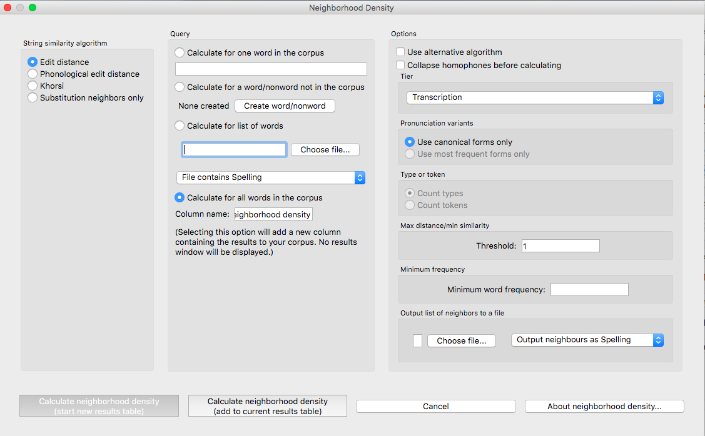
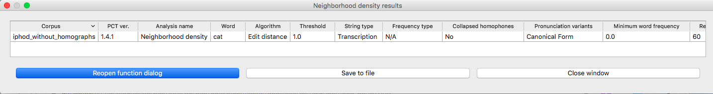
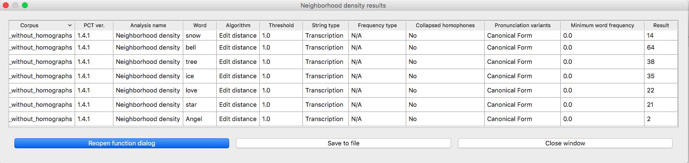

.. _neighborhood_density:

*******************************************
Neighbourhood density
*******************************************

.. _about_neighborhood_density:

About the functions
-------------------

Some measures of :ref:`string_similarity` are used to calculate neighbourhood
density (e.g. [Greenberg1964]_; [Luce1998]_; [Yao2011]_),
which has been shown to affect phonological processing. A phonological
“neighbor” of some word X is a word that is similar in some close way
to X. For example, it might differ by maximally one phone (through deletion,
addition, or subsitution) from X. X’s neighborhood density, then, is the
number of words that fit the criterion for being a neighbour.

.. _method_neighborhood_density:

Method of calculation: Neighbourhood density
--------------------------------------------

A word's neighborhood density is equal to the number of other words in the
corpus similar to that word (or, if using token frequencies, the sum of
those words' counts). The threshold that defines whether two words are
considered similar to each other can be calculated using any of the three
distance metrics described in :ref:`method_string_similarity`: Levenshtein edit distance,
phonological edit distance, or Khorsi (2012) similarity. As implemented
in PCT, for a query word, each other word in the corpus is checked for
its similarity to the query word and then added to a list of neighbors
if sufficiently similar.

For further detail about the available distance/similarity metrics,
refer to :ref:`method_string_similarity`.

.. _neighborhood_density_gui:

Implementing the neighbourhood density function in the GUI
----------------------------------------------------------

To start the analysis, click on “Analysis” / “Calculate neighbourhood
density...” in the main menu, and then follow these steps:

1. **String similarity algorithm**: The first step is to choose which of the
   three methods of string similarity is to be used to calculate
   neighbourhood density. Note that the standard way of calculating
   density is using standard Levenstein edit distance. We include the
   other two algorithms here as options primarily for the purpose of
   allowing users to explore whether they might be useful measures; we
   make no claims that either phonological edit distance or the Khorsi
   algorithm might be better than edit distance for any reason.

   a. **Minimal pair counts / Substitution neighbours**: It is also possible to
      calculate neighbourhood density by using a variation of edit distance
      that allows for “substitutions only” (not deletions or insertions).
      This is particularly useful if, for example, you wish to know the
      number of or identity of all minimal pairs for a given word in the
      corpus, as minimal pairs are generally assumed to be substitution
      neighbours with an edit distance of 1. (Note that the substitution
      neighbours algorithm automatically assumes a threshold of 1; multiple
      substitutions are not allowed.)

2. **Query type**: Neighbourhood density can be calculated for one of four
   types of inputs:

   a. **One word in the corpus**: The neighbourhood density of a single word
      can be calculated by entering that word’s orthographic representation
      in the query box.
   b. **One word not in the corpus**: (Note that this will NOT add the word
      itself to the corpus, and will not affect any subsequent calculations.
      To globally add a word to the corpus itself, please see the
      instructions in :ref:`add_word`.) Select “Calculate for a word/nonword
      in the corpus,” then choose “Create word/nonword” to enter the
      new word and do the following:

      i. **Spelling**: Enter the spelling for your new word / nonword using
         the regular input keyboard on your computer.
      ii. **Transcription**: To add in the phonetic transcription of the new
          word, it is best to use the provided inventory. While it is
          possible to type directly in to the transcription box, using
          the provided inventory will ensure that all characters are
          understood by PCT to correspond to existing characters in the
          corpus (with their concomitant featural interpretation). Click
          on “Show inventory” and then choose to show “Consonants,”
          “Vowels,” and/or other. (If there is no featural interpretation
          of your inventory, you will simply see a list of all the
          available segments, but they will not be classifed by major
          category.) Clicking on the individual segments will add them
          to the transcription. The selections will remain even when the
          sub-inventories are hidden; we allow for showing / hiding the
          inventories to ensure that all relevant buttons on the dialogue
          box are available, even on small computer screens. Note that you
          do NOT need to include word boundaries at the beginning and end
          of the word, even when the boundary symbol is included as a member
          of the inventory; these will be assumed automatically by PCT.
      iii. **Frequency and other columns**: These can be left at the default.
           Note that entering values will NOT affect the calculation; there
           is no particular need to enter anything here (it is an artifact
           of using the same dialogue box here as in the “Add Word” function
           described in :ref:`add_word`).
      iv. **Create word**: To finish and return to the “String similarity”
          dialogue box, click on “Create word.”

   c. **List of words**: If there is a specific list of words for which density
      is to be calculated (e.g., the stimuli list for an experiment), that
      list can be saved as a .txt file with one word per line and uploaded
      into PCT for analysis. Note that in this case, if the words **are** in
      the corpus, either transcription- or spelling-based neighbourhood
      density can be calculated; either way, the words on the list should be
      written in standard orthography (their transcriptions will be looked
      up in the corpus if needed). If the words are **not** in the corpus, then
      only spelling-based neighbourhood density can currently be calculated;
      again, the words should be written in orthographically.
   d. **Whole corpus**: Alternatively, the neighbourhood density for every word
      in the corpus can be calculated. This is useful, for example, if one
      wishes to find words that match a particular neighbourhood density.
      The density of each word will be added to the corpus itself, as a
      separate column; in the “query” box, simply enter the name of that
      column (the default is “Neighborhood Density”).
3. **Tier**: Neighbourhood density can be calculated from most of the available
   tiers in a corpus (e.g., spelling, transcription, or tiers that
   represent subsets of entries, such as a vowel or consonant tier).
   (If neighbourhood density is being calculated with phonological edit
   distance as the similarity metric, spelling cannot be used.) Standard
   neighbourhood density is calculated using edit distance on transcriptions.
4. **Type vs. token frequency**: If the Khorsi algorithm is selected as the
   string similarity metric, similarity can be calculated using either
   type or token frequency, as described in :ref:`khorsi`.
5. **Distance / Similarity Threshold**: A specific threshold must be set to
   determine what counts as a “neighbour.” If either of the edit distance
   metrics is selected, this should be the maximal distance that is
   allowed – in standard calculations of neighbourhood density, this
   would be 1, signifying a maximum 1-phone change from the starting
   word. If the Khorsi algorithm is selected, this should be the
   minimum similarity score that is required. Because this is not the
   standard way of calculating neighbourhood density, we have no
   recommendations for what value(s) might be good defaults here;
   instead, we recommend experimenting with the string similarity
   algorithm to determine what kinds of values are common for words
   that seem to count as neighbours, and working backward from that.
6. **Output file**: If this option is left blank, PCT will simply return
   the actual neighbourhood density for each word that is calculated
   (i.e., the number of neighbours of each word). If a file is chosen,
   then the number will still be returned, but additionally, a file
   will be created that lists all of the actual neighbours for each word.
7. **Results**: Once all options have been selected, click “Calculate
   neighborhood density.” If this is not the first calculation, and
   you want to add the results to a pre-existing results table, select
   the choice that says “add to current results table.” Otherwise,
   select “start new results table.” A dialogue box will open, showing
   a table of the results, including the word, its neighbourhood density,
   the string type from which neighbourhood density was calculated,
   whether type or token frequency was used (if applicable), the string
   similarity algorithm that was used, and the threshold value. If the
   neighbourhood density for all words in the corpus is being calculated,
   simply click on the “start new results table” option, and you will be
   returned to your corpus, where a new column has been added automatically.
8. **Saving results**: The results tables can each be saved to tab-delimited
   .txt files by selecting “Save to file” at the bottom of the window.
   Any output files containing actual lists of neighbours are already
   saved as .txt files in the location specified (see step 6). If all
   neighbourhood densities are calculated for a corpus, the corpus itself
   can be saved by going to “File” / “Export corpus as text file,” from
   where it can be reloaded into PCT for use in future sessions with the
   neighbourhood densities included.

Here’s an example of neighbourhood density being calculated on
transcriptions for the entire example corpus, using edit distance
with a threshold of 1:

The corpus with all words’ densities added:

An example of calculating all the neighbours for a given word in the
IPHOD corpus, and saving the resulting list of neighbours to an output file:

.. image:: static/neighdendialogoutput.png
   :width: 90%
   :align: center

The on-screen results table, which can be saved to a file itself:

And the saved output file listing all 45 of the neighbours of *cat* in the IPHOD corpus:

.. image:: static/neighdenoutput.png
   :width: 90%
   :align: center

An example .txt file containing one word per line, that can be uploaded
into PCT so that the neighbourhood density of each word is calculated:

.. image:: static/neighdeninput.png
   :width: 90%
   :align: center

The resulting table of neighbourhood densities for each word on the list
(in the IPHOD corpus, with standard edit distance and a threshold of 1):

To return to the function dialogue box with your most recently used
selections after any results table has been created, click on “Reopen
function dialog.” Otherwise, the results table can be closed and you
will be returned to your corpus view.

.._neighborhood_density_gui:

Implementing the neighbourhood density function on the command line
-------------------------------------------------------------------

In order to perform this analysis on the command line, you must enter a
command in the following format into your Terminal::

   pct_neighdens CORPUSFILE ARG2

...where CORPUSFILE is the name of your \*.corpus file and ARG2 is either
the word whose neighborhood density you wish to calculate or the name
of your word list file (if calculating the neighborhood density of each
word). The word list file must contain one word (specified using either
spelling or transcription) on each line. You may also use command line
options to change various parameters of your neighborhood density
calculations. Descriptions of these arguments can be viewed by running
``pct_neighdens –h`` or ``pct_neighdens –help``. The help text from this
command is copied below, augmented with specifications of default values:

Positional arguments:

.. cmdoption:: corpus_file_name

   Name of corpus file

.. cmdoption:: query

   Name of word to query, or name of file including a list of words

Optional arguments:

.. cmdoption:: -h
               --help

   Show this help message and exit

.. cmdoption:: -a ALGORITHM
               --algorithm ALGORITHM

   The algorithm used to determine distance

.. cmdoption:: -d MAX_DISTANCE
               --max_distance MAX_DISTANCE

   Maximum edit distance from the queried word to consider a word a neighbor.

.. cmdoption:: -s SEQUENCE_TYPE
               --sequence_type SEQUENCE_TYPE

   The name of the tier on which to calculate distance

.. cmdoption:: -w COUNT_WHAT
               --count_what COUNT_WHAT

   If 'type', count neighbors in terms of their type frequency. If
   'token', count neighbors in terms of their token frequency.

.. cmdoption:: -m
               --find_mutation_minpairs

   This flag causes the script not to calculate neighborhood density,
   but rather to find minimal pairs--see documentation.

.. cmdoption:: -o OUTFILE
               --outfile OUTFILE

   Name of output file.

EXAMPLE 1: If your corpus file is example.corpus and you want to
calculate the neighborhood density of the word 'nata' using defaults
for all optional arguments, you would run the following command in your
terminal window::

   pct_neighdens example.corpus nata

EXAMPLE 2: Suppose you want to calculate the neighborhood distance of a
list of words located in the file mywords.txt . Your corpus file is again
example.corpus. You want to use the phonological edit distance metric,
and you wish to count as a neighbor any word with a distance less than
0.75 from the query word. In addition, you want the script to produce an
output file called output.txt .  You would need to run the following command::

   pct_neighdens example.corpus mywords.txt -a phonological_edit_distance -d 0.75 -o output.txt

EXAMPLE 3: You wish to find a list of the minimal pairs of the word 'nata'.
You would need to run the following command::

   pct_neighdens example.corpus nata -m
