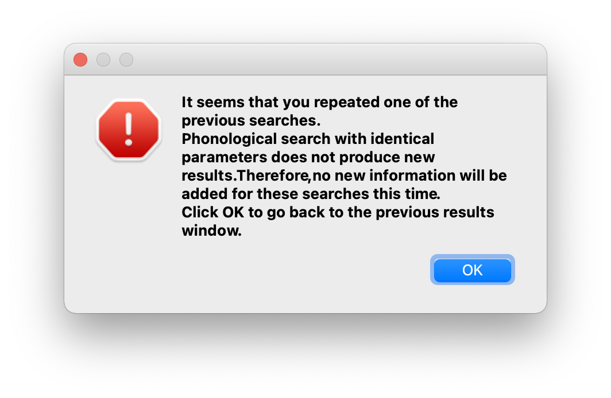
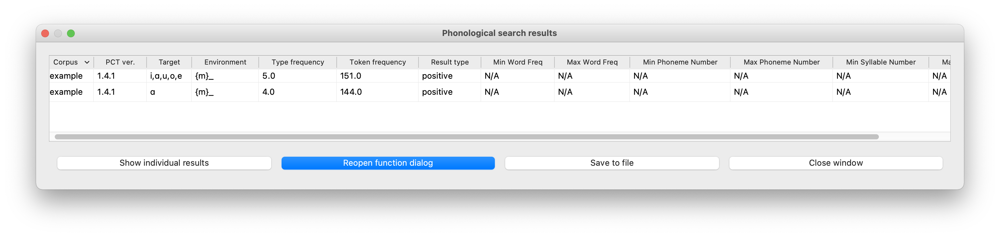
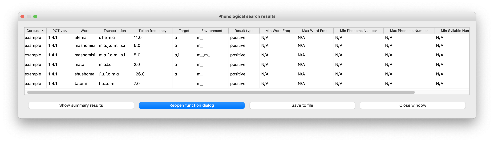

.. _phonological_search:

*******************
Phonological search
*******************

PCT allows you to do searches for various strings or syllables. They can be defined by segments or features, and can be filtered by frequency and / or length.
The search returns two types of information: the first is called “summary results,” where a general count
of the number of entries that fit the search is described, and the other is “individual results,” where
a list of all the words in the corpus that contain the specified string is presented. Finally, you can save a search for later use.

To conduct a search, first choose “Corpus” / “Phonological search...”
and do the following:

1. **Search mode**: There are two modes in which phonological searches can be conducted: "segment mode" and "syllable mode."
“Segment mode” treats words in the corpus as a linear sequence of segments, so it is useful for
searching for a target in a linear context. This is the only search type that was available
in early versions of PCT. “Syllable mode,” on the other hand, allows you to construct syllables for your search,
such that you can search for both syllable components like “onset” and “coda”. Syllable mode is useful
when, for example, you want to limit your search to the second syllable of a word, or to the onset of a syllable.
If you were to do it in segments mode, you would need to construct by hand all the different types of possible syllables before
the target, because the segments mode is blind to the notion of the syllable. Syllable mode also allows you to search
for characteristics that are specified at the syllabic level, such as stress or tone. In order to use syllables mode, though,
your corpus must be delimited for syllables; see :ref:`parsing_parameters` and :ref:`column-delimited` for more information.

2. **Result type**: Select either positive or negative. A positive search returns entries
   that satisfy the environment you choose in the environment selection; while negative search
   returns the strings that do *not* fall under the environment that you specify, i.e., the complement
   of your search.

3. **Tier**: Select the tier on which phonological search should be performed.
   The default would be the transcription tier, so that phonological
   environments are defined locally. But, for example, if a vowel tier
   is selected, then one could search for the occurrence of, e.g., [i]
   before mid vowels on that tier (hence ignoring intervening consonants). (Note that it is not currently possible to do a phonological search within :ref:`pronunciation_variants`; the search will look only at the canonical forms or whatever forms are listed in the specified tier.)

4. **Environments**: Select the strings you want to search for. See :ref:`environment_selection` and :ref:`sound_selection` for details, including the differences between selecting environments in segment vs. syllable mode.

   An example of adding environments for a positive search in segment mode (in this case, the environment “word-initial,
   before a vowel”) (before any actual target has been selected):

   .. image:: static/phonosearchenvironment.png
      :width: 100%
      :align: center

   An example of the phonological search window, set up to search for voiceless stops word-initially before vowels
   and between [ɑ] vowels, on the transcription tier (positive search):

   .. image:: static/phonosearchenvironment2.png
      :width: 100%
      :align: center

   Note that if a negative search is to be performed, only a SINGLE environment can be specified at a time. This is to avoid confusion in the list of results.  An example of the phonological search window, set up to do a *negative* search for voiceless stops word-initially before vowels, on the transcription tier is as follows. In other words, this search should return all words in the corpus that do NOT contain word-initial, pre-vocalic voiceless stops:

   .. image:: static/phonosearchenvironment3.png
      :width: 100%
      :align: center

5. **Saving Searches**: It is possible to save particular searches and then re-load them for later use (within the same
   corpus, or in a different one). PCT will automatically save the five most recent searches for you, but you can also
   specify that any particular search should be saved for the long term.

   To save a search, click on “Save current search” in the “Phonological Search” dialogue box (see above pictures).
   To modify it or to use a saved search, click on “Load recent search.” See :ref:`saving_phono_search` for details.

6. **Summary Display Option** As of PCT 1.5.1, there are two options for the display of results for searches that have multiple components in the target and environment selections. The default is that each environment specified returns one row of results in the summary results window. For example, if a search is done for [s, ʃ] in the environment __ [ɑ, i], then the summary results window will show that there are a total of six words that have either [s] or [ʃ] before either [ɑ] or [i]:

   .. image:: static/phonosearchenvironment4_not_sep.png
      :width: 100%
      :align: center

On the other hand, if the option "List target segments and environments separately in summary results" is checked, then each target and environment is shown separately, so that there are four results, one for [s] before [ɑ], one for [s] before [i], one for [ʃ] before [ɑ], and one for [ʃ] before [i] (this is the equivalent of doing these four searches separately):

   .. image:: static/phonosearchenvironment4_sep.png
      :width: 100%
      :align: center

Note that in either case, the individual results will be identical; this is just the list of individual words that match any of these four environments:

   .. image:: static/phonosearchenvironment4_individ_results.png
      :width: 100%
      :align: center

.. note::
   Note that it is not possible to list target segments and environments separately in summary results for a negative search. 

7. **Additional Filters**: As of PCT 1.5.0, there are some extra options that can be added to phonological searches. These act as filters on the returned results. If the filters are left blank, they are simply not applied and all results are returned. It is **VERY IMPORTANT** to realize that they act as *positive* filters on the *results*. This is crucially relevant for negative searches. If a search is performed, positive or negative, PCT first finds all words that match the search criteria, and then applies the filter(s). For example, if the search is a positive search for words that begin with [m] in the example corpus, with a filter set such that the minimum phoneme number is 3, then first all [#m...] words will be found, and then PCT will report only the subset of those words that match the filter, i.e., have a minimum length of 3 phonemes (e.g., [mɑtɑ]). If the same search is done but set to be negative, then first all the words that do *not* begin with [m] are found, and then PCT applies the positive filter and again reports only the subset of those words that match the filter, i.e., have a minimum length of 3 phonemes (e.g., [nɑtɑ]). For positive searches, the effects are simply cumulative. But for negative searches, the search and filter are crucially separate. The alternative would be to do a full positive search on the whole corpus, looking for words that both begin with [m] *and* are longer than three phonemes, and then returning all words that do not match *BOTH* those criteria. The difference in the result is whether words that are shorter than three phonemes and don't begin with [m] are included (e.g., [ʃi] in the example corpus). The actual implementation of PCT will *not* include such words, whereas the alternative interpretation described above *would* include such words. The three filters are:

   a. **Word frequency**: Specify what the minimum and / or maximum token frequency value each returned word should have is.
   
   b. **Phoneme number**: Specify what the minimum number and / or maximum number of phonemes each returned word should have is.
   
   c. **Syllable number**: Specify what the minimum number and / or maximum number of syllables each returned word should have is.
   
   
   Note that the syllable number filters are not applicable to a corpus without syllables. See :ref:`column-delimited` for how to create a corpus with a syllable delimiter.

8. **Results**: Once all selections have been made, click on “Calculate
   phonological search.” If there is not already an existing results table,
   or you want to start a new one, choose the “Start new results table”
   option. If you want to add the results to a pre-existing table, choose
   the “Add to current results table” option. The results appear in a new
   dialogue box that first shows the summary results, i.e., a list that
   contains the segment that was searched for, each environment that was
   searched for, the total count of words that contain that segment in that
   environment, and the total token frequency for those words (note that
   these are the frequencies of the WORDS containing the specified environments,
   so if for example, a particular word contains multiple instances of the same
   environment, this is NOT reflected in the counts). The individual words in
   the corpus that match the search criteria can be shown by clicking on “Show
   individual results” at the bottom of the screen; this opens a new dialogue
   box in which each word in the corpus that matches the search criteria is
   listed, including the transcription of the word, the segment that was found
   that matches the search criteria, and which environment that segment
   occurred in in that word. Note that the results can be sorted by any of
   the columns by clicking on that column’s name (e.g., to get all the words
   that contained the [a_a] environment together, simply click on the “Environment”
   label at the top of that column). To return to the summary results, click on
   “Show summary results.” Each set of results can be saved to a .txt file by
   clicking “Save to file” at the bottom of the relevant results window. To
   return to the search selection dialogue box, click on “Reopen function dialogue.”
   Otherwise, when finished, click on “Close window” to return to the corpus. See also See :ref:`syllable_notation` for information on how constructed syllables are represented in results window in a flat notation.

   An example of the summary results window for the above positive phonological search (with two separate environments). Note that featural selections have automatically been turned into the relevant matching segments in the results window:

   .. image:: static/phonosearchsummary.png
      :width: 90%
      :align: center

   And the individual results from the same search, sorted by environment:

   .. image:: static/phonosearchindividual.png
      :width: 90%
      :align: center

   Finally, the negative search option described above returns the following summary and individual results:

   .. image:: static/phonosearchsummarynegative.png
      :width: 90%
      :align: center
      
   .. image:: static/phonosearchindividualnegative.png
      :width: 90%
      :align: center

.. _duplicated_search:
**NOTE: Duplicated Searches**

Note that if a subsequent duplicates a prior search and "Add to current search results" is selected, PCT will produce a warning (see below) and not actually add the same results again.

If a subsequent search is a *superset* of a prior search (e.g., an initial search was for [m] before [ɑ] and then a subsequent search is for [m] before any [+syllabic], then the summary results will show the results of both searches:

...but the individual search results will not duplicate the individual words with [mɑ] -- they appear only once each:

Similar behaviour occurs with subset searches: the summary results will show both searches separately, but the individual results will show each matched word only once.

.. _saving_phono_search:

Saving searches
===============

The phonological searches you perform can be saved and used later, including in a different corpus.
You also have the option to name the phonological search that you save. For this, use the two buttons
under the “Searches” group in the “Phonological Search” dialogue. To save all current searches directly,
click “Save current search.” To choose which one to save, or load from previously saved searches,
click “Load recent search.”

* **Save current search**: If you click “Save current search,” a dialogue box with the information of a search will
  appear as shown below. In this example, we have already created a search for word-initial /t/ that comes before a vowel.
  Since we are saving this search, the target is specified as {t}, and environment as {#}_{ɑ,o,e,i,u}.
  If you confirm that this is the search you want to save, you can select “Save” to save it.
  Before clicking “Save,” you can give it a name using the textbox. Here, we name this search ‘word initial t.’
  If you don’t want to save the search, you can click the “cancel” button.

  .. image:: static/savingphonosearch1.png
     :width: 90%
     :align: center

  If the search is successfully saved, a message box will appear as below. Now ‘word initial t’
  can be found in the “Searches” dialogue, which is described next.

  .. image:: static/savingphonosearch2.png
     :width: 35%
     :align: center

* **Load recent search**: Clicking on “Load recent search” in the “Phonological Search” dialogue prompts a dialogue box titled
  “Searches” as shown below. This is the place where you can interact with recent, saved, or current searches:

  .. image:: static/phonosearchsaved.png
     :width: 90%
     :align: center

  On the left are listed the five most recent searches, showing the target and environment for each search.
  In the center are the “Saved searches.” On the right is the list of currently loaded searches. The list consists
  of searches that you created in the “Phonological Search” dialogue. It should be empty if you did not
  enter any search before coming into the “Searches” dialogue.

  You can right-click on one of these panels to bring up further options. For example, right-clicking on a
  recent search allows you to transfer it to the “Saved searches,” to delete it entirely, or to add it to the
  current search. Similarly, right-clicking on a saved search allows you to delete it entirely, to change its name,
  or to add it to the current search. Finally, you can save or delete a current search here too, by right-clicking
  on a recent search.

  .. image:: static/phonosearchsaved2.png
     :width: 90%
     :align: center

  You can give it a name when you save a current or recent search. If you want to change the name of an existing
  search, right-click on a saved search and select “Change name” as shown above. In these cases, the same
  “Name this search” dialogue will appear to let you (re)name the search.

  When you are done with saving searches, building a list of current searches, or other stuff in the “Searches”
  dialogue, click on the “Update environment” button to apply the change and go back to “Phonological Search.”

.. note:: Your “saved searches” are locally stored in the SEARCH folder within the working directory that contains
   the PCT software. See :ref:`local_storage` for details. If you want to conduct the same searches on a different machine,
   simply copy “saved.searches” to another computer.
