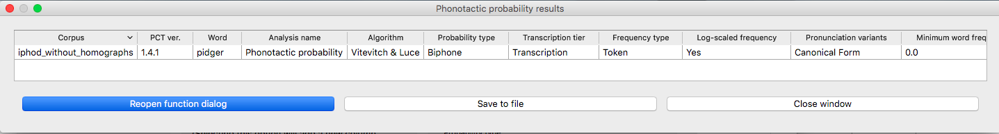

.. _phonotactic_probability:

***********************
Phonotactic Probability
***********************

.. _about_phonotactic_probability:

About the function
------------------

Phonotactic probability refers to the likelihood of a given set of segments
occurring in a given order for a given corpus of transcriptions.  For instance,
*blick* is a phonotactically probable nonword in English, but *bnick* is
phonotactically improbable.  Words as well as nonwords can be assessed for
their phonotactic probability, and this measure has been used in behavioural
research ([Vitevitch1999]_ and others). In particular, the phonotactic
probability of words has been correlated with their ability to be segmented,
acquired, processed, and produced; see especially the discussion in [Vitevitch2004]_
for extensive references.

.. _method_phonotactic_probability:

Method of calculation
---------------------

One method for computing the phonotactic probability, and the current algorithm implemented in PCT, uses average unigram
or bigram positional probabilities across a word ([Vitevitch2004]_;
their online calculator for this function is available `here
<http://www.people.ku.edu/~mvitevit/PhonoProbHome.html>`_).
For a word like *blick* in English, the unigram average would include the
probability of /b/ occurring in the first position of a word, the
probability of /l/ in the second position, the probability of /ɪ/
occuring in the third position, and the probability of /k/ occurring
in the fourth position of a word.  Each positional probability is
calculated by summing the log token frequency of words containing that
segment in that position divided by the sum of the log token frequency
of all words that have that position in their transcription.  The bigram
average is calculated in an equivalent way, except that sequences of two
segments and their positions are used instead of single segments.  So for
*blick* that would be /bl/, /lɪ/, /ɪk/ as the included positional probabilities.
As with all n-gram based approaches, bigrams are preferable to unigrams.
In the example of *blick* versus *bnick*, unigrams wouldn't likely capture
the intuitive difference in phonotactic probability, since the probability
of /n/ and /l/ in the second position isn't necessarily radically different.
Using bigrams, however, would capture that the probability of /bl/ versus /bn/
in the first position is radically different.

Consider a toy example, in which the following corpus is assumed
(note that, generally speaking, there is no “type frequency” column
in a PCT corpus, as it is assumed that each row in the corpus represents
1 type; it is included here for clarity):

+--------+-----------------------+
|        |        Original       | 
|        +--------+------+-------+
|  Word  | Trans. | Type | Token |
|        |        | Freq.| Freq. |
+========+========+======+=======+
|  blick | [blɪk] |    1 |    22 |
+--------+--------+------+-------+
|  blep  | [blɛp] |    1 |   107 |
+--------+--------+------+-------+
|  dwyk  | [dwɪk] |    1 |     3 |
+--------+--------+------+-------+
|  mup   | [mʌp]  |    1 |    57 |
+--------+--------+------+-------+

Let's take the case of bigram phonotactic probability, calculated using token frequencies (which is the default in PCT and which is recommended by Vitevitch and Luce). To calculate this value for the word *blick* we do the following:

.. math:: \text{PhonProb}_{\text{tokens}} &= \Bigg[\frac{\text{Sum of log frequencies of words with [bl] in initial biphone position}}{\text{Sum of log frequencies of words with any biphone in initial biphone position}} \\
                                          &\quad + \frac{\text{Sum of log frequencies of words with [lɪ] in second biphone position}}{\text{Sum of log frequencies of words with any biphone in second biphone position}} \\
                                          &\quad + \frac{\text{Sum of log frequencies of words with [ɪk] in third biphone position}}{\text{Sum of log frequencies of words with any biphone in third biphone position}}\Bigg] \\
                                          &\quad \big/ \big[\text{Number of biphone positions}\big]

...which in this specific case, translates to:

.. math:: \text{PhonProb}_{\text{tokens}} &= \Bigg[\frac{log(22) + log(107)}{log(22) + log(107) + log(3) + log(57)} + \frac{log(22)}{log(22) + log(107) + log(3) + log(57)} \\
                                          &\quad + \frac{log(22) + log(3)}{log(22) + log(107) + log(3)} \Bigg] \big/ 3 \\
                                          &= 0.43795

There are other ways of calculating phonotactic probability that don't
have the strict left-to-right positional assumptions that the Vitevitch
& Luce algorithm has, such as the constraint-based method in BLICK by
Bruce Hayes (Windows executable available on the `Blick homepage`_, Python package
available at `python-blick on PyPi`_
with source code available at `python-blick on GitHub`_).
However, such algorithms require training on a specific language, and
the constraints are not computed from transcribed corpora in as
straightforward a manner as the probabilities used in the Vitevitch &
Luce algorithm. Therefore, PCT currently supports only the Vitevitch &
Luce style algorithm.

.. _Blick homepage: http://www.linguistics.ucla.edu/people/hayes/BLICK/

.. _python-blick on PyPi: https://pypi.python.org/pypi/python-BLICK/0.2.12

.. _python-blick on GitHub: https://github.com/mmcauliffe/python-BLICK/

.. _phonotactic_probability_gui:

Calculating phonotactic probability in the GUI
----------------------------------------------

To start the analysis, click on “Analysis” / “Calculate phonotactic probability...”
in the main menu, and then follow these steps:

1. **Phonotactic probability algorithm**: Currently the only offered algorithm
   is the Vitevitch & Luce algorithm, described above.
2. **Query type**: Phonotactic probability can be calculated for one of three
   types of inputs:

   a. **One word**: The phonotactic probability of a single word can be calculated
      by entering that word’s orthographic representation in the query box.
   b. **One word/nonword not in the corpus**: The phonotactic probability can
      be calculated on a word that is not itself in the corpus, but using
      the probabilities derived from the corpus. These words are distinct
      from the corpus and won't be added to it, nor will their creation
      affect any future calculations. See :ref:`add_word` for information on how
      to more permanently add a new word to the corpus. Words can be
      created through the dialogue opened by pressing the button:

      i. **Spelling**: Enter the spelling for your new word / nonword using
         the regular input keyboard on your computer. The spelling is
         how the word will be referenced in the results table, but won’t
         affect the calculation of phonotactic probability.
      ii. **Transcription**: To add in the phonetic transcription of the new
          word, it is best to use the provided inventory. While it is
          possible to type directly in to the transcription box, using
          the provided inventory will ensure that all characters are
          understood by PCT to correspond to existing characters in the
          corpus (with their concomitant featural interpretation). Click
          on “Show inventory” and then choose to show “Consonants,” “Vowels,”
          and/or other. (If there is no featural interpretation of your
          inventory, you will simply see a list of all the available
          segments, but they will not be classifed by major category.)
          Clicking on the individual segments will add them to the
          transcription. The selections will remain even when the
          sub-inventories are hidden; we allow for showing / hiding
          the inventories to ensure that all relevant buttons on the
          dialogue box are available, even on small computer screens.
          Note that you do NOT need to include word boundaries at the
          beginning and end of the word, even when the boundary symbol
          is included as a member of the inventory; these will be assumed
          automatically by PCT.
      iii. **Frequency**: This can be left at the default. Note that entering
           a value will NOT affect the calculation; there is no particular
           need to enter anything here (it is an artifact of using the same
           dialogue box here as in the “Add Word” function described in :ref:`add_word`).
      iv. **Create word**: To finish and return to the “Phonotactic probability”
          dialogue box, click on “Create word.”

   c. **List of words**: If there is a specific list of words for which
      phonotactic probability is to be calculated (e.g., the stimuli list
      for an experiment), that list can be saved as a .txt file with one
      word per line, each written in orthography, and uploaded into PCT for analysis. Currently, all words need to be in the corpus and presented orthographically for this function to work. 
   d. **Whole corpus**: Alternatively, the phonotactic probability for every
      current word in the corpus can be calculated. The phonotactic
      probability of each word will be added to the corpus itself, as
      a separate column; in the “query” box, simply enter the name of
      that column (the default is “Phonotactic probability”).

3. **Log scaling**: If token frequencies are being used, the default is to log the frequencies first (following Vitevitch and Luce, described above). PCT takes natural logs, i.e., logs with base e, but note that because of the calculation involved, the choice of log makes no difference to the final answer (the calculation involves dividing the log frequency of words with the sound in question in the given position by the log frequency of all words that have any sound in the given position, so the bases of the logs cancel each other). One can choose not to log-scale the frequencies at all if one prefers. Note that this is an option only for token frequencies; if type frequencies are being used, each word has a type frequency of 1, and the logarithm of 1 is 0, regardless of the base; hence, log-scaling type frequencies would make all the calculations meaningless. Note that if log-scaling of token frequencies is used, then in the event that a word has a token frequency of 1, this is first replaced in the calculation with 1.00001 to avoid any problems with division by zero.

4. **Tier**: Phonotactic probability can be calculated from transcription
   tiers in a corpus (e.g., transcription or tiers that represent subsets
   of entries, such as a vowel or consonant tier).

5. **Pronunciation variants**: Specify whether phonotactic probability should be calculated based on the canonical pronunciations of each word or the most frequent pronunciations (which may not be the same). See more in :ref:`pronunciation_variants`.

6. **Type vs. token frequency**: Specify whether phonotactic probabilities
   should be based on word type frequency or token frequency.  The
   original Vitevitch & Luce algorithm uses token frequency. As discussed above in (3), token frequency
   defaults to using the log frequency when calculating probabilities.
7. **Probability type**: Specify whether to use biphone positional
   probabilities or single segment positional probabilities.  Defaults to biphone.
8. **Results**: Once all options have been selected, click “Calculate
   phonotactic probability.” If this is not the first calculation, and
   you want to add the results to a pre-existing results table, select
   the choice that says “add to current results table.” Otherwise, select
   “start new results table.” A dialogue box will open, showing a table of
   the results, including the word, its phonotactic probability, the
   transcription tier from which phonotactic probability was calculated,
   whether type or token frequency was used, whether the frequency was log-scaled, whether the algorithm used
   unigram or bigram probabilities, and the phonotactic probability algorithm
   that was used. If the phonotactic probability for all words in the corpus
   is being calculated, simply click on the “start new results table” option,
   and you will be returned to your corpus, where a new column containing the phonotactic probability for each word has been added
   automatically.
9. **Saving results**: The results tables can each be saved to tab-delimited .txt
   files by selecting “Save to file” at the bottom of the window. If all
   phonotactic probabilities are calculated for a corpus, the corpus
   itself can be saved by going to “File” / “Export corpus as text file,”
   from where it can be reloaded into PCT for use in future sessions with
   the phonotactic probabilities included.

An example of the “Phonotactic Probability” dialogue box for calculating
the probability of the non-word “pidger” [pɪdʒɚ], or [P.IH.JH.ER] in Arpabet, using log-scaled, token-frequency-based, biphone position
probabilities, using the IPHOD corpus (note that the results window is too long to fit in one screenshot; the second one has just been scrolled to the right so that the actual phonotactic probability result is visible):

.. image:: static/phonoprobdialog.png
   :width: 90%
   :align: center

   
.. image:: static/phonoprobresults_2.png
   :width: 90%
   :align: center

To return to the function dialogue box with your most recently used
selections, click on “Reopen function dialog.” Otherwise, the results
table can be closed and you will be returned to your corpus view.

.. _phono_prob_classes_and_functions:

Classes and functions
---------------------
For further details about the relevant classes and functions in PCT's
source code, please refer to :ref:`phono_prob_api`.
