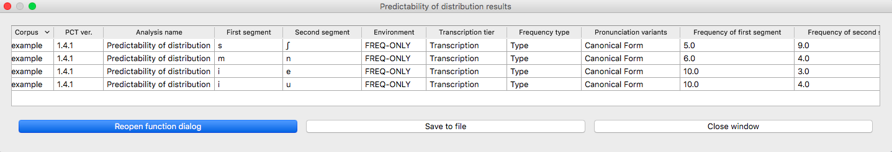

.. _predictability_of_distribution:

******************************
Predictability of Distribution
******************************

.. _about_pred_dist:

About the function
------------------

Predictability of distribution is one of the common methods of determining
whether or not two sounds in a language are contrastive or allophonic.
The traditional assumption is that two sounds that are predictably
distributed (i.e., in complementary distribution) are allophonic, and
that any deviation from complete predictability of distribution means
that the two sounds are contrastive. [Hall2009]_, [Hall2012]_ proposes a way of
quantifying predictability of distribution in a gradient fashion, using
the information-theoretic quantity of *entropy* (uncertainty), which is
also used for calculating functional load (see :ref:`method_functional_load`), which can be used
to document the *degree* to which sounds are contrastive in a language.
This has been shown to be useful in, e.g., documenting sound changes
[Hall2013b]_, understanding the choice of epenthetic vowel in a languages
[Hume2013]_, modeling intra-speaker variability [Thakur2011]_,
gaining insight into synchronic phonological patterns [Hall2013a]_,
and understanding the influence of phonological relations on perception
([Hall2009]_, [Hall2014a]_). See also the related measure of
Kullback-Leibler divergence (:ref:`kullback-leibler`), which is used in [Peperkamp2006]_
and applied to acquisition; it is also a measure of the degree to which
environments overlap, but the method of calculation differs (especially
in terms of environment selection).

It should be noted that predictability of distribution and functional
load are not the same thing, despite the fact that both give a measure
of phonological contrast using entropy. Two sounds could be entirely
unpredictably distributed (perfectly contrastive), and still have either
a low or high functional load, depending on how often that contrast is
actually used in distinguishing lexical items. Indeed, for any degree of
predictability of distribution, the functional load may be either high or
low, with the exception of the case where both are 0. That is, if two
sounds are entirely predictably distributed, and so have an entropy of
0 in terms of distribution, then by definition they cannot be used to
distinguish between any words in the language, and so their functional
load, measured in terms of change in entropy upon merger, would also be 0.

.. _method_pred_dist:

Method of calculation
---------------------

As mentioned above, predictability of distribution is calculated using
the same entropy formula as above, repeated here below, but with different
inputs.

Entropy:

:math:`H = -\sum_{i \in N} p_{i} * log_{2}(p_{i})`

Because predictability of distribution is determined between exactly two
sounds, *i* will have only two values, that is, each of the two sounds.
Because of this limitation to two sounds, entropy will range in these
situations between 0 and 1. An entropy of 0 means that there is 0
uncertainty about which of the two sounds will occur; i.e., they are
perfectly predictably distributed (commonly associated with being
allophonic). This will happen when one of the two sounds has a probability
of 1 and the other has a probability of 0. On the other hand, an entropy
of 1 means that there is complete uncertainty about which of the two
sounds will occur; i.e., they are in perfectly overlapping distribution
(what might be termed “perfect” contrast). This will happen when each
of the two sounds has a probability of 0.5.

Predictability of distribution can be calculated both within an individual
environment and across all environments in the language; these two
calculations are discussed in turn.

.. _method_pred_dist_environment:

Predictability of Distribution in a Single Environment
``````````````````````````````````````````````````````

For any particular environment (e.g., word-initially; between vowels;
before a [+ATR] vowel with any number of intervening consonants; etc.),
one can calculate the probability that each of two sounds can occur.
This probability can be calculated using either types or tokens, just
as was the case with functional load. Consider the following toy data,
which is again repeated from the examples of functional load, though
just the original distribution of sounds.


+--------+-----------------------+
|        |        Original       |
|        +--------+------+-------+
|  Word  | Trans. | Type | Token |
|        |        | Freq.| Freq. |
+========+========+======+=======+
|  hot   |  [hɑt] |    1 |     2 |
+--------+--------+------+-------+
|  song  |  [sɑŋ] |    1 |     4 |
+--------+--------+------+-------+
|  hat   |  [hæt] |    1 |     1 |
+--------+--------+------+-------+
|  sing  |  [sɪŋ] |    1 |     6 |
+--------+--------+------+-------+
|  tot   |  [tɑt] |    1 |     3 |
+--------+--------+------+-------+
|  dot   |  [dɑt] |    1 |     5 |
+--------+--------+------+-------+
|  hip   |  [hɪp] |    1 |     2 |
+--------+--------+------+-------+
|  hid   |  [hɪd] |    1 |     7 |
+--------+--------+------+-------+
|  team  |  [tim] |    1 |     5 |
+--------+--------+------+-------+
|  deem  |  [dim] |    1 |     5 |
+--------+--------+------+-------+
|  toot  |  [tut] |    1 |     9 |
+--------+--------+------+-------+
|  dude  |  [dud] |    1 |     2 |
+--------+--------+------+-------+
|  hiss  |  [hɪs] |    1 |     3 |
+--------+--------+------+-------+
|  his   |  [hɪz] |    1 |     5 |
+--------+--------+------+-------+
| sizzle | [sɪzəl]|    1 |     4 |
+--------+--------+------+-------+
| dizzy  |  [dɪzi]|    1 |     3 |
+--------+--------+------+-------+
| tizzy  |  [tɪzi]|    1 |     4 |
+--------+--------+------+-------+
|      Total      |   17 |    70 |
+--------+--------+------+-------+


Consider the distribution of [h] and [ŋ], word-initially. In this
environment, [h] occurs in 6 separate words, with a total token frequency
of 20. [ŋ] occurs in 0 words, with, of course, a token frequency of 0.
The probability of [h] occurring in this position as compared to [ŋ],
then, is 6/6 based on types, or 20/20 based on tokens. The entropy of
this pair of sounds in this context, then, is:

:math:`H_{types/tokens} = -[1 log_{2}(1) + 0 log_{2} (0)] = 0`

Similar results would obtain for [h] and [ŋ] in word-final position,
except of course that it’s [ŋ] and not [h] that can appear in this environment.

For [t] and [d] word-initially, [t] occurs 4 words in this environment,
with a total token frequency of 21, and [d] also occurs in 4 words,
with a total token frequency of 15. Thus, the probability of [t] in
this environment is 4/8, counting types, or 21/36, counting tokens, and
the probability of [d] in this environment is 4/8, counting types, or
15/36, counting tokens. The entropy of this pair of sounds is therefore:

:math:`H_{types} = -[(\frac{4}{8} log_{2}(\frac{4}{8}))
+ (\frac{4}{8} log_{2}(\frac{4}{8}))] = 1`

:math:`H_{types} = -[(\frac{21}{36} log_{2}(\frac{21}{36}))
+ (\frac{15}{36} log_{2}(\frac{15}{36}))] = 0.98`

In terms of what environment(s) are interesting to examine, that is of
course up to individual researchers. As mentioned in the preface to :ref:`predictability_of_distribution`,
these functions are just tools. It would be just as possible to calculate
the entropy of [t] and [d] in word-initial environments before [ɑ],
separately from word-initial environments before [u]. Or one could
calculate the entropy of [t] and [d] that occur anywhere in a word
before a bilabial nasal...etc., etc. The choice of environment should
be phonologically informed, using all of the resources that have
traditionally been used to identify conditioning environments of interest.
See also the caveats in the following section that apply when one is
calculating systemic entropy across multiple environments.

.. _pred_dist_envs:

Predictability of Distribution across All Environments (Systemic Entropy)
`````````````````````````````````````````````````````````````````````````

While there are times in which knowing the predictability of distribution
within a particular environment is helpful, it is generally the case that
phonologists are more interested in the relationship between the two
sounds as a whole, across all environments. This is achieved by
calculating the weighted average entropy across all environments in which
at least one of the two sounds occurs.

As with single environments, of course, the selection of environments
for the systemic measure need to be phonologically informed. There are
two further caveats that need to be made about environment selection when
multiple environments are to be considered, however: (1) **exhaustivity** and
(2) **uniqueness**.

With regard to **exhausitivity**: In order to calculate the total
predictability of distribution of a pair of sounds in a language, one
must be careful to include all possible environments in which at least
one of the sounds occurs. That is, the total list of environments needs
to encompass all words in the corpus that contain either of the two
sounds; otherwise, the measure will obviously be incomplete. For example,
one would not want to consider just word-initial and word-medial positions
for [h] and [ŋ]; although the answer would in fact be correct (they have 0
entropy across these environments), it would be for the wrong reason—i.e.,
it ignores what happens in word-final position, where they *could* have had
some other distribution.

With regard to **uniqueness**: In order to get an *accurate* calculation of the
total predictability of distribution of a pair of sounds, it is important
to ensure that the set of environments chosen do not overlap with each other,
to ensure that individual tokens of the sounds are not being counted multiple
times. For example, one would not want to have both [#__] and [__i] in the
environment list for [t]/[d] while calculating systemic entropy, because
the words *team* and *deem* would appear in both environments, and the sounds
would (in this case) appear to be “more contrastive” (less predictably
distributed) than they might otherwise be, because the contrasting nature
of these words would be counted twice.

To be sure, one can calculate the entropy in a set of individual
environments that are non-exhaustive and/or overlapping, for comparison
of the differences in possible generalizations. But, in order to get an
accurate measure of the total predictability of distribution, the set of
environments must be both exhaustive and non-overlapping. As will be
described below, PCT will by default check whether any set of environments
you provide does in fact meet these characteristics, and will throw a
warning message if it does not.

It is also possible that there are multiple possible ways of developing
a set of exhaustive, non-overlapping environments. For example,
“word-initial” vs. “non-word-initial” would suffice, but so would
“word-initial” vs. “word-medial” vs. “word-final.” Again, it is up to
individual researchers to determine which set of environments makes the
most sense for the particular pheonmenon they are interested in.
See [Hall2012]_ for a comparison of two different sets of possible
environments in the description of Canadian Raising.

Once a set of exhaustive and non-overlapping environments has been
determined, the entropy in each individual environment is calculated,
as described in :ref:`method_pred_dist_environment`. The frequency of each environment itself is
then calculated by examining how many instances of the two sounds
occurred in each environment, as compared to all other environments, and
the entropy of each environment is weighted by its frequency. These
frequency-weighted entropies are then summed to give the total average
entropy of the sounds across the environments. Again, this value will
range between 0 (complete predictability; no uncertainty) and 1 (complete
unpredictability; maximal uncertainty). This formula is given below; e
represents each individual environment in the exhaustive set of
non-overlapping environments.

Formula for systemic entropy:

:math:`H_{total} = -\sum_{e \in E} H(e) * p(e)`

As an example, consider [t]/[d]. One possible set of exhaustive,
non-overlapping environments for this pair of sounds is (1) word-initial
and (2) word-final. The relevant words for each environment are shown in
the table below, along with the calculation of systemic entropy from
these environments.

The calculations for the entropy of word-initial environments were given
above; the calculations for word-final environments are analogous.

To calculate the probability of the environments, we simply count up the
number of total words (either types or tokens) that occur in each
environment, and divide by the total number of words (types or tokens)
that occur in all environments.

Calculation of systemic entropy of [t] and [d]:

+------+-------+-------+---------------------------------+----------------------------------+
| *e*  | [t]-  | [d]-  |             Types               |             Types                |
|      |       |       +-------+-------+-----------------+-------+--------+-----------------+
|      | words | words | H(*e*)| p(*e*)| p(*e*) * H(*e*) | H(*e*)| p(*e*) | p(*e*) * H(*e*) |
+======+=======+=======+=======+=======+=================+=======+========+=================+
| [#__]| tot,  | dot,  |     1 |(4+4)/ |          0.533  |   0.98|(21+15)/|          0.543  |
|      | team, | dude, |       |(8+7)  |                 |       |(36+29) |                 |
|      | toot, | deem, |       |=8/15  |                 |       |=36/65  |                 |
|      | tizzy | dizzy |       |       |                 |       |        |                 |
+------+-------+-------+-------+-------+-----------------+-------+--------+-----------------+
| [__#]| hot,  | hid,  | 0.863 |7/15   |          0.403  |  0.894| 29/65  |          0.399  |
|      | hat,  | dude  |       |       |                 |       |        |                 |
|      | tot,  |       |       |       |                 |       |        |                 |
|      | dot,  |       |       |       |                 |       |        |                 |
|      | toot  |       |       |       |                 |       |        |                 |
+------+-------+-------+-------+-------+-----------------+-------+--------+-----------------+
|                                      |0.533+0.403=0.936|                |0.543+0.399=0.942|
+--------------------------------------+-----------------+----------------+-----------------+

In this case, [t]/[d] are relatively highly unpredictably distributed
(contrastive) in both environments, and both environments contributed
approximately equally to the overall measure. Compare this to the example
of [s]/[z], shown below.

Calculation of systemic entropy of [s] and [z]:

+------+-------+-------+---------------------------------+----------------------------------+
| *e*  | [s]-  | [z]-  |             Types               |             Types                |
|      |       |       +-------+-------+-----------------+-------+--------+-----------------+
|      | words | words | H(*e*)| p(*e*)| p(*e*) * H(*e*) | H(*e*)| p(*e*) | p(*e*) * H(*e*) |
+======+=======+=======+=======+=======+=================+=======+========+=================+
| [#__]| song, |       |     0 | 3/8   |          0      |   0   |14/33   |          0      |
|      | sing, |       |       |       |                 |       |        |                 |
|      | sizzle|       |       |       |                 |       |        |                 |
+------+-------+-------+-------+-------+-----------------+-------+--------+-----------------+
| [__#]| hiss  | his   | 1     |2/8    |          0.25   |  0.954| 8/33   |          0.231  |
+------+-------+-------+-------+-------+-----------------+-------+--------+-----------------+
| [V_V]|       |sizzle,| 0     |3/8    |          0      |  0    | 11/33  |          0      |
|      |       |dizzy, |       |       |                 |       |        |                 |
|      |       |tizzy  |       |       |                 |       |        |                 |
+------+-------+-------+-------+-------+-----------------+-------+--------+-----------------+
|                                      |       0.25      |                |     0.231       |
+--------------------------------------+-----------------+----------------+-----------------+

In this case, there is what would traditionally be called a contrast word
finally, with the minimal pair *hiss* vs. *his*; this contrast is neutralized
(made predictable) in both word-initial position, where [s] occurs but
[z] does not, and intervocalic position, where [z] occurs but [s] does
not. The three environments are roughly equally probable, though the
environment of contrast is somewhat less frequent than the environments
of neutralization. The overall entropy of the pair of sounds is on
around 0.25, clearly much closer to perfect predictability (0 entropy)
than [t]/[d].

Note, of course, that this is an entirely fictitious example—that is,
although these are real English words, one would **not** want to infer
anything about the actual relationship between either [t]/[d] or [s]/[z]
on the basis of such a small corpus. These examples are simplified for
the sake of illustrating the mathematical formulas!

.. _pred_dist_all:

“Predictability of Distribution” Across All Environments (i.e., Frequency-Only Entropy)
```````````````````````````````````````````````````````````````````````````````````````

Given that the calculation of predictability of distribution is based on
probabilities of occurrence across different environments, it is also
possible to calculate the overall entropy of two segments using their
raw probabilities and ignoring specific environments. Note that this
doesn’t really reveal anything about predictability of distribution per
se; it simply gives the uncertainty of occurrence of two segments that
is related to their relative frequencies. This is calculated by simply
taking the number of occurrences of each of sound 1 (N1) and sound 2
(N2) in the corpus as a whole, and then applying the following formula:

Formula for frequency-only entropy:

:math:`H = (-1) * [(\frac{N1}{N1+N2}) log_{2} (\frac{N1}{N1+N2})
+(\frac{N2}{N1+N2}) log_{2} (\frac{N2}{N1+N2})]`

The entropy will be 0 if one or both of the sounds never occur(s) in the
corpus. The entropy will be 1 if the two sounds occur with exactly the
same frequency. It will be a number between 0 and 1 if both sounds occur,
but not with the same frequency.

Note that an entropy of 1 in this case, which was analogous to
perfect contrast in the environment-specific implementation of this
function, does *not* align with contrast here. For example, [h] and [ŋ]
in English, which are in complementary distribution, could theoretically
have an entropy of 1 if environments are ignored and they happened to
occur with exactly the same frequency in some corpus. Similarly, two
sounds that do in fact occur in the same environments might have a low
entropy, close to 0, if one of the sounds is vastly more frequent than
the other. That is, this calculation is based ONLY on the frequency of
occurrence, and not actually on the distribution of the sounds in the
corpus. This function is thus useful only for getting a sense of the
frequency balance / imbalance between two sounds. Note that one can
also get total frequency counts for any segment in the corpus through
the “Summary” information feature (:ref:`corpus_summary`).

.. _pred_dist_gui:

Calculating predictability of distribution in the GUI
-----------------------------------------------------

Assuming a corpus has been opened or created, predictability of
distribution is calculated using the following steps.

1. **Getting started**: Choose “Analysis” / “Calculate predictability of
   distribution...” from the top menu bar.

2. **Segments**: First, select which pairs of sounds you want the predictability
   of distribution to be calculated for. There are two options for this. First is to add individual pairs of sounds. Do this by clicking on “Add pair of sounds”;
   the “Select segment pair” dialogue box will open. The order that the sounds are selected in is irrelevant; picking [i] first and [u] second will yield the same
   results as picking [u] first and [i] second. See more about interacting with the sound selection box (including, e.g., the use of features in selecting sounds and the options for selecting multiple pairs) in :ref:`sound_selection`.

The second alternative is to select pairs of sounds based on shared vs. contrasting features. This option allows you, for example, to test the predictability of distribution of the front/back contrast in vowels, regardless of vowel height. To do this, click on "Add sets of segments based on features"; the "Select feature pair" dialogue box will open. See :ref:`feature_selection` for more information on using this interface.

Once sounds have been selected, click “Add.” Pairs will appear in the “Predictability of distribution” dialogue box.

3. **Environments**: Click on “New environment” to add an environment in
   which to calculate predictability of distribution. See :ref:`environment_selection` for details on how to use this interface. Note that you will not be able to edit the "target" segments in this function, because the targets are automatically populated from the list of pairs selected on the left-hand side.

   .. note:: If NO environments are added, PCT will
      calculate the overall predictability of distribution of the two
      sounds based only on their frequency of occurrence. This will simply
      count the frequency of each sound in the pair and calculate the
      entropy based on those frequencies (either type or token). See
      below for an example of calculating environment-free entropy for
      four different pairs in the sample corpus:



4. **Environment list**: Individual environments from the
   list can be selected and edited or removed if it is determined that an environment
   needs to be changed. It is this list that PCT will verify as being
   both exhaustive and unique; i.e., the default is that the environments
   on this list will exhaustively cover all instances in your corpus of
   the selected sounds, but will do so in such a way that each instance
   is counted exactly once.

5. **Tier**: Under “Options,” first pick the tier on which you want
   predictability of distribution to be calculated. The default is for
   the entire transcription to be used, such that environments are defined
   on any surrounding segments. If a separate tier has been created as part
   of the corpus (see :ref:`create_tiers`), however, predictability of distribution can
   be calculated on this tier. For example, one could extract a separate
   tier that contains only vowels, and then calculate predictability of
   distribution based on this tier. This makes it much easier to define
   non-adjacent contexts. For instance, if one wanted to investigate the
   extent to which [i] and [u] are predictably distributed before front
   vs. back vowels, it will be much easier to to specify that the relevant
   environments are _[+back] and _[-back] on the vowel tier than to try
   to account for possible intervening segments on the entire transcription
   tier.

6. **Pronunciation variants**: If the corpus contains multiple pronunciation variants for lexical items, select what strategy should be used. For details, see :ref:`pronunciation_variants`.

7. **Type vs. Token Frequency**: Next, pick whether you want the calculation
   to be done on types or tokens, assuming that token frequencies are
   available in your corpus. If they are not, this option will not be
   available. (Note: if you think your corpus does include token frequencies,
   but this option seems to be unavailable, see :ref:`corpus_format` on the required
   format for a corpus.)

8. **Exhaustivity & Uniqueness**: The default is for PCT to check for both
   exhaustivity and uniqueness of environments, as described above in
   :ref:`pred_dist_envs`. Un-checking this box will turn off this mechanism. For
   example, if you wanted to compare a series of different possible
   environments, to see how the entropy calculations differ under
   different generalizations, uniqueness might not be a concern. Keep
   in mind that if uniqueness and exhaustivity are not met, however,
   the calculation of systemic entropy will be inaccurate.

   a. If you ask PCT to check for exhaustivity, and it is not met, an error
      message will appear that warns you that the environments you have
      selected do not exhaustively cover all instances of the symbols in
      the corpus, as in the following; the “Show details...” option has
      been clicked to reveal the specific words that occur in the corpus
      that are not currently covered by your list of environments.
      Furthermore, a .txt file is automatically created that lists all
      of the words, so that the environments can be easily adjusted. This
      file is stored in the ERRORS folder within the working directory
      that contains the PCT software (see also :ref:`preferences`), and can be accessed directly by
      clicking “Open errors directory.” If exhaustivity is not important,
      and only the entropy in individual environments matters, then it is
      safe to not enforce exhaustivity; it should be noted that the
      weighted average entropy across environments will NOT be accurate
      in this scenario, because not all words have been included.

      .. image:: static/proderror.png
         :width: 90%
         :align: center


   b. If you ask PCT to check for uniqueness, and it is not met, an error
      message will appear that indicates that the environments
      are not unique, as shown below. Furthermore, a .txt file explaining
      the error and listing all the words that are described by multiple
      environments in your list is created automatically and stored in
      the ERRORS folder within the working directory that contains the
      PCT software. Clicking “Show details” in the error box also reveals
      this information.

      .. image:: static/proderror2.png
         :width: 90%
         :align: center

   Here’s an example of correctly exhaustive and unique selections for
   calculating the predictability of distribution based on token frequency
   for [s] and [ʃ] in the example corpus (note that some environments were selected using features, e.g., _[-voc], _[+voc, -high], while others were selected as segments, e.g., _#, _{u, i}; the environment will show up the way it was selected, but PCT will evaluate exhaustivity and uniqueness correctly [by internally translating featural selections into sets of segments]): 

   .. image:: static/proddialog.png
      :width: 90%
      :align: center

9. **Minumum Word Frequency**: It is possible to set a minimum token frequency for including words in the calculation. This allows easy exclusion of rare words. To include all words in the corpus, regardless of their token frequency, set the minimum frequency to 0, or leave the field blank. Note that if a minimum frequency is set, all words below that frequency will be ignored entirely for the purposes of calculation.

10. **Entropy calculation / results**: Once all environments have been specified,
   click “Calculate predictability of distribution.” If you want to start
   a new results table, click that button; if you’ve already done at least
   one calculation and want to add new calculations to the same table,
   select the button with “add to current results table.” Results will
   appear in a pop-up window on screen.  The last row for each pair gives
   the weighted average entropy across all selected environments, with
   the environments being weighted by their own frequency of occurrence.
   See the following example (noting that not all columns in the result file are visible on screen):

   .. image:: static/prodresults.png
      :width: 90%
      :align: center

11. **Output file / Saving results**: If you want to save the table of results,
   click on “Save to file” at the bottom of the table. This opens up a
   system dialogue box where the directory and name can be selected.

   To return to the function dialogue box with your most recently used
   selections, click on “Reopen function dialog.” Otherwise, the results
   table can be closed and you will be returned to your corpus view.

.. _prod_classes_and_functions:

Classes and functions
---------------------
For further details about the relevant classes and functions in PCT's
source code, please refer to :ref:`prod_api`.
