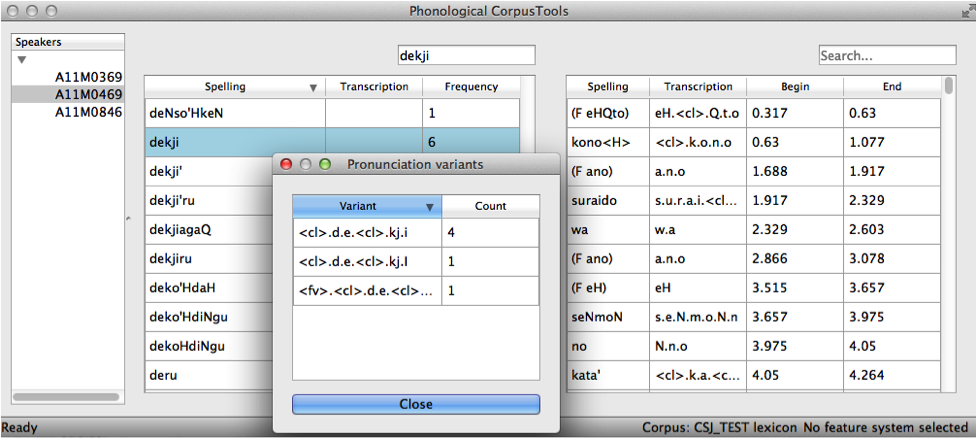

.. _pronunciation_variants:

***********************
Pronunciation Variants
***********************

.. _about_pronunciation_variants:

About Pronunciation Variants:
-----------------------------

In some corpora (e.g., spontaneous speech corpora), there may be different
pronunciation variants that are associated with the same lexical item.
For instance, the word "probably" might be variably produced as [pɹɑbəbli]
(its canonical form) or as [pɹɑbli], [pɹɑli], [pɹɑi], or any of a number
of other reduced forms. In the Buckeye corpus, for example, there are 290
tokens of the word "probably", only 50 of which have the canonical
pronunciation ([BUCKEYE]_).

A number of studies have looked at the effects of this kind of surface
variation on lexical representations (e.g., [Connine2008]_; [Pinnow2014]_;
[Pitt2009]_; [Pitt2011]_; [Sumner2009]_). For example, [Pinnow2014]_ show
that lexical items with high-frequency variants that include deleted schwas
have processing advantages over similar items where the deleted variant
is less frequent, suggesting that frequency matters in the representations.

Because such differences may matter, PCT includes several options
(:ref:`pronunciation_variants_options`) for handling pronunciation
variants in its analysis functions (though note that not every option
is available in every analysis function as of version 1.1). To the best
of our knowledge, none of the analysis functions we provide has ever been
applied to anything other than the canonical pronunciations of forms, so
it is a completely open question as to which of these options is best, or
even how to determine which one might be best (e.g., in terms of correlations
with other linguistic or behavioural patterns). It is simply our hope that
by allowing the functions to be applied in a variety of ways, such empirical
questions can be answered in the future.

.. _creating_pronunciation_variants:

Creating Pronunciation Variants:
--------------------------------

To create a corpus that has pronunciation variants, there are several options
(see also :ref:`loading_corpora`). First is to use a specially formatted
corpus, such as the Buckeye corpus ([BUCKEYE]_), that PCT already recognizes
as containing pronunciation variants. Second is to create a corpus from an
interlinear gloss file that has separate lines for lexical items and their
pronunciations. For example, a fragment of the text might be as follows:

Line 1:

+-----+---+--------+-----+--+---+--+---+----+------+
|Well,|I'm|probably|going|to|go |to|the|pool|after.|
+-----+---+--------+-----+--+---+--+---+----+------+
|wɛl  |ɑɪm|pɹɑbəbli|goʊɪŋ|tu|goʊ|tu|ðə |pul | æftɚ |
+-----+---+--------+-----+--+---+--+---+----+------+
|wɛl  |ɑɪm|pɹɑli   | gʌn |ə |goʊ|ɾə|ðə |pul | æftɚ |
+-----+---+--------+-----+--+---+--+---+----+------+

Line 2:

+--+----+-----+----+---+
|Is|Max |going|with|us?|
+--+----+-----+----+---+
|ɪz|mæks|goʊɪŋ|wɪθ |ʌs |
+--+----+-----+----+---+
|z |mæks|goʊɪŋ|wɪθ |ʌs |
+--+----+-----+----+---+

Line 3:

+---+---+-----+--------+----+-----+
|Oh,|no,|he'll|probably|stay|home.|
+---+---+-----+--------+----+-----+
|oʊ |noʊ|hil  |pɹɑbəbli|steɪ|hoʊm |
+---+---+-----+--------+----+-----+
|oʊ |noʊ|həl  |pɹɑbəbli|steɪ|hoʊm |
+---+---+-----+--------+----+-----+

The first line shows the spelling; the second the canonical pronunciation
of each word; and the third the pronunciation of the word as it was
actually said in context. This would get read in to PCT as:

+--------+---------------+---------+
|spelling|transcription  |frequency|
+========+===============+=========+
|I'm     | ɑɪ.m          |1        |
+--------+---------------+---------+
|is      | ɪ.z           |1        |
+--------+---------------+---------+
|Max     | m.æ.k.s       |1        |
+--------+---------------+---------+
|oh      |  oʊ           |1        |
+--------+---------------+---------+
|well    | w.ɛ.l         |1        |
+--------+---------------+---------+
|after   | æ.f.t.ɚ       |1        |
+--------+---------------+---------+
|go      |g.oʊ           |1        |
+--------+---------------+---------+
|going   |g.oʊ.ɪ.ŋ       |2        |
+--------+---------------+---------+
|he'll   |h.i.l          |1        |
+--------+---------------+---------+
|home    |h.oʊ.m         |1        |
+--------+---------------+---------+
|no      |n.oʊ           |1        |
+--------+---------------+---------+
|pool    |p.u.l          |1        |
+--------+---------------+---------+
|probably|p.ɹ.ɑ.b.ə.b.l.i|2        |
+--------+---------------+---------+
|stay    |s.t.eɪ         |1        |
+--------+---------------+---------+
|the     |ð.ə            |1        |
+--------+---------------+---------+
|to      |t.u            |2        |
+--------+---------------+---------+
|us      |ʌ.s            |1        |
+--------+---------------+---------+
|with    |w.ɪ.θ          |1        |
+--------+---------------+---------+

...where the words "going," "to," and "probably" each have multiple variants associated with them (see :ref:`viewing_pronunciation_variants` for more on how to view these). (Note that to achieve this result, you would indicate in the :ref:`parsing_parameters` that both lines 2 and 3 are "Transcription" lines, but that line 2 is associated with the lexical item while line 3 is allowed to vary within lexical items.)

A similar method works for creating pronunciation variants from TextGrid files. As in the interlinear gloss files, you would have three tiers in a TextGrid; one with spelling, one with canonical pronunciations; and one with the specific pronunciations used in particular instances. The :ref:`parsing_parameters` would be filled in similarly.

Note that currently, every corpus must have canonical pronunciations; a two-line interlinear gloss file, for example, cannot have pronunciation variants. (So e.g., you cannot have pronunciation variants that are linked to each other through a shared spelling.)

Note that it is also not currently possible to create a corpus with pronunciation variants from a .csv file, as there is no standard way of associating the variants with a given lexical item. 

.. _viewing_pronunciation_variants:

Viewing Pronunciation Variants:
--------------------------------

If a corpus has pronunciation variants, you can view these by right-clicking on any word in the corpus and selecting “List
pronunciation variants.” A new dialogue box will pop up that shows the
individual pronunciation variants that occur in the corpus for that word,
along with their token frequencies. (See also :ref:`exporting_pronunciation_variants` for information about how to save these to a .txt file for use outside of PCT.)

.. _pronunciation_variants_options:

Options for Pronunciation Variants:
-----------------------------------

There are four basic options in PCT for dealing with pronunciation variants, each of which is described below. In all cases, the way that PCT handles them is to create a version of the corpus that is set up with the selected option; analysis functions are then applied as normal. Thus, each time that a non-canonical approach is used, there will be a slight delay in processing time while the alternative corpus structure is set up.

1. **Canonical forms**: The first option is for PCT to use only the
   canonical forms in analyses. This is the default and the option
   that is usually reported in the literature. For many corpora, only
   the canonical pronunciation is available anyway, and will be the only
   option. In corpora with pronunciation variants, this option is
   available only if there is a form that is known by PCT to be the
   canonical pronunciation (see :ref:`creating_pronunciation_variants`).
   Note that the token frequency values are summed across all variants.

   As an example, the canonical form for the word "cat" is [kæt]; the
   canonical form for the word "probably" is [pɹɑbəbli]. A fragment of the
   corpus would be as follows:

   +------------+------------------+----------------+-----------------+
   |  Spelling  |   Transcription  | Type frequency | Token frequency |
   +============+==================+================+=================+
   |  cat       |      k.æ.t       |              1 |               6 |
   +------------+------------------+----------------+-----------------+
   |  probably  |  p.ɹ.ɑ.b.ə.b.l.i |              1 |             290 |
   +------------+------------------+----------------+-----------------+

2. **Most frequent forms**: Alternatively, PCT can use only the most frequent
   variant of each lexical item in analyses. This option puts priority on forms as
   they are actually used most often in the corpus. If there are two or more
   forms that have equal frequencies, and one of them is the canonical form,
   then PCT will fall back on the canonical form, if one is available. If no
   canonical form is available or if it is not one of the forms that is tied
   for being most frequent, then the *longest* of the most frequent forms
   will be chosen (on the assumption that this will be closest to the
   canonical form). If there is a tie in terms of frequencies AND a tie
   in terms of the lengths of the tied forms, then PCT will simply use the
   variant that is first alphabetically.

   As an example, the most frequent form of the word "probably" in the Buckeye
   corpus is [pɹɑbli]; 66 of the 290 tokens of the word have this form
   (whereas only 50 are the canonical pronunciation). Similarly, the most
   frequent form for the word "cat" is [kæʔ]; 3 of the six tokens of "cat"
   have this pronunciation. Thus, searches and analyses using the most frequent
   forms would use these transcriptions instead. The token frequency values
   are again combined across all variants.

   A fragment of the corpus would be as follows:

   +------------+------------------+----------------+-----------------+
   |  Spelling  |   Transcription  | Type frequency | Token frequency |
   +============+==================+================+=================+
   |  cat       |      k.æ.ʔ       |              1 |               6 |
   +------------+------------------+----------------+-----------------+
   |  probably  |   p.ɹ.ɑ.b.l.i    |              1 |             290 |
   +------------+------------------+----------------+-----------------+

3. **Each word token separately**: The third option is for PCT to treat
   each pronunciation variant as its own separate lexical entry. This
   allows all variants to be considered, regardless of canonical-ness
   or frequency. At the same time, it will somewhat artificially inflate
   the number of occurrences of segments that relatively stably occur
   in words that otherwise have lots of variation. For example, there
   are 74 different pronunciation variants of the word "probably" in the
   Buckeye corpus; 73 of these begin with [p] (one, [frai], begins with [f]).
   Thus, while this method is useful for seeing the range of variability
   elsewhere in the word, it will make word-initial [p] seem much more
   relatively frequent than it actually is. It allows every pronunciation
   variant to count equally as far as word types are concerned. Token
   frequencies for each individual variant are used, or each variant is assigned
   a frequency of 1 if type frequencies are used.

   A fragment of the corpus would be as follows:

   +------------+------------------+----------------+-----------------+
   |  Spelling  |   Transcription  | Type frequency | Token frequency |
   +============+==================+================+=================+
   |  cat       |      k.æ.t       |              1 |               2 |
   +------------+------------------+----------------+-----------------+
   |  cat       |      k.æ.ʔ       |              1 |               3 |
   +------------+------------------+----------------+-----------------+
   |  cat       |      k.æ.ɾ       |              1 |               1 |
   +------------+------------------+----------------+-----------------+
   |  probably  | p.ɹ.ɑ.b.ə.b.l.i  |              1 |              50 |
   +------------+------------------+----------------+-----------------+
   |  probably  |   p.ɹ.ɑ.b.l.i    |              1 |              66 |
   +------------+------------------+----------------+-----------------+
   |  probably  |    p.ɹ.ɑ.l.i     |              1 |              35 |
   +------------+------------------+----------------+-----------------+

   ... (not all variants of the word "probably" are shown)

4. **Weight each word types by the frequency of each variant**: The fourth
   option is for PCT to weight each variant's frequency by the overall
   token frequency (if using token frequency) or by the number of variants
   (if using type frequency).

   As an example, the word "probably" has 74 variants in the Buckeye corpus.
   The most frequent, [pɹɑbli], occurs 66 times out of the 290 tokens.
   66/290 = 0.2276. So, there would be a lexical entry in the corpus for
   [pɹɑbli], with a type frequency of 0.2276 (instead of 1). Similarly, the
   canonical pronunciation, [pɹɑbəbli], occurs with a relative frequency
   of 50/290 = 0.1724, so that would be the type frequency for its lexical
   entry. Thus, the total type frequency across all variants of a single
   lexical item sum to 1. The token frequencies match the original numbers.

   A fragment of the corpus would be as follows:

   +------------+------------------+----------------+-----------------+
   |  Spelling  |   Transcription  | Type frequency | Token frequency |
   +============+==================+================+=================+
   |  cat       |      k.æ.t       |           0.333|               2 |
   +------------+------------------+----------------+-----------------+
   |  cat       |      k.æ.ʔ       |           0.5  |               3 |
   +------------+------------------+----------------+-----------------+
   |  cat       |      k.æ.ɾ       |           0.167|               1 |
   +------------+------------------+----------------+-----------------+
   |  probably  | p.ɹ.ɑ.b.ə.b.l.i  |           0.172|              50 |
   +------------+------------------+----------------+-----------------+
   |  probably  |   p.ɹ.ɑ.b.l.i    |           0.228|              66 |
   +------------+------------------+----------------+-----------------+
   |  probably  |    p.ɹ.ɑ.l.i     |           0.121|              35 |
   +------------+------------------+----------------+-----------------+

   ... (not all variants of the word "probably" are shown)

.. _exporting_pronunciation_variants:

Exporting Pronunciation Variants:
---------------------------------

It is possible to export pronunciation variants with a corpus for easy
reference or use outside of PCT. General information about exporting a
corpus can be found in :ref:`corpus_save`. The basic procedure is to go
to “File” / “Export corpus as text file” and enter the file name and
location and the column and transcription delimiters.

PCT provides three options for exporting pronunciation variants. They
can simply be excluded entirely (by selecting "Do not include"); the
resulting file will have only the canonical pronunciations, assuming
the corpus contains these. The following is an example of the resulting
single line of the output file from the Buckeye corpus for the word "probably":

+------------+------------------+-----------+
|  Spelling  |   Transcription  | Frequency |
+============+==================+===========+
|  probably  |p.r.aa.b.ah.b.l.iy|       290 |
+------------+------------------+-----------+

Alternatively, pronunciation variants can be included in either of two
formats. Selecting "Include in each word's line" will organize the
output by lexical item, with exactly one line per item. Pronunciation
variants of that item will be listed at the end of the line. Here's an
example of the single line that results for the word "probably" in this
version of the export of the Buckeye corpus:

+--------+------------------+---------+---------------------------------------+
|Spelling|   Transcription  |Frequency|Variants                               |
+========+==================+=========+=======================================+
|probably|p.r.aa.b.ah.b.l.iy|      290|p.r.ah.eh, p.r.aa.b.eh.b.l.ey,         |
|        |                  |         |p.aa.b.l.ih, f.r.ay, p.r.eh.ih,        |
|        |                  |         |p.r.aa.b.l.uh, p.ah.r.eh,              |
|        |                  |         |p.r.aa.b.b.l.iy, p.r.ah.b.l.ah,        |
|        |                  |         |p.r.aw.b.w.iy, p.r.aw.b.l.iy,          |
|        |                  |         |p.r.aa.b.ah.b.l.ey, p.r.aa.w.ah.v.w.iy,|
|        |                  |         |p.r.aa.ey, p.r.aa.b.ah.b.l,            |
|        |                  |         |p.r.aa.b.el.ih, p.r.aa.b.w.iy.jh,      |
|        |                  |         |p.p.r.aa.b.l.iy, p.r.aa.b,             |
|        |                  |         |p.r.ah.ay, p.r.ah.b.l.ih,              |
|        |                  |         |p.r.aa.iy.m, p.r.aa.b.uh.b.l.ah,       |
|        |                  |         |p.aa.b.ow.b.l.iy, p.er.r.eh.ih,        |
|        |                  |         |p.aa.b.ow.l.iy, p.r.ah.b.w.iy,         |
|        |                  |         |p.r.aa.b.ow.b.l.ey, p.r.aa.b.ah.b.l.ih,|
|        |                  |         |p.r.aa.v.iy, p.r.ah.ey, p.aa.b.ih,     |
|        |                  |         |p.aa.ih.ih, p.r.aa.r.iy,               |
|        |                  |         |p.r.aa.l.uw, p.r.aa.b.r.ih,            |
|        |                  |         |p.ah.b.l.iy, p.r.ao.b.ih, p.ah.l.ih,   |
|        |                  |         |p.aa.r, p.r.aa.w.iy, p.r.ao.ey,        |
|        |                  |         |p.r.ow.iy, p.aa.l.iy,                  |
|        |                  |         |p.r.ah.b.uh.b.l.iy,                    |
|        |                  |         |p.r.aa.ah.b.l.iy, p.r.aa.l.eh,         |
|        |                  |         |p.r.aa.ih, p.r.aa.b.ow.b.l.iy,         |
|        |                  |         |p.r.ah.l.ih, p.r.ah.b.iy,              |
|        |                  |         |p.r.aa.b.ih, p.r.aa.el.iy,             |
|        |                  |         |p.r.aa.b.el.b.l.iy, p.aa.b.el.b.l.iy,  |
|        |                  |         |p.r.ah.iy, p.aa.ih, p.aa.b.l.iy,       |
|        |                  |         |p.r.aa, p.r.ah, p.r.aa.v.l.iy,         |
|        |                  |         |p.r.aa.b.uh.b.l.iy, p.r.aa.b.el.iy,    |
|        |                  |         |p.r.aa.l.ih, p.r.aa.eh, p.r.ah.l.iy,   |
|        |                  |         |p.r.ah.b.l.iy, p.r.aa.b.l.ih,          |
|        |                  |         |p.r.aa.iy, p.r.aa.b.iy, p.r.ay,        |
|        |                  |         |p.r.aa.l.iy, p.r.aa.b.ah.b.l.iy,       |
|        |                  |         |p.r.aa.b.l.iy                          |
+--------+------------------+---------+---------------------------------------+

The other format for exporting pronunciation variants, "Have a line for each variant,"
will put each different variant on a separate line in the exported corpus.
Each will *also* include the spelling and canonical transcription (if available).
This version also lists the frequency with which each different variant occurs
in the corpus. Here's an example of the 74 lines that result for the word
"probably" in this version of the export of the Buckeye corpus:

+--------+------------------+---------+-------------------+---------------+
|Spelling|Transcription     |Frequency|Token_Transcription|Token_Frequency|
+========+==================+=========+===================+===============+
|probably|p.r.aa.b.ah.b.l.iy|     290 |   p.r.ah.eh       |              1|
+--------+------------------+---------+-------------------+---------------+
|probably|p.r.aa.b.ah.b.l.iy|     290 |p.r.aa.b.eh.b.l.ey |              1|
+--------+------------------+---------+-------------------+---------------+
|probably|p.r.aa.b.ah.b.l.iy|     290 |   p.aa.b.l.ih     |              1|
+--------+------------------+---------+-------------------+---------------+
|probably|p.r.aa.b.ah.b.l.iy|     290 |   p.r.aa.b.l.iy   |             66|
+--------+------------------+---------+-------------------+---------------+
|probably|p.r.aa.b.ah.b.l.iy|     290 |   p.r.aa.ah.b.l.iy|              2|
+--------+------------------+---------+-------------------+---------------+
|probably|p.r.aa.b.ah.b.l.iy|     290 |   p.r.aa.l.eh     |              2|
+--------+------------------+---------+-------------------+---------------+
|probably|p.r.aa.b.ah.b.l.iy|     290 |   p.r.aa.l.ih     |              4|
+--------+------------------+---------+-------------------+---------------+
|probably|p.r.aa.b.ah.b.l.iy|     290 |   f.r.ay          |              1|
+--------+------------------+---------+-------------------+---------------+
|probably|p.r.aa.b.ah.b.l.iy|     290 |   p.r.aa.ih       |              2|
+--------+------------------+---------+-------------------+---------------+
|probably|p.r.aa.b.ah.b.l.iy|     290 |   p.r.eh.ih       |              1|
+--------+------------------+---------+-------------------+---------------+
|probably|p.r.aa.b.ah.b.l.iy|     290 |   p.r.aa.b.l.uh   |              1|
+--------+------------------+---------+-------------------+---------------+
|probably|p.r.aa.b.ah.b.l.iy|     290 |   p.ah.r.eh       |              1|
+--------+------------------+---------+-------------------+---------------+
|probably|p.r.aa.b.ah.b.l.iy|     290 |p.r.aa.b.ow.b.l.iy |              2|
+--------+------------------+---------+-------------------+---------------+
|probably|p.r.aa.b.ah.b.l.iy|     290 |   p.r.aa.b.b.l.iy |              1|
+--------+------------------+---------+-------------------+---------------+
|probably|p.r.aa.b.ah.b.l.iy|     290 |   p.r.ah.b.l.ah   |              1|
+--------+------------------+---------+-------------------+---------------+
|probably|p.r.aa.b.ah.b.l.iy|     290 |   p.r.aw.b.w.iy   |              1|
+--------+------------------+---------+-------------------+---------------+
|probably|p.r.aa.b.ah.b.l.iy|     290 |   p.r.aw.b.l.iy   |              1|
+--------+------------------+---------+-------------------+---------------+
|probably|p.r.aa.b.ah.b.l.iy|     290 | p.r.aa.b.ah.b.l.ey|              1|
+--------+------------------+---------+-------------------+---------------+
|probably|p.r.aa.b.ah.b.l.iy|     290 |   p.r.aa.eh       |              4|
+--------+------------------+---------+-------------------+---------------+
|probably|p.r.aa.b.ah.b.l.iy|     290 |   p.r.ah.l.ih     |              2|
+--------+------------------+---------+-------------------+---------------+
|probably|p.r.aa.b.ah.b.l.iy|     290 |   p.r.ah.l.iy     |              4|
+--------+------------------+---------+-------------------+---------------+
|probably|p.r.aa.b.ah.b.l.iy|     290 |   p.r.ah          |              3|
+--------+------------------+---------+-------------------+---------------+
|probably|p.r.aa.b.ah.b.l.iy|     290 | p.r.aa.w.ah.v.w.iy|              1|
+--------+------------------+---------+-------------------+---------------+
|probably|p.r.aa.b.ah.b.l.iy|     290 |   p.r.aa.ey       |              1|
+--------+------------------+---------+-------------------+---------------+
|probably|p.r.aa.b.ah.b.l.iy|     290 |   p.r.aa.v.l.iy   |              3|
+--------+------------------+---------+-------------------+---------------+
|probably|p.r.aa.b.ah.b.l.iy|     290 |   p.r.aa.b.ah.b.l |              1|
+--------+------------------+---------+-------------------+---------------+
|probably|p.r.aa.b.ah.b.l.iy|     290 |   p.r.aa.b.el.ih  |              1|
+--------+------------------+---------+-------------------+---------------+
|probably|p.r.aa.b.ah.b.l.iy|     290 |   p.r.ah.b.iy     |              2|
+--------+------------------+---------+-------------------+---------------+
|probably|p.r.aa.b.ah.b.l.iy|     290 |   p.r.aa.b.w.iy.jh|              1|
+--------+------------------+---------+-------------------+---------------+
|probably|p.r.aa.b.ah.b.l.iy|     290 |   p.p.r.aa.b.l.iy |              1|
+--------+------------------+---------+-------------------+---------------+
|probably|p.r.aa.b.ah.b.l.iy|     290 |   p.r.aa.b        |              1|
+--------+------------------+---------+-------------------+---------------+
|probably|p.r.aa.b.ah.b.l.iy|     290 | p.r.aa.b.uh.b.l.iy|              3|
+--------+------------------+---------+-------------------+---------------+
|probably|p.r.aa.b.ah.b.l.iy|     290 |   p.r.aa.b.ih     |              2|
+--------+------------------+---------+-------------------+---------------+
|probably|p.r.aa.b.ah.b.l.iy|     290 |   p.r.ah.ay       |              1|
+--------+------------------+---------+-------------------+---------------+
|probably|p.r.aa.b.ah.b.l.iy|     290 |   p.r.ah.b.l.ih   |              1|
+--------+------------------+---------+-------------------+---------------+
|probably|p.r.aa.b.ah.b.l.iy|     290 |   p.r.aa.iy.m     |              1|
+--------+------------------+---------+-------------------+---------------+
|probably|p.r.aa.b.ah.b.l.iy|     290 |   p.r.aa.el.iy    |              2|
+--------+------------------+---------+-------------------+---------------+
|probably|p.r.aa.b.ah.b.l.iy|     290 | p.r.aa.b.ah.b.l.iy|             50|
+--------+------------------+---------+-------------------+---------------+
|probably|p.r.aa.b.ah.b.l.iy|     290 |   p.r.aa.iy       |              6|
+--------+------------------+---------+-------------------+---------------+
|probably|p.r.aa.b.ah.b.l.iy|     290 | p.r.aa.b.uh.b.l.ah|              1|
+--------+------------------+---------+-------------------+---------------+
|probably|p.r.aa.b.ah.b.l.iy|     290 |   p.aa.b.ow.b.l.iy|              1|
+--------+------------------+---------+-------------------+---------------+
|probably|p.r.aa.b.ah.b.l.iy|     290 |   p.er.r.eh.ih    |              1|
+--------+------------------+---------+-------------------+---------------+
|probably|p.r.aa.b.ah.b.l.iy|     290 |   p.aa.b.ow.l.iy  |              1|
+--------+------------------+---------+-------------------+---------------+
|probably|p.r.aa.b.ah.b.l.iy|     290 |   p.r.aa.b.l.ih   |              5|
+--------+------------------+---------+-------------------+---------------+
|probably|p.r.aa.b.ah.b.l.iy|     290 |   p.r.aa.b.iy     |             11|
+--------+------------------+---------+-------------------+---------------+
|probably|p.r.aa.b.ah.b.l.iy|     290 |   p.r.ah.b.w.iy   |              1|
+--------+------------------+---------+-------------------+---------------+
|probably|p.r.aa.b.ah.b.l.iy|     290 | p.r.aa.b.ow.b.l.ey|              1|
+--------+------------------+---------+-------------------+---------------+
|probably|p.r.aa.b.ah.b.l.iy|     290 | p.r.aa.b.el.b.l.iy|              2|
+--------+------------------+---------+-------------------+---------------+
|probably|p.r.aa.b.ah.b.l.iy|     290 |   p.aa.b.el.b.l.iy|              2|
+--------+------------------+---------+-------------------+---------------+
|probably|p.r.aa.b.ah.b.l.iy|     290 |   p.r.ah.b.l.iy   |              4|
+--------+------------------+---------+-------------------+---------------+
|probably|p.r.aa.b.ah.b.l.iy|     290 | p.r.aa.b.ah.b.l.ih|              1|
+--------+------------------+---------+-------------------+---------------+
|probably|p.r.aa.b.ah.b.l.iy|     290 |   p.r.aa.v.iy     |              1|
+--------+------------------+---------+-------------------+---------------+
|probably|p.r.aa.b.ah.b.l.iy|     290 |   p.r.ah.ey       |              1|
+--------+------------------+---------+-------------------+---------------+
|probably|p.r.aa.b.ah.b.l.iy|     290 |   p.aa.b.ih       |              1|
+--------+------------------+---------+-------------------+---------------+
|probably|p.r.aa.b.ah.b.l.iy|     290 |   p.r.ah.iy       |              2|
+--------+------------------+---------+-------------------+---------------+
|probably|p.r.aa.b.ah.b.l.iy|     290 |   p.aa.ih.ih      |              1|
+--------+------------------+---------+-------------------+---------------+
|probably|p.r.aa.b.ah.b.l.iy|     290 |   p.r.aa.b.el.iy  |              3|
+--------+------------------+---------+-------------------+---------------+
|probably|p.r.aa.b.ah.b.l.iy|     290 |   p.r.aa.r.iy     |              1|
+--------+------------------+---------+-------------------+---------------+
|probably|p.r.aa.b.ah.b.l.iy|     290 |   p.r.aa.l.uw     |              1|
+--------+------------------+---------+-------------------+---------------+
|probably|p.r.aa.b.ah.b.l.iy|     290 |   p.aa.ih         |              2|
+--------+------------------+---------+-------------------+---------------+
|probably|p.r.aa.b.ah.b.l.iy|     290 |   p.aa.b.l.iy     |              2|
+--------+------------------+---------+-------------------+---------------+
|probably|p.r.aa.b.ah.b.l.iy|     290 |   p.r.aa.b.r.ih   |              1|
+--------+------------------+---------+-------------------+---------------+
|probably|p.r.aa.b.ah.b.l.iy|     290 |   p.ah.b.l.iy     |              1|
+--------+------------------+---------+-------------------+---------------+
|probably|p.r.aa.b.ah.b.l.iy|     290 |   p.r.ao.b.ih     |              1|
+--------+------------------+---------+-------------------+---------------+
|probably|p.r.aa.b.ah.b.l.iy|     290 |   p.ah.l.ih       |              1|
+--------+------------------+---------+-------------------+---------------+
|probably|p.r.aa.b.ah.b.l.iy|     290 |   p.aa.r          |              1|
+--------+------------------+---------+-------------------+---------------+
|probably|p.r.aa.b.ah.b.l.iy|     290 |   p.r.aa.w.iy     |              1|
+--------+------------------+---------+-------------------+---------------+
|probably|p.r.aa.b.ah.b.l.iy|     290 |   p.r.ao.ey       |              1|
+--------+------------------+---------+-------------------+---------------+
|probably|p.r.aa.b.ah.b.l.iy|     290 |   p.r.aa          |              2|
+--------+------------------+---------+-------------------+---------------+
|probably|p.r.aa.b.ah.b.l.iy|     290 |   p.r.aa.l.iy     |             35|
+--------+------------------+---------+-------------------+---------------+
|probably|p.r.aa.b.ah.b.l.iy|     290 |   p.r.ow.iy       |              1|
+--------+------------------+---------+-------------------+---------------+
|probably|p.r.aa.b.ah.b.l.iy|     290 |   p.r.ay          |             16|
+--------+------------------+---------+-------------------+---------------+
|probably|p.r.aa.b.ah.b.l.iy|     290 |   p.aa.l.iy       |              1|
+--------+------------------+---------+-------------------+---------------+
|probably|p.r.aa.b.ah.b.l.iy|     290 | p.r.ah.b.uh.b.l.iy|              1|
+--------+------------------+---------+-------------------+---------------+
