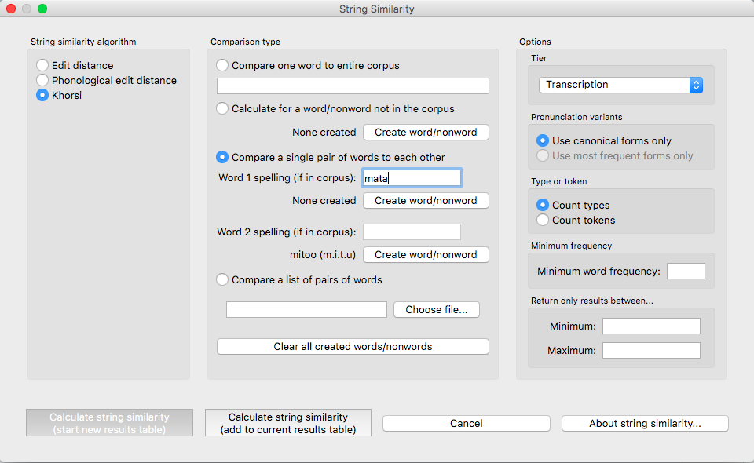
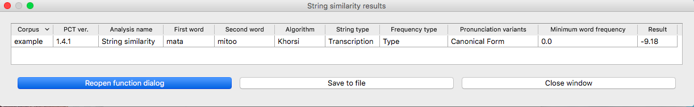

.. _string_similarity:

*****************
String similarity
*****************

.. _about_string_similarity:

About the function
------------------

String similarity is any measure of how similar any two sequences of
characters are. These character strings can be strings of letters or
phonemes; both of the methods of calculation included in PCT allow for
calculations using either type of character. It is, therefore, a basic
measure of overall form-based similarity.

String similarity finds more widespread use in areas of linguistics other
than phonology; it is, for example, used in Natural Language Processing
applications to determine, for example, possible alternative spellings
when a word has been mistyped. It is, however, also useful for determining
how phonologically close any two words might be.

String similarity could be part of a calculation of morphological
relatedness, if used in conjunction with a measure of semantic similarity
(see, e.g., [Hall2016]_). In particular, it can be used in conjunction
with the Frequency of Alternation function of PCT (see :ref:`frequency_of_alternation`) as a means
of calculating the frequency with which two sounds alternate with each
other in a language.

Some measure of string similarity is also used to calculate neighbourhood
density (e.g. [Greenberg1964]_; [Luce1998]_; [Yao2011]_),
which has been shown to affect phonological processing. A phonological
“neighbour” of some word X is a word that is similar in some close way
to X. For example, it might differ by maximally one phone (through deletion,
addition, or subsitution) from X. X’s neighbourhood density, then, is the
number of words that fit the criterion for being a neighbour.

.. _method_string_similarity:

Method of calculation
---------------------

.. _edit_distance:

Levenshtein Edit Distance
`````````````````````````

Edit distance is defined as the minimum number of one-symbol deletions,
additions, and substitutions necessary to turn one string into another.
For example, *turn* and *burn* would have an edit distance of 1, as the only
change necessary is to turn the <t> into a <b>, while the edit distance
between *turn* and *surfs* would be 3, with <t> becoming <s>, <n> becoming
<f>, and ∅ becoming <s> at the end of the word. All such one-symbol
changes are treated as equal in Levenshtein edit distance, unlike
phonological edit distance, described in the following section. Generally
speaking, the neighbourhood density of a particular lexical item is
measured by summing the number of lexical items that have an edit distance
of 1 from that item [Luce1998]_.

.. _phono_edit_distance:

Phonological Edit Distance
``````````````````````````

Phonological edit distance is quite similar to Levenshtein edit distance,
in that it calculates the number of one-symbol changes between strings,
but it differs in that changes are weighted based on featural similarity.
For example, depending on the feature system used, changing <t> to <s>
might involve a single feature change (from [-cont] to [+cont]), while
changing <t> to <b> might involve two (from [-voice, +cor] to [+voice,
-cor]). By default, the formula for calculating the phonological distance
between two segments—or between a segment and “silence”, i.e. insertion
or deletion—is the one used in the Sublexical Learner [Allen2014]_.
When comparing two segments, the distance between them is equal to the
sum of the distances between each of their feature values: the distance
between two feature values that are identical is 0, while the distance
between two opposing values (+/- or -/+) is 1, and the distance between
two feature values in the case that just one of them is 0 (unspecified)
is set to by default to 0.25. When comparing a segment to “silence”
(insertion/deletion), the silence is given feature values of 0 for
all features and then compared to the segment as normal.

.. _khorsi:

Khorsi (2012) Similarity Metric
```````````````````````````````

Khorsi (2012) proposes a particular measure of string similarity based
on orthography, which he suggests can be used as a direct measure of
morphological relatedness. PCT allows one to calculate this measure,
which could be used, as Khorsi describes, on its own, or could be used
in conjunction with other measures (e.g., semantic similarity) to create
a more nuanced view.

This measure starts with the sum of the log of the inverse of the
frequency of occurrence of each of the letters in the longest common
shared sequence between two words, and then subtracts the sum of the
log of the inverse of the frequency of the letters that are not shared,
as shown below.

Formula for string similarity from [Khorsi2012]_:

:math:`\sum_{i=1}^{\lVert LCS(w_1,w_2) \rVert} log (\frac{1}{freq(LCS(w_1,w_2)[i])})
- \sum_{i=1}^{\lVert \overline{LCS(w_1,w_2)} \rVert} log (\frac{1}{freq(\overline{LCS(w_1,w_2)}[i])})`

Note:

* *w1, w2* are two words whose string similarity is to be measured

* *LCS(w1, w2)* represents the Longest Common Shared Sequence of symbols
  between the two words

As with other functions, the frequency measure used for each character
will be taken from the current corpus. This means that the score will
be different for a given pair of words (e.g., *pressed* vs. *pressure*)
depending on the frequency of the individual characters in the loaded corpus.

.. _string_similarity_gui:

Calculating string similarity in the GUI
----------------------------------------

To start the analysis, click on “Analysis” / “Calculate string similarity...”
in the main menu, and then follow these steps:

1. **String similarity algorithm**: The first step is to choose which of the
   three methods described above is to be used to calculate string similarity.
   The options are phonological edit distance, standard (Levenshtein) edit
   distance, and the algorithm described above and in [Khorsi2012]_.

2. **Comparison type**: Next, choose what kind of comparison is to be done.
   One can either take a single word and get its string similarity score
   to every other word in the corpus (useful, for example, when trying
   to figure out which words are most / least similar to a given word,
   as one might for stimuli creation), or can compare individual pairs
   of words (useful if a limited set of pre-determined words is of
   interest). For each of these, you can use words that already exist
   in the corpus or calculate the similarity for words (or non-words)
   that are not in the corpus. Note that these words will NOT be added
   to the corpus itself; if you want to globally add the word (and
   therefore have its own properties affect calculations), please use
   the instructions in :ref:`add_word`.

   a. **One word in the corpus**: To compare the similarity of one word that
      already exists in the corpus to every other word in the corpus,
      simply select “Compare one word to entire corpus” and enter the
      single word into the dialogue box, using its standard orthographic
      representation. Note that you can choose later which tier string
      similarity will be calculated on (spelling, transcription, etc.);
      this simply identifies the word for PCT.
   b. **One word not in the corpus**: Click on “Calculate for a word/nonword
      not in the corpus” and then select “Create word/nonword” to enter
      the new word.

      i. **Spelling**: Enter the spelling for your new word / nonword using
         the regular input keyboard on your computer.
      ii. **Transcription**: To add in the phonetic transcription of the new
          word, it is best to use the provided inventory. While it is
          possible to type directly in to the transcription box, using
          the provided inventory will ensure that all characters are
          understood by PCT to correspond to existing characters in the
          corpus (with their concomitant featural interpretation). Click
          on “Show inventory.” (See also :ref:`inventory_categories`
          for more on how to
          set up the inventory window.) Clicking on the individual
          segments will add them to the transcription. Note that
          you do NOT need to include word boundaries at the beginning
          and end of the word, even when the boundary symbol is included
          as a member of the inventory; these will be assumed
          automatically by PCT.
      iii. **Frequency and other columns**: These can be left at the default.
           Note that entering values will NOT affect the calculation;
           there is no particular need to enter anything here (it is an
           artifact of using the same dialogue box here as in the “Add Word”
           function described in :ref:`add_word`).
      iv. **Create word**: To finish and return to the “String similarity”
          dialogue box, click on “Create word.”

   c. **Single word pair (in or not in) the corpus**: If the similarity of an
      individual word pair is to be calculated, one can enter the pair
      directly into the dialogue box. For each word that **is** in the corpus,
      simply enter its standard orthographic form. For each word that is
      **not** in the corpus, you can add it by selecting “Create word/nonword”
      and following the steps described immediately above in (2b).
   d. **List of pairs of words (in the corpus)**: If there is a long list of pairs
      of words, one can simply create a tab-delimited plain .txt file
      with one *word pair* per line. In this case, click on “Choose file” and select the .txt file in the resulting system
      dialogue box. Note that this option is currently available only
      for words that already exist in the corpus, and that these pairs
      should be listed using their standard orthographic representations. If there is a word that PCT can't find in the corpus, it will tell you and return "N/A" for that word pair, calculating the rest of the word pairs as normal.

2. **Tier**: The tier from which string similarity is to be calculated can
   be selected. Generally, one is likely to care most about either
   spelling or transcription, but other tiers (e.g., a vowel tier)
   can also be selected; in this case, all information removed from
   the tier is ignored. Words should always be entered orthographically
   (e.g., when telling PCT what word pairs to compare). If similarity is
   to be calculated on the basis of spelling, words that are *entered* are
   broken into their letter components. If similarity is to be calculated
   on the basis of transcription, the transcriptions are looked up in the
   corpus, or taken from the created nonword (see step # 1b above).

3. **Pronunciation variants**: If the corpus contains multiple pronunciation variants for lexical items, select what strategy should be used. For details, see :ref:`pronunciation_variants`. Note that here, the only choices currently available are canonical or most-frequent forms.

4. **Frequency type**: If Khorsi similarity is to be calculated, the frequencies
   of the symbols is relevant, and so will be looked up in the currently
   loaded corpus. Either type frequency or token frequency can be used for
   the calculation. This option will not be available for either edit
   distance algorithm, because frequency isn’t taken into account in
   either one.

5. **Minimum Word Frequency**: It is possible to set a minimum token frequency for including words in the calculation. This allows easy exclusion of rare words. To include all words in the corpus, regardless of their token frequency, set the minimum frequency to 0, or leave the field blank. Note that if a minimum frequency is set, all words below that frequency will be ignored entirely for the purposes of calculation.

6. **Minimum / Maximum similarity**: If one is calculating the similarity of
   one word to all others in the corpus, an arbitrary minimum and maximum
   can be set to filter out words that are particularly close or distant.
   For example, one could require that only words with an edit distance
   of both at least and at most 1 are returned, to get the members of
   the standard neighbourhood of a particular lexical item. (Recall
   that the Khorsi calculation is a measure of similarity, while edit
   distance and phonological edit distance are measures of difference.
   Thus, a minimum similarity value is analogous to a maximum distance
   value. PCT will automatically interpret “minimum” and “maximum”
   relative to the string-similarity algorithm chosen.

Here’s an example for calculating the Khorsi similarity of the pair
*mata* (which occurs in the corpus) and *mitoo* [mitu] (which does not),
in the sample corpus, using token frequencies and comparing transcriptions:



7. **Results**: Once all options have been selected, click “Calculate string
   similarity.” If this is not the first calculation, and you want to
   add the results to a pre-existing results table, select the choice
   that says “add to current results table.” Otherwise, select “start
   new results table.” A dialogue box will open, showing a table of the
   results, including word 1, word 2, the result (i.e., the similarity
   score for Khorsi or distance score for either of the edit algorithms), what choice was made regarding pronunciation variants, whether type or token frequency was used (if the Khorsi method is
   selected; otherwise, N/A), and which algorithm was used. Note that
   the entries in the table will be written in spelling regardless of
   whether spelling or transcriptions were used. This file can be saved
   to a desired location by selecting “Save to file” at the bottom of
   the table.

Here’s an example result file for the above selection:



To return to the function dialogue box with your most recently used
selections, click on “Reopen function dialog.” Otherwise, the results
table can be closed and you will be returned to your corpus view.

.. _string_sim_classes_and_functions:

Classes and functions
---------------------
For further details about the relevant classes and functions in PCT's
source code, please refer to :ref:`symbol_sim_api`.
