.. _transcriptions_and_feature_systems:

***********************************************
Working with transcriptions and feature systems
***********************************************

In order to do phonological analysis, PCT needs to know what segments
exist in a corpus, and what features are assigned to each segment.
There are a variety of built-in transcription systems and feature
systems available, but users can also define their own for custom
use. Transcription and feature systems are essentially packaged
together as .txt files in the form of a spreadsheet, where particular
transcription symbols are mapped to a set of features (described below
in :ref:`feature_format`). In general, however, feature systems (i.e., files containing
transcriptions and their features) must be explicitly loaded into PCT
before they are available for use. Thus, it makes sense to start by
loading in at least one such system before attempting to work with corpora.

.. _feature_format:

Required format of a feature file
=================================

As mentioned above, transcription and feature systems are packaged
together as .txt files in the form of a delimited spreadsheet. The
first column in the file lists all the transcription symbols that
are to be recognized. *Note that this column must be labeled with
the name “symbol” in order for PCT to correctly read in the file*.
Every symbol used in the corpus needs to be in this column. Subsequent
columns list individual features that are to be used. Each cell in a
row gives either a + or – for each feature, indicating what value the
initial symbol in that row has for that feature; a 0 or n can also be
used, to indicate that a particular feature is not defined for a given
segment (0 is the default in the built-in *hayes* system; n is the default
in the built-in *spe* system). The following shows an example; keep in mind
that this is in fact a tab-delimited .txt file, but the names in the
first row are longer than any of the values in subsequent rows, so the
alignment is visually misleading. For example, the first row containing
symbols contains the symbol [p], which is designated as [-syllabic],
[+consonantal], [-sonorant], [-continuant], etc., although the column
names aren’t aligned with the feature values visually.

.. image:: static/featurefile.png
   :width: 90%
   :align: center

.. _download_features:

Downloadable transcription and feature choices
==============================================

Currently, the built-in transcription systems that are usable are
IPA, ARPABET (used for the [CMU]_ dictionary), XSAMPA, CPA, CELEX, DISC,
Klatt, and Buckeye. These transcription systems can be associated with either the
features as laid out in [Mielke2012]_, which in turn are based on [SPE]_,
or as laid out in [Hayes2009]_ [#]_. Each of these
transcription-to-feature mappings is laid out as above in a .txt file that
can be downloaded from within PCT. The former system is called “spe” for
short within PCT, while the latter is called “hayes.”

To download one of these systems, click on “Corpus” /
“Manage feature systems...” and follow these steps:

1. **Download**: Click on “Download feature systems” to open up the relevant dialogue box.
2. **Transcription**: Select which of the transcription systems you want
   (IPA, ARPABET, XSAMPA, CPA, CELEX, DISC, Klatt, or Buckeye).
3. **Feature system**: Select which set of features you would like to map
   the transcription symbols to (SPE or Hayes).
4. **Saving**: Click “OK” to have PCT load in the selected feature file
   (you must be connected to the internet to have this functionality).
   The newly downloaded feature file will now appear in your “Manage
   feature systems” dialogue box, and is available for all subsequent
   use of PCT unless and until you delete it (done by selecting the
   system and clicking “Remove selected feature system”). Click “Done”
   to return to the regular corpus analysis window.

.. image:: static/downloadfeature.png
   :width: 90%
   :align: center

The in-built SPE and Hayes systems use '0,' 'n,' or '.', in addition to '+' and '-'. In the Hayes system, '0' is used
to indicate the given feature cannot be defined for the segment, like [lateral] for noncoronals. For the same purpose,
the SPE system uses 'n'. Additionally, a '.' in the SPE system is used for complex segments with conflict feature values.
For example, in the ipa2spe feature, [coronal] for /fʃ/ has a '.' because its component /f/ and /ʃ/ are specified
for opposite values.

See :ref:`applying_editing_feature` for more information about applying / editing feature systems in
conjunction with corpora.

.. _custom_feature:

Using a custom feature system
=============================

In addition to using one of the built-in feature systems, you can design
your own transcription-to-feature mapping, of the format specific in :ref:`feature_format`.

.. _load_custom_feature:

Loading a custom feature system
-------------------------------

Once you have a feature file in the required format (see :ref:`feature_format`
and :ref:`modifying_feature`),
go to “File” / “Manage feature systems...” to load it in. Select
“Create feature system from text file” and the “Create feature system from csv”
dialogue box will open.

1. **File selection**: Specify the file by entering its directory path or
   by selecting it using the “Choose file...” button.
2. **Transcription system**: Indicate which transcription system this is a
   feature file for. (For example, you can create a new feature file for
   existing IPA transcriptions.) If this is a brand-new system for PCT,
   i.e., a new transcription system being associated with features, then
   select “Custom” from the dropdown menu. Then, enter a name for the
   transcription system in the box.
3. **Feature system**: Indicate which feature system is being used (e.g.,
   is this a case of assigning existing SPE features to a new transcription
   system?). If this is a brand-new set of features, then select “Custom”
   from the dropdown menu. Then, enter a name for the feature system in the box.

.. note:: For both existing transcription and feature systems, you still
   need to include both the transcriptions and the features in the .txt
   file itself; you can simply indicate here in PCT that these transcriptions
   and / or features are identical to ones that are already extant in the
   system, so that they can be used / interpreted consistently. The name
   of the transcription / feature system file in PCT will conventionally
   be transcription2features (e.g., ipa2hayes for IPA symbols interpreted
   using Hayes features), so it’s useful to be consistent about what the names are.

4. **Delimiter**: Indicate what the column delimiter in the custom file is.
   The default, tab, is indicated by ``\t``.

Click “OK,” and the feature system should now appear in your “Available
feature systems” window. Click “Done.” See :ref:`applying_editing_feature` for more information about
applying the feature system to corpora. The image below shows the dialogue
box used to load in the custom, tab-delimited feature file for interpreting
the custom “gitksan” transcription system using Hayes features.

.. _modifying_feature:

Modifying an existing feature system’s text file
------------------------------------------------

A custom system can be created from scratch, following the format
described in :ref:`feature_format`. It is probably easier, however, to create a new
system by modifying an existing system’s file. While this can be done
to a certain extent within PCT itself (see :ref:`applying_editing_feature`), large-scale changes
are best done in separate text-editing software. To do so, you’ll need
to start with an existing file, which can be obtained through PCT: Download one of the built-in feature systems (:ref:`download_features`) and apply it to your corpus (:ref:`applying_editing_feature`). Then go to “File” / “Export feature system as text file...” and save the file locally.

Once you have the file, open it in whatever software you prefer (e.g.,
TextEdit, OpenOffice, etc.); it may be easiest to import it into a
spreadsheet reader (e.g., Excel, Calc, etc.) in terms of legibility.
You can then add new symbols to the first column, feature specifications
in the subsequent columns, new feature names, etc., etc. Remember that
the name of the first column must always be “symbol” in order for PCT to
read the file. Save the new file as a CSV or tab-delimited .txt file,
and load it following the instructions in :ref:`load_custom_feature`.

.. _applying_editing_feature:

Applying / editing feature systems
==================================

Once a feature system has been loaded into PCT (:ref:`download_features`,
:ref:`custom_feature`), it is
available for use with a corpus. To do so, first load in a corpus
(:ref:`loading_corpora`);
if you are using a custom corpus or creating a corpus from text, you can
select the feature system you want to use during the loading. Once a
corpus has been loaded (with or without a feature system), you can edit
the system by clicking on “Features” / “View / change feature system....”
The following options are shown:

1. **View system**: At the top of the “Edit feature system” dialogue box,
   you’ll see the current transcription and feature system being used,
   assuming one has been selected. The first column shows the individual
   symbols; subsequent columns give the feature specifications for each
   symbol. Clicking on the name of any column sorts the entire set by the
   values for that feature; clicking again flips the sort order based on
   that same column.
2. **Change transcription and feature systems**: If there is no feature system
   already specified, or if you would like to change the transcription or
   feature system, use the dropdown menus under “Change feature systems” to
   select from your currently available systems. If no system is available,
   or the system you want to use is not available, go back to
   :ref:`download_features` or :ref:`custom_feature`
   to learn how to load feature systems in to PCT. Be sure to click on “Save
   changes to this corpus’s feature system” after selecting a new feature
   system in order to actually apply it to the corpus.
3. **Modify the feature system**: You can modify the current feature system
   directly within PCT. There are three options.

   a. **Add segment**: To add a new segment and its associated feature values
      to the current feature system, click on “Add segment.” A new dialogue
      box will open up, with a space to input the symbol and dropdown
      menus for all of the features expected in the current system.
      You can also specify that all features should be set to a particular
      value, and then change / edit individual features as needed.
      Simply fill in all the values and click “OK”; the symbol and
      features will be added to the feature system.
   b. **Edit segment**: To change the feature specifications of an existing segment,
      click on the row containing that segment and then on “Edit Segment.”
      Then use the resulting dialogue box to change the feature specifications.
   c. **Add feature**: To add an additional feature to the current system,
      click on “Add feature.” Enter the name of the feature in the dialogue
      box, select the default value that all segments will have for this
      feature, and hit “OK.” The feature will be added to all the segments
      in the corpus, with the default value. To change the value of the
      feature for each segment, simply click on the segment and then use
      the “Edit segment” functionality described above; the new feature
      will automatically be added to the dialogue box for each segment.

.. warning:: Be sure to click on
   “Save changes to this corpus’s feature system” after adding a new
   segment or feature, or editing the feature specifications of a segment,
   in order to actually apply the changes to the corpus.

4. **Corpus inventory coverage**: There are two tools built in to help you
   check the coverage in your corpus.

   a. **Extraneous symbols**: The built-in feature systems are fairly
      extensive, and may include symbols for sounds that do not occur
      in your corpus. Click on “Hide all segments not used by corpus”
      to remove such segments from the viewing window. (This does NOT
      remove them from the feature system itself; it just de-clutters
      your view of the system.) To revert back to the full system,
      simply click on “Show all segments.”
   b. **Corpus coverage**: It’s possible that there are symbols used in
      your corpus that are **not** covered in whatever feature system you
      have selected. To find out, click on “Check corpus inventory
      coverage.” A new window will appear that either confirms that
      all symbols in the corpus are mapped onto features, or lists
      the symbols that are currently lacking. If there are symbols
      that are missing, you’ll need to add them before doing phonological
      analysis on the corpus. You can do so in two ways: (1) adding them
      within the PCT interface, following the instructions under “Modify
      the feature system,” immediately below; or (2) changing the feature
      system itself by editing the .txt file and reloading it (more
      information given in :ref:`modifying_feature`).

Below is an example of the “Edit feature” system dialogue box, loaded
with the “ipa2spe” transcription and feature file:

.. image:: static/editfeatures.png
   :width: 90%
   :align: center

5. **Display options**: The standard view is to display the
   segments and features as a matrix. 

.. _inventory_categories:

Edit inventory categories
=========================

There are many instances in which PCT
needs to display the inventory of the corpus in order for sounds to be
selected for search or analysis. The default is to display segments in
alphabetical order, which is not necessarily particularly intuitive as
far as a linguist's ability to interact with the list. For example, here
is the unordered version of the segments in the sample “Lemurian” corpus
(see :ref:`example_corpora`):

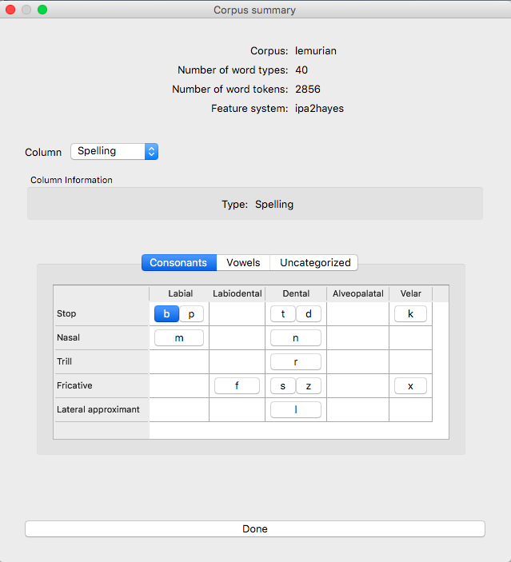

Once a feature file has been associated with a corpus, this unordered set
can be arranged into something more closely resembling an IPA chart. Here
is the Lemurian corpus once the IPA symbols have been interpreted using
Hayes-style features. Note that for space reasons, the consonant chart and vowel chart are in separate tabbed views; there is also a tab for any segments that have not been categorized.

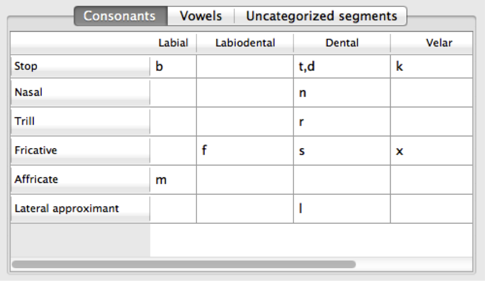
   
   
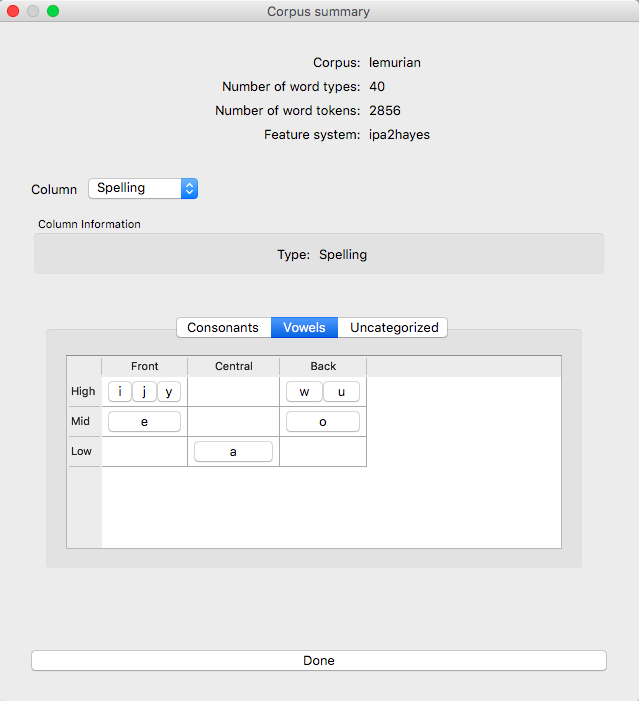

To create or edit the inventory chart, go to “Features” / “Manage inventory chart.” The “Manage inventory” dialogue box appears. If the feature system being used is either the built-in [Hayes2009]_ or the [SPE]_ style feature system, clicking on “Autocategorize” should result in a relatively standard IPA-like chart, which can be further edited if needed. [Note: if you are using a custom feature system but want the “Autocategorize” function to work, please ensure that all of the following features are included in your system, with these exact names, even if they aren't phonologically necessary for your inventory:

For "Hayes"-like systems: 'consonantal', 'sonorant', 'nasal', 'continuant', 'lateral', 'trill', 'tap',
'delayed_release', 'voice', 'labial', 'labiodental', 'coronal', 'anterior', 'dorsal', 'front', 'back', 'high', 'low'

For "SPE"-like systems: 'cons', 'son', 'ant', 'cor', 'high', 'low', 'back', 'lat', 'nasal' (cf. in older versions of
PCT, 'voc' was used instead of 'cons.' Although this is still supported for backward compatibility, the the default
feature for consonants vs vowels is now 'cons.')

1. **Defining defaults (Consonants vs. Vowels)**: PCT first needs to know what the default features are for consonants and vowels. For example, one might set the default for consonants to be [+consonantal] and the default for vowels to be [-consonantal]. After features have been entered into these boxes, click on "Update defaults" to have them go into effect.

2. **Defining rows and columns**: Then, individual rows and columns in the inventory chart can be defined. E.g., in the vowel chart, the first row might set to be High Vowels, and the first column might be set to be Front Vowels. To do so, start by double-clicking the empty "Row 1" header. The "Edit row properties" dialogue box opens. The name of the row can be changed from "Row 1" to "High vowels," and the set of features needed to fill the row can be selected. E.g., one could select the feature [high] and then specify that segments in this row must all be have a [+] value for that feature. Multiple features may be selected. Click "ok." While the row name will update, no segments will actually appear until columns have been defined, too. Double-click on the empty "Column 1" header to open the "Edit column properties" dialogue box. Change the name of the column to "Front vowels" and specify that the segments in this column must be [-back]. Click ok. The inventory chart should now look as follows:

.. image:: static/high_front_vowels_only.png
   :width: 90%
   :align: center

.. note:: Segments must also match all default features for consonants or vowels in order to appear in the inventory
    chart, even though those features aren't specified in the individual rows or columns. For instance, /ɹ/ does not
    appear in the inventory chart of consonants under the default settings with the built-in Hayes system. This is
    because /ɹ/ has [-consonant] while the default consonant feature for the Hayes system is [+consonant].

3. **Adding and re-arranging rows and columns**: Additional rows and columns can be added by right-clicking on existing rows and columns and selecting "Insert {row, column}." The new row or column will by default appear above or to the left of the selected row or column, respectively, but the order of rows and columns may be re-arranged by clicking on the row or column name and dragging it to the new position. [We know that this re-arranging is somewhat finicky, and we apologize. We'll work on getting a smoother system in place! In general, we find that it is easier to move rows up and columns leftward than in the opposite directions.]

4. **Editing or deleting rows and columns**: Double-clicking a row or column also allows you to edit or delete that row or column.

5. **Deciding which features to use**: In order to help make categorization as easy as possible, information about the feature specifications for uncategorized segments is available. In the "Uncategorized segments" tab, right-click on any listed segment to see both which rows and columns it may have a partial match with, and also an entire list of its featural specifications. If only high front and back vowels have been defined, for example, clicking on the uncategorized vowel [a] would show the following information. Note that this specifies that the [a] will go into the "back vowel" column; it also shows the rest of the features, so that for instance, it's clear that we need a row for [+low] vowels. 

.. image:: static/a_matches.png
   :width: 90%
   :align: center

The above steps can be repeated until all segments are appropriately categorized. The resulting inventory system is the one that will appear in all situations throughout PCT when an inventory is being shown (e.g., for segment selection in searches or analyses). 

.. note:: These categories are for display purposes only, however; if, for example, you left [j] and [w] in the vowel chart, this would not prevent you from specifying in an actual analysis that you wanted only [+syllabic, +high] segments and correctly eliminating them. (Likewise, one could safely leave them as uncategorized in the inventory display chart by specifying that vowels must be [+syllabic], and then still access them in analyses by selecting them directly or through use of shared features such as [+high].)

.. _create_tiers:

Creating new tiers in the corpus
================================

It is possible to have PCT extract a tier of segments from the
transcribed words in your corpus, based on any segment, feature, or
set of features that are defined for your corpus. For example, it is
easy to extract separate tiers for consonants and vowels. This extraction
is particularly useful if, for example, one is interested in looking at
an analysis of predictability of distribution where the conditioning
contexts are non-adjacent segments; the extraction of a tier allows
otherwise non-adjacent segments to be adjacent to each other on the
selected tier. For example, one could examine the possibility of vowel
height harmony in language X by extracting the vowels from all words and
then calculating the extent to which high / low vowels are predictably
distributed in high / low vowel contexts. (See also :ref:`add_column` for information
on how to add a column to a corpus, which contains any kind of user-specified
information, and :ref:`add_count_column` for information on how to add a count column to a
corpus, which contains counts of specific elements within each entry in the corpus.)

To create a new tier for a corpus that is currently open, click on the
“Corpus” menu and select either “Add tier...” or “Add abstract tier...”;
the “create tier” dialogue box opens. An “abstract” tier is a tier that is
not based directly on the transcriptins themselves, but rather abstracts
to a higher level. As of June 2015, the only abstract tier available is
a CV skeleton tier. Before creating the tier, you can “preview” the tier
as in the following example; this shows what segments PCT thinks are
consonants and vowels in the current corpus.

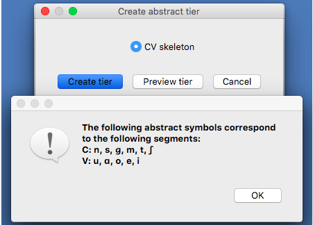

The example corpus after an abstract CV tier has been added:

To create a less abstract tier, i.e., one that is just an extraction of
all transcription symbols in the corpus that have some particular characteristic(s),
use the following instructions after choosing “Corpus” / “Add tier...”:

1. **Name**: Enter a short-hand name for the tier, which will appear as the
   column header in your corpus. For example, “vowels” or “consonants” or “nasals.”
2. **Basis for creating tier**: You can create the tier using natural classes
   if you base the tier on features; you can also create “unnatural” tiers
   that are simply extractions of any set of user-defined segments.
3. **Segments**: To actually select the segments, using either features or
   individually, follow the directions given in :ref:`sound_selection`.

The image below shows an example of creating a tier to contain all the non-mid
vowels in the example corpus. (Note that the image shows the mid vowels
highlighted but not yet selected; one would need to hit "enter" again or
choose "Select highlighted" to make the actual selection):

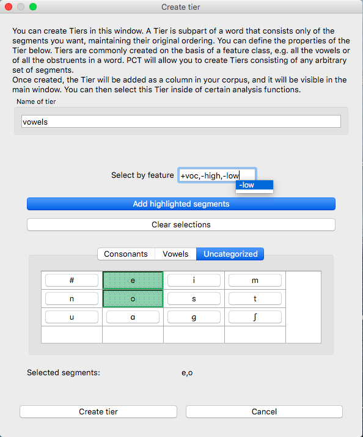

The features available will be based on whatever feature system has been
selected as part of the corpus; see :ref:`download_features` for
information on selecting or defining different features for the segments in the corpus.

4. Finalizing the tier: To create the tier and return to the corpus,
   click on “Create tier.” It may take a moment to process the entire
   corpus, but a new column should be added to the corpus that shows the
   segments matching these feature selections for every word in the corpus.

5. Saving the tier: The tier can be saved along with the corpus for future
   use by selecting “Corpus” / “Save corpus” from the menu items (this will
   be done automatically if auto-save is on; see :ref:`preferences`). It is also possible
   to export the corpus as a text file (.txt), which can be opened in other
   software, by selecting “File” / “Export corpus as text file.”

6. Removing a tier: To delete a tier that has been created, simply click on
   “Corpus” / “Remove tier or column...” and select the tier you want to
   remove; then click “Remove.” You can also right-click on the column name
   and select “Remove column.” Note that only tiers that have been added
   through PCT can be removed; tiers that are inherent in loaded corpora
   cannot be removed in PCT. You can, of course, export the corpus
   itself to a text file, remove the column manually, and then re-load
   the changed corpus. To remove all the added tiers, leaving only the
   inherent (“essential”) tiers in the corpus, select “Remove all non-essential
   columns.” PCT will list which columns are non-essential and verify that
   you want to remove them before the removal is permanent. The “essential”
   columns for most corpora are “Spelling,” “Transcription,” and “Frequency.”

The following shows an example of the a vowel tier added to the example
corpus using the SPE feature system:

.. _adding_editing_word_columns_tiers:

Adding, editing, and removing words, columns, and tiers
=======================================================

.. _add_column:

Adding a column
---------------

In addition to the ability to add tiers based on information already in
the corpus, as described above in :ref:`create_tiers`, it is also possible to add a
column containing any other user-specified information to a corpus (see
also :ref:`add_count_column` to find out how to add a column based on counts of elements
within each corpus entry). For example, one could add a “Part of Speech”
column and indicate what the lexical category of each entry in the corpus
is. Note that as a general proposition, it is probably easier to add
such information in a spreadsheet before importing the corpus to PCT,
where sorting and batch updates are easier, but we include this functionality
in a basic form in case it is useful.

To add a column, go to “Corpus” / “Add column...” and do the following:

1. **Name**: Enter the name of the new column.
2. **Type of column**: Indicate what type of information the column will
   contain. The choices are “Spelling,” “Numeric,” and “Factor.” A
   spelling column will have values that are written out as strings
   of characters, with each entry taken to be a unique string. A numeric
   column will have numeric values, upon with mathematical operations
   can be performed. A factor column will have values that can contain
   characters or numbers, but are limited in number, as in the levels
   of a categorical variable. This is useful when, for example, the
   column encodes categorical information such as part of speech, with
   each entry in the corpus belonging to one of a limited set of categories
   such as “Noun,” “Verb,” and “Preposition.”
3. **Default value**: A default value for the column can be entered if desired,
   such that every entry in the corpus receives that value in the new column.
   Individual entries can subsequently be edited to reflect its actual
   value (see :ref:`edit_word`).

Click “Add column” to return to the corpus and see the new column,
with its default values.

.. _add_count_column:

Adding a “count” column
-----------------------

In addition to adding columns that contain any kind of user-specified
information (:ref:`add_column`), and tiers that contain phonological information
based on the entries themselves (:ref:`create_tiers`), one can also add “Count”
columns, which contain information about the *number* of occurrences of
a feature or segment in each entry in a corpus. For example, one could
add a column that lists, for each entry, the number of round vowels
that are contained in that entry. To add a count column, go to “Corpus”
/ “Add count column...” and then do the following:

1. **Name**: Enter the name of the new column.
2. **Tier**: Specify what tier the count column should refer to in order to
   determine the counts (e.g., transcription or a derived tier such as
   a vowel tier).
3. **Segment selection**: Use the standard :ref:`sound_selection` instructions to select which segments or types of segments to count.

Click “Add count column” to return to the corpus and see the new column,
with its count values automatically filled in.

.. _remove_column:

Removing a tier or column
-------------------------

To delete a tier or column that has been created, simply click on
“Corpus” / “Remove tier or column...” and select the tier you want to
remove; then click “Remove.” Note that only tiers that have been added
through PCT can be removed; tiers that are inherent in loaded corpora
cannot be removed in PCT. You can, of course, export the corpus itself
to a text file, remove the column manually, and then re-load the changed
corpus. To remove all the added tiers, leaving only the inherent
(“essential”) tiers in the corpus, select “Remove all non-essential
columns.” PCT will list which columns are non-essential and verify that
you want to remove them before the removal is permanent. The “essential”
columns for most corpora are “Spelling,” “Transcription,” and “Frequency.”

.. _add_word:

Adding a word
-------------

As a general proposition, we don’t recommend using PCT as a database
manager. It is designed to facilitate analyses of pre-existing corpora
rather than to be an interface for creating corpora. That said, it is
occasionally useful to be able to add a word to a pre-existing corpus in
PCT. Note that this function will actually add the word to the corpus
(and, if auto-save is on, the word will be saved automatically in future
iterations of the corpus). If you simply need to add a word temporarily,
e.g., to calculate the neighbourhood density of a hypothetical word given
the current corpus, you can also add a word in the relevant function’s
dialogue box, without adding the word permanently to the corpus.

To do add the word globally, howveer, go to “Corpus” / “Add new word...”
and do the following:

1. **Spelling**: Type in the orthographic representation of the new word.
2. **Transcription**: To add in the phonetic transcription of the new word,
   it is best to use the provided inventory. While it is possible to type
   directly in to the transcription box, using the provided inventory will
   ensure that all characters are understood by PCT to correspond to existing
   characters in the corpus (with their concomitant featural interpretation).
   (If there is no featural interpretation of your inventory,
   you will simply see a list of all the available segments, but they will
   not be classifed by major category.) Clicking on the individual segments
   will add them to the transcription. Note that you do
   NOT need to include word boundaries at the beginning and end of the
   word, even when the boundary symbol is included as a member of the
   inventory; these will be assumed automatically by PCT.
3. **Frequency**: Enter the token frequency of this word.
4. **Other**: If there are other tiers or columns in your corpus, you can
   also enter the relevant values for those columns in the dialogue box.
   For tiers that are defined via features, the values should be
   automatically populated as you enter the transcription. E.g., if you
   have a vowel tier, and add the word [pim.ku] to your corpus by selecting
   the relevant segments from the inventory, the vowel tier should
   automatically fill in the entry as [i.u].

Once all values are filled in, select “Create word” to return to the
corpus with the word added. If auto-save is not on, you can save this
new version of the corpus for future use by going to “File” / “Save corpus.”
If you have added a word and the corpus has NOT been saved (either manually
or through auto-save) afterward, and then try to quit PCT, it will warn
you that you have unsaved changes and ask that you verify that you want
to quit without saving them.

.. _remove_word:

Removing a word
---------------

To remove a word from the corpus, select it in the corpus view and
right-click (ctrl-click on a Mac) on it. Choose “Remove word” from the
menu. Regardless of whether warnings are turned on or not (see :ref:`warnings`),
PCT will verify that you want to remove the word before commiting the
change. Word removal is not auto-saved with a corpus, even if “Auto-save”
is turned on (see :ref:`preferences`); if you want to save the new version of the
corpus with the word removed, you should explicitly go to “File” /
“Save corpus.” If you have removed a word and NOT manually saved the
corpus afterward, and then try to quit PCT, it will again warn you that
you have unsaved changes and ask that you verify that you want to quit.

.. _edit_word:

Editing a word
--------------

To edit a word in the corpus, right-click on the word’s entry and chooser
“Edit word details,” or double-click the word’s entry in the corpus.
A dialogue box opens that shows the word’s spelling, transcription,
frequency, and any other information that is included in the corpus.
Most of these entries can be edited manually, though a few, such as
tiers that are dependent on a word’s transcription, cannot themselves
be directly edited. To edit such a derived tier, edit the transcription
of the word; the derived tier will update automatically as the new
transcription is provided.

.. _non_transcribed:

Hiding / showing non-transcribed items
--------------------------------------

When working with a corpus, it is possible to hide all entries that do
not have a transcription (if any such entries exist). To do this,
right-click anywhere in the corpus itself and select “Hide non-transcribed
items.” To reveal them again, right-click anywhere in the corpus itself
and select “Show non-transcribed items.”

.. _phonological_search:

Phonological Search
===================

PCT allows you to do searches for various strings, defined by segments or features. 
The search returns two types of information: one, a general count
of the number of entries that fit the search description, and two, the
actual list of all the words in the corpus that contain the specified
string. There are two modes in which this “phonological search” can be conducted: “Segment mode” and “Syllable mode.”
“Segment mode” treats words in the corpus as a linear sequence of segments, so it is useful for 
searching for a target in a linear context. This is the only search type that was available 
in early versions of PCT.
“Syllable mode,” on the other hand, allows you to construct syllables for your search, 
such that you can search for both syllable components like “onset” and “coda” and also 
for characteristics of words that are defined at the syllabic level, such as tone or stress. 
Syllable mode requires your corpus to have syllable delimiters.

To conduct a search, first choose “Corpus” / “Phonological search...”
and do the following:

.. _segment_mode:

Segment Mode
------------
Segment mode lets you search a target in linear environments.

1. **Search mode**: Select “Segments.”

2. **Result type**: Select either positive or negative. A positive search returns entries 
   that satisfy the environment you choose in the environment selection; while negative search
   returns the strings that do *not* fall under the environment that you specify, i.e., the complement
   of your search.

3. **Tier**: Select the tier on which phonological search should be performed.
   The default would be the transcription tier, so that phonological
   environments are defined locally. But, for example, if a vowel tier
   is selected, then one could search for the occurrence of, e.g., [i]
   before mid vowels on that tier (hence ignoring intervening consonants). (Note that it is not currently possible to do a phonological search within :ref:`pronunciation_variants`; the search will look only at the canonical forms or whatever forms are listed in the specified tier.)

4. **Environments**: Select the strings you want to search for. See :ref:`environment_selection` and :ref:`sound_selection` for details.

   An example of adding environments for a positive search (in this case, the environment “word-initial,
   before a vowel”):

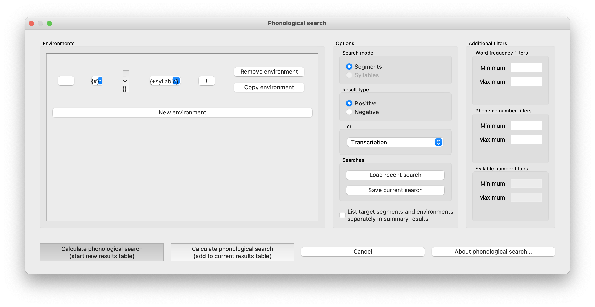

   An example of the phonological search window, set up to search for voiceless stops word-initially before vowels
   and between [ɑ] vowels, on the transcription tier (positive search):

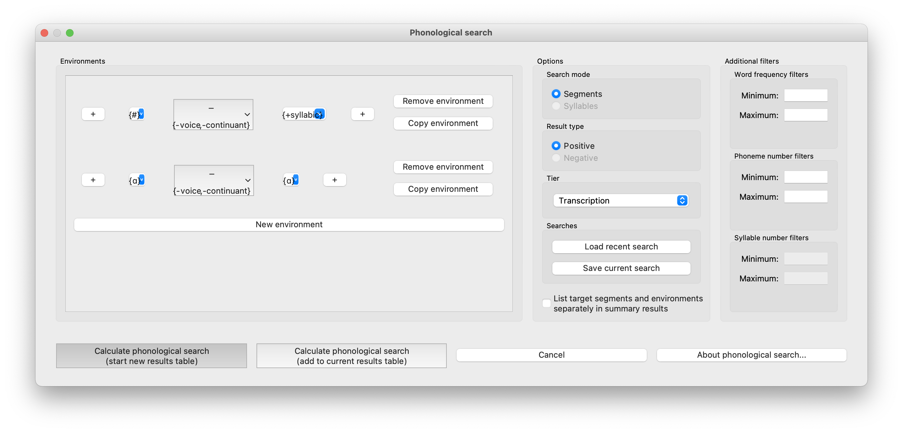

   An example of the phonological search window, set up to search for voiceless stops word-initially before vowels and
   between [ɑ] vowels, on the transcription tier (negative search):

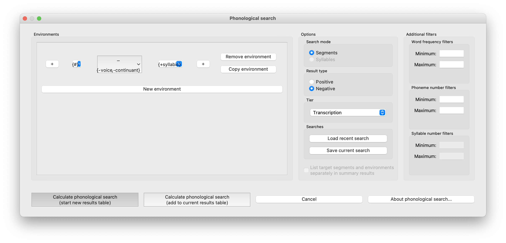

5. **Saving Searches**: It is possible to save particular searches and then re-load them for later use (within the same
   corpus, or in a different one). PCT will automatically save the five most recent searches for you, but you can also
   specify that any particular search should be saved for the long term.

   To save a search, click on “Save current search” in the “Phonological Search” dialogue box (see above pictures).
   To modify it or to use a saved search, click on “Load recent search.” Doing so brings up the “Searches” dialogue box
   as follows:

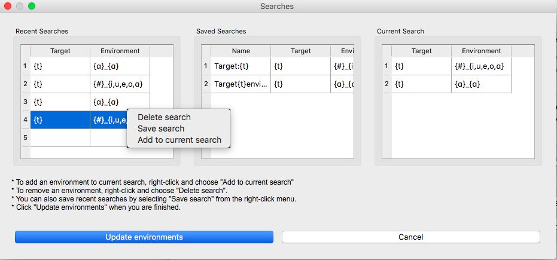
   

On the left are listed the five most recent searches, showing the target and environment for each search. In the center are the officially “saved” searches. On the right is an empty panel in which a new search can be 'built' from the saved searches. Right-clicking on one of these panels will bring up further options. For example, right-clicking on a recent search allows you to transfer it to the saved searches, to delete it entirely, or to add it to the current search. Similarly, right-clicking on a saved search allows you to delete it entirely or to add it to the current search. Double-clicking in the “Notes” column of saved searches allows you to label searches or add other useful information about them. Once one or more searches have been added to the "Current Search" panel, they can be loaded by clicking on "Load selected search." (Note that if only one search is needed, it does not have to be added to the "Current Search" panel first, though it can be.) You will be turned to the main "Phonological Search" dialogue box and the environments for searches will be automatically populated with the selected searches. These can then be further modified if needed (though they would then need to be re-saved if you want them to be stored.)

6. **Results**: Once all selections have been made, click on “Calculate
   phonological search.” If there is not already an existing results table,
   or you want to start a new one, choose the “Start new results table”
   option. If you want to add the results to a pre-existing table, choose
   the “Add to current results table” option. The results appear in a new
   dialogue box that first shows the summary results, i.e., a list that
   contains the segment that was searched for, each environment that was
   searched for, the total count of words that contain that segment in that
   environment, and the total token frequency for those words (note that
   these are the frequencies of the WORDS containing the specified environments,
   so if for example, a particular word contains multiple instances of the same
   environment, this is NOT reflected in the counts). The individual words in
   the corpus that match the search criteria can be shown by clicking on “Show
   individual results” at the bottom of the screen; this opens a new dialogue
   box in which each word in the corpus that matches the search criteria is
   listed, including the transcription of the word, the segment that was found
   that matches the search criteria, and which environment that segment
   occurred in in that word. Note that the results can be sorted by any of
   the columns by clicking on that column’s name (e.g., to get all the words
   that contained the [a_a] environment together, simply click on the “Environment”
   label at the top of that column). To return to the summary results, click on
   “Show summary results.” Each set of results can be saved to a .txt file by
   clicking “Save to file” at the bottom of the relevant results window. To
   return to the search selection dialogue box, click on “Reopen function dialogue.”
   Otherwise, when finished, click on “Close window” to return to the corpus.

An example of the summary results window for the above positive phonological search:

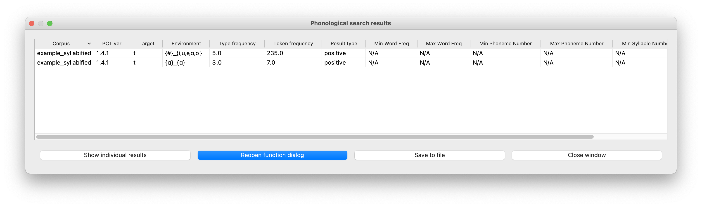

And the individual results from the same search, sorted by environment:

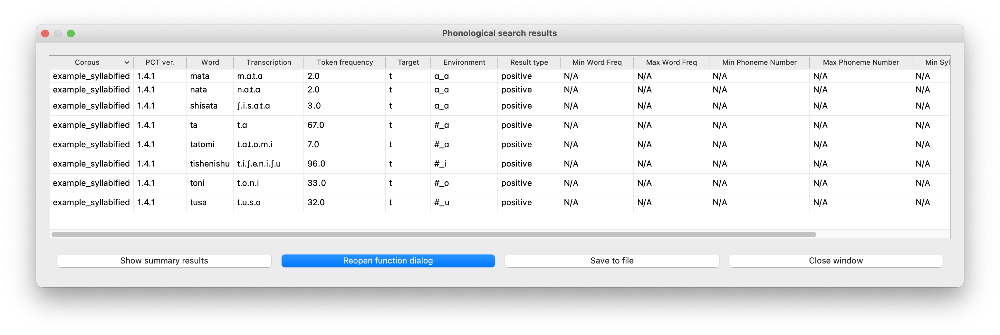

Finally, the same environment but negative search option returns the following individual results:

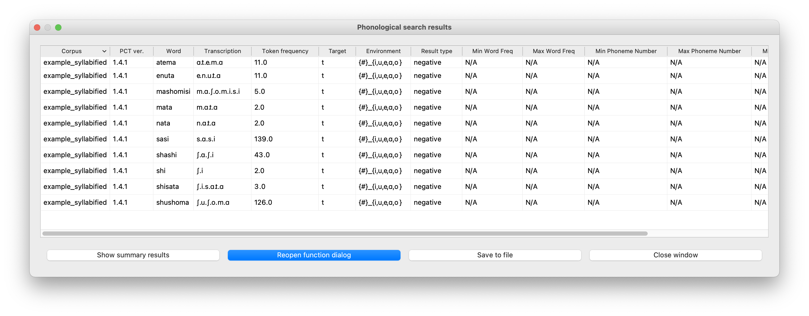

   
.. _syllable_mode:

Syllable Mode
-------------
Syllable mode enables you to incorporate the notion of the syllable in your phonological searches. The basic 
operation is the same as segments mode, except the environment selection. Syllables mode comes in handy 
when, for example, you want to limit your search to the second syllable of a word, or to the onset of a syllable. 
If you were to do it in segments mode, you would need to construct by hand all the different types of possible syllables before
the target, because the segments mode is blind to the notion of the syllable. Syllables mode also allows you to search 
for characteristics that are specified at the syllabic level, such as stress or tone. In order to use syllables mode, though, 
your corpus must be delimited for syllables; see :ref:`parsing_parameters`.

1. **Search mode**: Select “Syllables.”

2. **Result type**: Select either positive or negative. A positive search returns entries that satisfy
   the environment you choose in the environment selection; while negative search returns the strings
   that do NOT fall under the environment that you specify. 

3. **Tier**: Select the tier on which phonological search should be performed.
   The default would be the transcription tier, so that phonological
   environments are defined locally. But, for example, if a vowel tier
   is selected, then one could search for the occurrence of, e.g., [i]
   before mid vowels on that tier (hence ignoring intervening consonants). 
   Note that it is not currently possible to do a syllable search within other tiers than 'Transcription.' 
   Also, phonological search within :ref:`pronunciation_variants` is not available. The search will look 
   only at the canonical forms or whatever forms are listed in the specified tier.)

4. **Environments**: Construct a syllable by selecting 'Construct the syllable,' or add a non-segment symbol (for non-targets). Constructing a syllable means 
   specifying the environment for each syllable component. See examples below for the syllable construction. Also, see :ref:`environment_selection` and :ref:`sound_selection` for environment selection.

   To construct a syllable, first you will need to add a new environment by clicking the “New environment” button.
   And then, you can construct a target syllable by selecting "Construct the syllable" from the dropdown menu
   of Edit. The Construct syllables window will pop up. Now you can specify Onset and Nucleus just as you
   would do in :ref:`environment_selection`. And you can also specify Stress and Tone for the target syllable
   on the right-hand side.

   For each syllable component, you can select environment and specify a search type among "Exactly matches", "Minimally contains", "Starts with", and "Ends with."
   Please note that using "Exactly matches" while not specifying an onset/coda slot means "no onset/coda", while using "Minimally contains" without specifying an
   onset or coda means that the onset or coda may either be empty or filled. Using a single wildcard for onset/coda slot does mean that a segment must fill the slot.

   Additionally, you can exclude specific segments at a syllable component by selecting "Set negative" from the dropdown menu. For example,
   if you want to search for a syllable that has any phoneme except +labial at the onset position and [ɑ] as the nucleus, you can do so in
   the "Construct syllables" window by specifying "Nucleus" as [ɑ] and setting "Onset" as +labial with "Set negative" option checked from
   the dropdown menu. This will search for [sɑ], [rɑ], etc. but exclude [mɑ] or [pɑ].

   Now, let's assume you search for the cases where the second syllables are either /tɑ/ or /sɑ/ (Alveolar-stop or alveolar-fricative onset and low-back vowel nucleus). You may want to select syllable environment as the below screenshot shows. To implement a second syllable position, the target syllable is preceded by a # and an unspecified syllable (select 'Add an unspecified syllable' from dropdown menu)

   An example of constructing a target syllable at the second syllable position (in this case, a syllable constructed so as to have the onset consist of either an alveolar stop or fricative, and the nucleus of a low-back vowel):

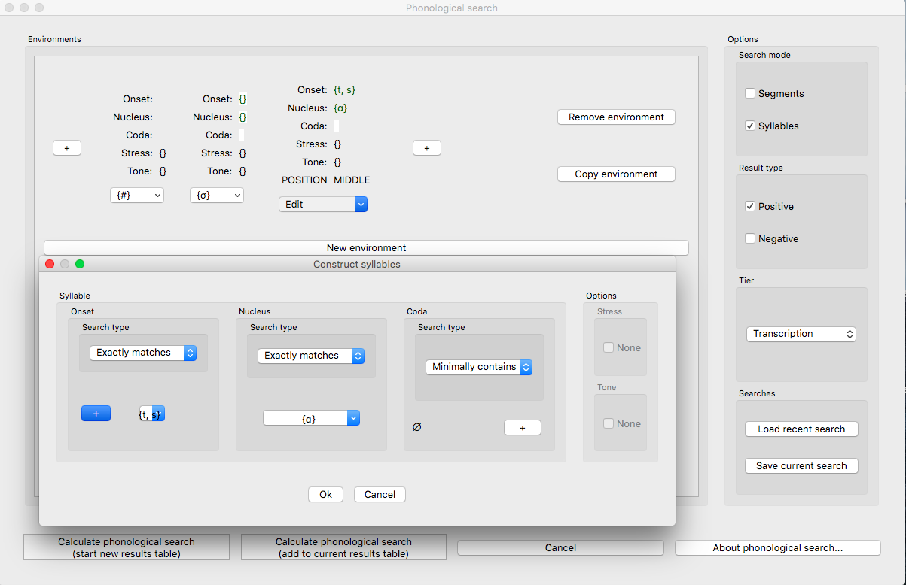

   Another example of constructing the syllable (unlike above, only closed syllables are counted):

.. image:: static/phonosearchenvironmentsyllable2.png
   :width: 100%
   :align: center

   
5. **Saving Searches**: It is possible to save particular searches, as in the Segments mode. To save a search, click on "Save current search" in the "Phonological Search" dialogue box. See above for more information.

6. **Results**: Once all selections have been made, click on “Calculate
   phonological search.” If there is not already an existing results table,
   or you want to start a new one, choose the “Start new results table”
   option. If you want to add the results to a pre-existing table, choose
   the “Add to current results table” option. The results appear in a new
   dialogue box that first shows the summary results, i.e., a list that
   contains the segment that was searched for, each environment that was
   searched for, the total count of words that contain that segment in that
   environment, and the total token frequency for those words (note that
   these are the frequencies of the WORDS containing the specified environments,
   so if for example, a particular word contains multiple instances of the same
   environment, this is NOT reflected in the counts). The individual words in
   the corpus that match the search criteria can be shown by clicking on “Show
   individual results” at the bottom of the screen; this opens a new dialogue
   box in which each word in the corpus that matches the search criteria is
   listed, including the transcription of the word, the segment that was found
   that matches the search criteria, and which environment that segment
   occurred in in that word. Note that the results can be sorted by any of
   the columns by clicking on that column’s name. To return to the summary results, click on
   “Show summary results.” Each set of results can be saved to a .txt file by
   clicking “Save to file” at the bottom of the relevant results window. To
   return to the search selection dialogue box, click on “Reopen function dialogue.”
   Otherwise, when finished, click on “Close window” to return to the corpus.

   An example of the summary results window for the above syllable mode search:

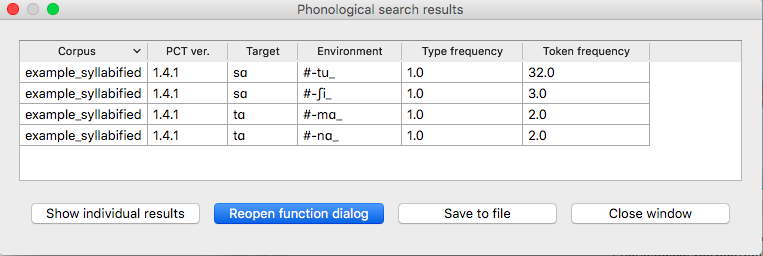

   And the individual results from the same search, sorted by environment:

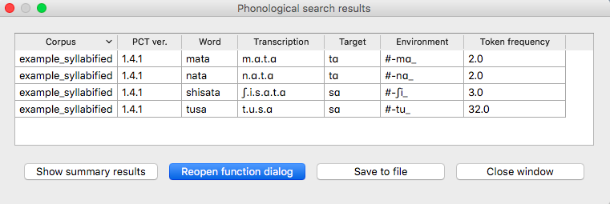

.. _io_classes_and_functions:

Classes and functions
=====================
For further details about the relevant classes and functions in PCT's
source code, please refer to :ref:`api_reference`.

.. [#] Note that the original [Hayes2009]_ system does not include
   diphthongs. We have included featural interpretations for common
   English diphthongs using two additional features, [diphthong] and
   [front-diphthong]. The former has a [+] value for all diphthongs, a
   [-] value for all vowels that are not diphthongs, and a [0] value for
   non-vowels. The latter references the end point of a diphthong; [aɪ],
   [eɪ], and [ɔɪ] are [+front-diphthong], [aʊ] and [oʊ] are [-front-diphthong].
   All other segments are left unspecified for this feature. Other vowel
   features for diphthongs are specified based on the first element of
   the diphthong; e.g., all of [aɪ], [eɪ], [ɔɪ], [aʊ], and [oʊ] are
   [-high]; of these five, only [aɪ] and [aʊ] are [+low]; only [eɪ]
   is [+front]; only [oʊ] and [ɔɪ] are [+back]; only [oʊ] and [ɔɪ] are [+round].
