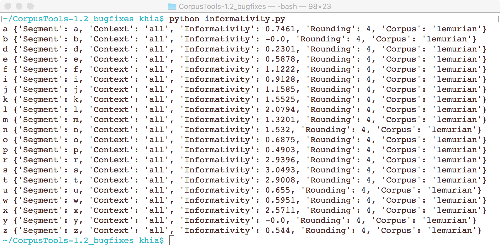
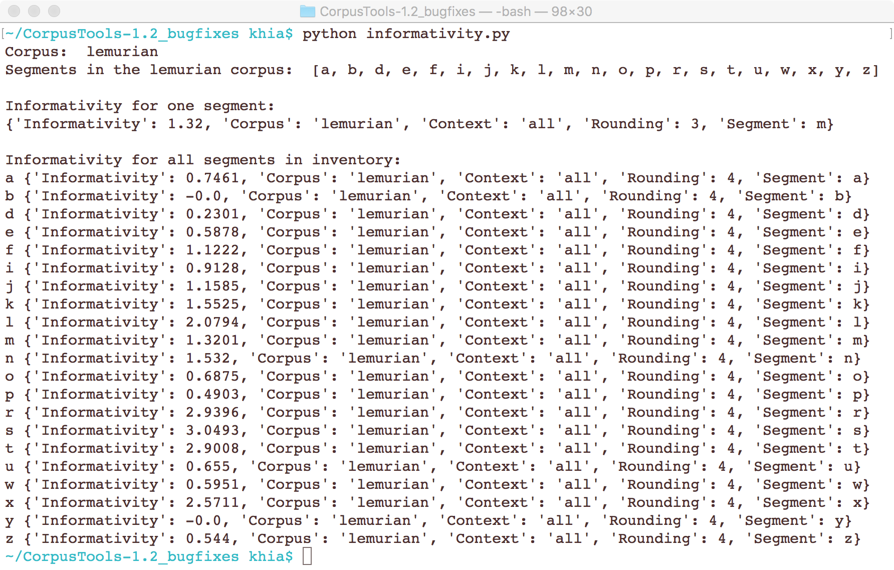

.. _informativity:

*************
Informativity
*************

.. _about_informativity:

About the function
------------------

Informativity is one of three primary information theoretic measures that has been demonstrated to affect how speech is
realized. Informativity is “the weighted average of the negative log predictability of all the occurrences of a segment”
[CohenPriva2015]_. It is formally defined with the following formula:

:math:`-sum[P(context|segment) * log2P(segment|context)]`

While other information theoretic measures such as frequency and predictability can be used to describe a wide variety
of deletion and duration effects, Cohen Priva argues that informativity provides more nuanced and accurate predictions,
and offers empirical evidence from English, as well as other languages [CohenPrivaInPress]_.

One of the primary decisions in calculating informativity, is selecting the type of context to be used.
[CohenPriva2015]_ discusses four options used in the literature - uniphone, biphone, triphone, and all preceding
segments in the word. Within PCT, "all preceding" is currently the only supported option.

.. _method_informativity:

Method of calculation
---------------------

.. _method_context:

Defining context
````````````````
The context for a given segment is currently defined as all of the preceding segments within the same word - the
preferred method in [CohenPriva2015]. The context method includes parameters for the index (integer) of the segment and word in question. Index is used instead of segment, as a word may contain more than one of the same segment,and it is important to consider the context for each occurrence. The function returns a tuple of segments comprising the context. Typical users will not interact with context. Future improvements to the informativity function will allow for customizable context.

Informativity
`````````````
The function to get the informativity of one segment is structured such that it calls on other functions within
:math:`informativity.py` to create three dictionaries containing:

1.  The frequency of a segment occurring given a context, with contexts as the key and captured in the dictionary
:math:`s_frs`
2.  The frequency of those contexts, regardless of the segment that occurs after
3.  The conditional probabilities of a segment occurring in a given context, captured in dictionary :math:`c_prs`.

Given this input, the informativity of a given segment is calculated as follows:

:math:`informativity=round(-(sum([(s_frs[c])*log2(c_prs[c]) for c in c_prs]))/sum([(s_frs[s])for s in s_frs]),rounding)`

The following is an example run of the function for a single segment:

.. image:: informativity1.png
   :width: 90%
   :align: center

In addition to getting the informativity for a single segment, :math:`informativity.py` includes a function to calculate
the informativity of all segments in a corpus. This function gets the list of segments from the corpus’ inventory, and
creates a dictionary with the segments as the key, and the output of the get_informativity function as its value.

The following is an example run for getting the informativities for all segments in the inventory:



.. _informativity_corpus_file:

Calculating informativity with a .corpus file
---------------------------------------------

1.  **Locate the corpus**: Verify that the lemurian.corpus file is located in the same directory as informativity.py.

2.  **Run informativity.py**: Open a terminal and navigate to the directory where informativity.py is located. Note that
PCT uses Python 3, and run the following:

    :math:`python informativity.py`

The following is an example run of the current test print statements:



3.  **Run additional tests**: At your discretion!


**NOTE**: In the future, this portion of the documentation will be modified for calculating informativity in the GUI and
on the command line, to better conform to and integrate with PCT.

.. _functional_load_gui:

Calculating functional load in the GUI
--------------------------------------
Details will be added here upon full integration with PCT.

.. _functional_load_cli:

Implementing the functional load function on the command line
-------------------------------------------------------------
Details will be added here upon full integration with PCT.

.. _informativity_classes_and_functions:

Additional Information
----------------------
Details will be added here upon full integration with PCT.

**********
References
**********

Note that these references will be migrated to the "references.rst" file when fully integrated.

.. [CohenPriva2015] Cohen Priva, Uriel (2015). Informativity affects consonant duration and deletion rates. Laboratory
Phonology, 6(2), 243–278.

.. [CohenPrivaInPress] Cohen Priva, Uriel (in press). Informativity and the actuation of lenition. Language.  https://urielcpublic.s3.amazonaws.com/Informativity-and-the-actuation-of-lenition-accepted.pdf
